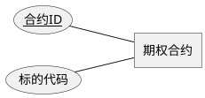

# Option Schema Designer

## 概述

用这个 skill 为基于当前脚手架实现的期权策略设计数据库范式、Schema 文档、Chen notation 的 E-R 图，以及在文档批准后的 Peewee Model 映射。

硬性要求：所有生成的设计摘要、Markdown 文档、章节标题、图注、审阅说明，以及图中面向业务阅读者的说明文字都必须使用中文；只有模型、表、字段、类名、脚本参数等技术标识保持英文。

默认先做设计，后做建模：

1. 先引导用户澄清持久化需求。
2. 再整理成 `docs/design/schema/<strategy-slug>.md` 和 `docs/plantuml/code/E-R/<strategy-slug>-er.puml`。
3. 渲染 SVG 到 `docs/plantuml/charts/<strategy-slug>-er.svg` 并插回文档。
4. 停在“等待用户审阅/批准”。
5. 只有用户明确要求继续时，才进入 Peewee 阶段。

不要生成 DDL，不要讨论部署。

## 工作模式

### Plan Mode

- 先探索仓库上下文，再进入引导式对话。
- 一次只推进一个高影响决策。
- 阶段性摘要、待确认项、审阅提示等面向用户的输出必须使用中文。
- 维护并显式输出：
  - 已确认约束
  - 待确认项
  - 计划产物路径
  - 当前阶段草案摘要
- 不写文件，不生成图，不运行会改动仓库内容的命令。
- 当设计已经 decision-complete 时，先给出结构化摘要并停在等待批准。

### 普通执行模式

- 沿用已经确认过的业务约束和设计摘要。
- 所有生成的文档正文、章节标题、图注和业务说明必须使用中文。
- 生成或更新稳定文件：
  - `docs/design/schema/<strategy-slug>.md`
  - `docs/plantuml/code/E-R/<strategy-slug>-er.puml`
  - `docs/plantuml/charts/<strategy-slug>-er.svg`
- 使用脚本做确定性的渲染与插图。
- 写完文档后停在等待用户审阅/批准。
- 只有收到明确继续指令时，才推进到 Peewee Model。

## 先读什么

- 总是先读 `references/discovery-checklist.md`
  - 用它按领域分组做需求访谈。
- 在整理逻辑模型前读 `references/schema-design-rules.md`
  - 用它约束范式边界、主外键、唯一键、时间戳和版本字段。
- 在写 Markdown 前读 `references/schema-doc-template.md`
  - 按模板组织中文文档。
- 只有用户批准文档并要求继续时，才读 `references/peewee-mapping.md`
  - 把逻辑模型映射成 Peewee Model。
- 如需判断触发语句或示例交互，读 `references/example-prompts.md`。

## 主流程

### 阶段 1：探索上下文

1. 识别策略名、现有 docs 布局、是否已有 schema 文档。
2. 确认目标路径：
   - `docs/design/schema/<strategy-slug>.md`
   - `docs/plantuml/code/E-R/<strategy-slug>-er.puml`
   - `docs/plantuml/charts/<strategy-slug>-er.svg`
3. 识别仓库里已经存在的领域术语和模型命名，尽量复用。

### 阶段 2：引导式访谈

严格按 `references/discovery-checklist.md` 的分组推进。

每轮只追一个领域，问完后立刻输出一段简短小结：

- 新增实体候选
- 新增关系候选
- 建议主键/唯一键
- 是否为核心高范式对象
- 是否允许快照型冗余
- 仍缺失的信息

如果当前会话在 Plan Mode，这一步只做整理和确认，不写文件。

### 阶段 3：设计收束

当领域信息足够时，先给出设计摘要，至少包括：

- 设计目标与上下文
- 持久化范围边界
- 核心实体与关系
- 关键范式判断
- 需要受控冗余的快照/投影对象
- 计划写入的文件路径

如果用户还没有批准，不要进入产物生成。

### 阶段 4：文档与图表落地

收到批准后：

1. 按 `references/schema-doc-template.md` 生成或更新 Markdown。
2. 产出 Chen notation 的 `.puml`：
   - 使用 `@startchen` / `@endchen`
   - 只表达实体、关系、基数、关键属性
3. 运行：

```bash
python .codex/skills/option-schema-designer/scripts/render_er_diagram.py --input docs/plantuml/code/E-R/<strategy-slug>-er.puml --output-dir docs/plantuml/charts
python .codex/skills/option-schema-designer/scripts/update_schema_doc.py --doc docs/design/schema/<strategy-slug>.md --image docs/plantuml/charts/<strategy-slug>-er.svg --title "<策略名> 主 E-R 图"
```

4. 文档写完后停止，等待用户审阅。

### 阶段 5：Peewee Model

只有当用户明确要求继续建模时才进入这一阶段。

- 读取 `references/peewee-mapping.md`
- 将逻辑模型映射为 Peewee Model
- 保持中文说明、英文标识
- 明确主键、外键、唯一约束、索引建议
- 不生成 DDL，不承担部署

## 输出规则

- 所有生成的设计摘要、文档正文、章节标题、图注和审阅说明都必须使用中文。
- 模型、表、字段、类名、脚本参数使用英文标识。
- E-R 图可以用中文业务名称配英文别名，例如：



- 核心交易事实优先坚持 3NF/BCNF。
- 快照、投影、缓存类对象允许受控冗余，但必须在文档中说明原因。

## 停止点

遇到下面任一情况时必须停下并向用户确认：

- 领域问题仍存在高影响歧义
- 用户尚未批准设计摘要
- Markdown 与 E-R 图已经生成，但用户还没批准继续进入 Peewee
- 用户要求直接做 DDL 或部署

## 成功标准

- 用户的持久化需求被按领域逐步澄清。
- `docs/design/schema/<strategy-slug>.md` 包含主 E-R 图和完整中文设计说明。
- `docs/plantuml/code/E-R/<strategy-slug>-er.puml` 使用 Chen notation。
- `docs/plantuml/charts/<strategy-slug>-er.svg` 成功渲染并被插入文档。
- Plan Mode 与普通执行模式中的面向用户输出都保持中文。
- 在 Plan Mode 下没有越界写文件。
- 在 Peewee 阶段只推进到 Peewee Model，不触碰 DDL。
