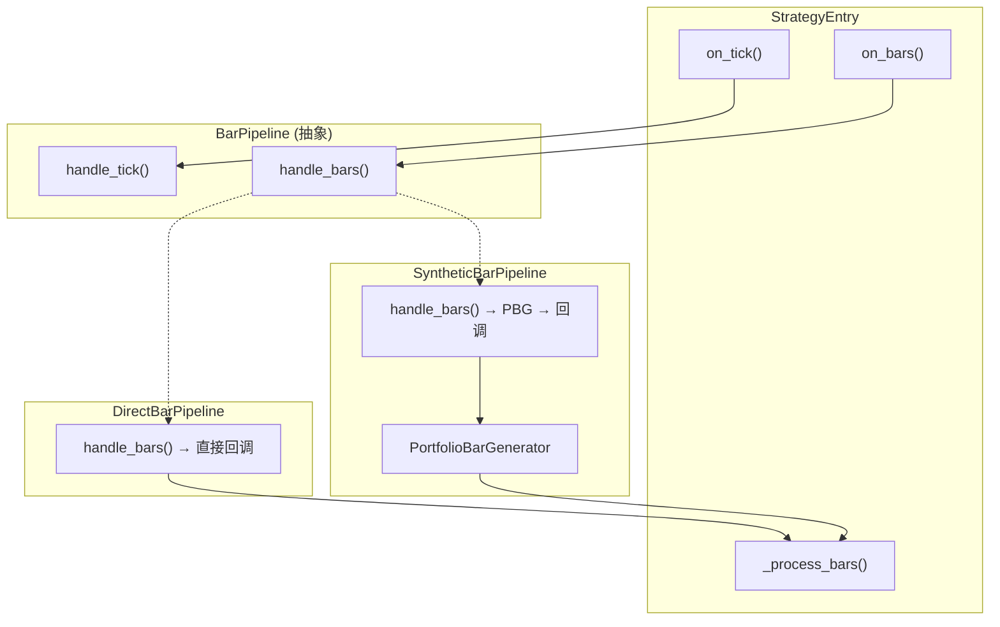

# 设计文档：K线生成器解耦

## 概述

本设计将K线生成器从 `StrategyEntry` 中解耦，引入 **BarPipeline** 抽象层，采用策略模式（Strategy Pattern）将K线数据流处理封装为可插拔的管道组件。

核心思路：
- 定义 `BarPipeline` 抽象基类，统一K线数据流入口
- 实现 `DirectBarPipeline`（直通）和 `SyntheticBarPipeline`（合成）两种管道
- `StrategyEntry` 仅持有 `BarPipeline` 接口引用，不再直接操作 `PortfolioBarGenerator`
- K线合成参数从策略级参数下沉到 `SyntheticBarPipeline` 内部
- 提供工厂函数根据配置自动选择管道实现

## 架构



**数据流对比：**

重构前：
```
Tick → StrategyEntry.on_tick → self.pbg.update_tick()
Bars → StrategyEntry.on_bars → self.pbg.update_bars() 或 self._process_bars()
PBG合成完成 → StrategyEntry.on_window_bars → self._process_bars()
```

重构后：
```
Tick → StrategyEntry.on_tick → self.bar_pipeline.handle_tick()
Bars → StrategyEntry.on_bars → self.bar_pipeline.handle_bars()
管道处理完成 → bar_callback → self._process_bars()
```

## 组件与接口

### BarPipeline 抽象基类

文件位置：`src/strategy/infrastructure/bar_pipeline/bar_pipeline.py`

```python
from abc import ABC, abstractmethod
from typing import Callable, Dict

class BarPipeline(ABC):
    """K线数据流管道抽象基类"""

    def __init__(self, bar_callback: Callable[[Dict[str, "BarData"]], None]) -> None:
        self._bar_callback = bar_callback

    @property
    def bar_callback(self) -> Callable:
        return self._bar_callback

    @abstractmethod
    def handle_tick(self, tick: "TickData") -> None:
        """处理 tick 数据"""
        ...

    @abstractmethod
    def handle_bars(self, bars: Dict[str, "BarData"]) -> None:
        """处理 bars 数据"""
        ...
```

### DirectBarPipeline

文件位置：`src/strategy/infrastructure/bar_pipeline/direct_bar_pipeline.py`

```python
class DirectBarPipeline(BarPipeline):
    """直通管道 — 不做K线合成，直接传递"""

    def handle_tick(self, tick: "TickData") -> None:
        pass  # 直通模式忽略 tick

    def handle_bars(self, bars: Dict[str, "BarData"]) -> None:
        self._bar_callback(bars)
```

### SyntheticBarPipeline

文件位置：`src/strategy/infrastructure/bar_pipeline/synthetic_bar_pipeline.py`

```python
from vnpy_portfoliostrategy.utility import PortfolioBarGenerator
from vnpy.trader.constant import Interval

class SyntheticBarPipeline(BarPipeline):
    """合成管道 — 封装 PBG 进行K线合成"""

    def __init__(
        self,
        bar_callback: Callable[[Dict[str, "BarData"]], None],
        window: int = 15,
        interval: Interval = Interval.MINUTE,
    ) -> None:
        super().__init__(bar_callback)
        self._window = window
        self._interval = interval

        # 内部 PBG：on_bars 接收1分钟K线，on_window_bars 输出合成K线
        self._pbg = PortfolioBarGenerator(
            on_bars=self._on_intermediate_bars,
            window=self._window,
            on_window_bars=self._on_window_bars,
            interval=self._interval,
        )

    def _on_intermediate_bars(self, bars):
        """PBG 内部的1分钟K线回调（传递给 PBG 做合成用）"""
        self._pbg.update_bars(bars)

    def _on_window_bars(self, bars):
        """PBG 合成完成后的回调 → 传递给业务逻辑"""
        self._bar_callback(bars)

    def handle_tick(self, tick: "TickData") -> None:
        self._pbg.update_tick(tick)

    def handle_bars(self, bars: Dict[str, "BarData"]) -> None:
        self._pbg.update_bars(bars)
```

### 工厂函数

文件位置：`src/strategy/infrastructure/bar_pipeline/__init__.py`

```python
def create_bar_pipeline(
    bar_callback: Callable,
    setting: dict,
) -> BarPipeline:
    """根据配置创建对应的 BarPipeline 实现"""
    bar_window = setting.get("bar_window", 0)
    if bar_window and bar_window > 0:
        bar_interval_str = setting.get("bar_interval", "MINUTE")
        interval_map = {
            "MINUTE": Interval.MINUTE,
            "HOUR": Interval.HOUR,
            "DAILY": Interval.DAILY,
        }
        interval = interval_map.get(bar_interval_str, Interval.MINUTE)
        return SyntheticBarPipeline(
            bar_callback=bar_callback,
            window=bar_window,
            interval=interval,
        )
    return DirectBarPipeline(bar_callback=bar_callback)
```

### StrategyEntry 重构后的关键变更

```python
class StrategyEntry(StrategyTemplate):
    # 移除: bar_window, bar_interval 从 parameters 列表
    # 移除: self.pbg
    # 新增: self.bar_pipeline

    def on_init(self):
        # ... 其他初始化 ...
        self.bar_pipeline = create_bar_pipeline(
            bar_callback=self._process_bars,
            setting=self.setting,  # 或从 setting dict 传入
        )

    def on_tick(self, tick):
        self.bar_pipeline.handle_tick(tick)

    def on_bars(self, bars):
        self.last_bars.update(bars)
        # 换月检查、补漏检查逻辑保留不变
        self.bar_pipeline.handle_bars(bars)

    # 移除: on_window_bars() 方法
```

## 数据模型

本次重构不引入新的数据模型。现有的 `BarData`、`TickData` 等 VnPy 数据类型保持不变。

关键类型签名：
- `bar_callback: Callable[[Dict[str, BarData]], None]` — 管道输出回调
- `BarPipeline` — 抽象基类，持有 `bar_callback`
- `DirectBarPipeline(BarPipeline)` — 无状态直通
- `SyntheticBarPipeline(BarPipeline)` — 有状态，内部持有 PBG 实例

文件结构：
```
src/strategy/infrastructure/bar_pipeline/
├── __init__.py              # 导出 + create_bar_pipeline 工厂函数
├── bar_pipeline.py          # BarPipeline 抽象基类
├── direct_bar_pipeline.py   # DirectBarPipeline 实现
└── synthetic_bar_pipeline.py # SyntheticBarPipeline 实现
```


## 正确性属性

*正确性属性是一种在系统所有有效执行中都应成立的特征或行为——本质上是关于系统应该做什么的形式化陈述。属性是人类可读规范与机器可验证正确性保证之间的桥梁。*

### Property 1: DirectBarPipeline 恒等传递

*For any* bars 字典（包含任意数量的 vt_symbol → BarData 映射），当 DirectBarPipeline 的 `handle_bars` 被调用时，bar_callback 应该收到与输入完全相同的 bars 字典。

**Validates: Requirements 2.1**

### Property 2: DirectBarPipeline 忽略 tick

*For any* tick 数据，当 DirectBarPipeline 的 `handle_tick` 被调用时，bar_callback 不应被调用。

**Validates: Requirements 2.2**

### Property 3: 工厂函数正确选择管道

*For any* 配置字典，当 `bar_window` 为正整数时，`create_bar_pipeline` 应返回 `SyntheticBarPipeline` 实例；当 `bar_window` 为 0、负数或不存在时，应返回 `DirectBarPipeline` 实例。

**Validates: Requirements 4.1**

## 错误处理

| 场景 | 处理方式 |
|------|---------|
| `bar_callback` 抛出异常 | BarPipeline 不捕获，由调用方（StrategyEntry）处理 |
| `SyntheticBarPipeline` 创建时 PBG 导入失败 | 抛出 `ImportError`，阻止策略初始化 |
| warmup 过程中 BarPipeline 处理失败 | StrategyEntry 记录错误日志并抛出异常终止初始化 |
| `create_bar_pipeline` 收到无效的 `bar_interval` | 回退到 `Interval.MINUTE` 默认值 |

## 测试策略

### 属性测试（Property-Based Testing）

使用 `hypothesis` 库进行属性测试，每个属性至少运行 100 次迭代。

每个正确性属性对应一个独立的属性测试：

- **Property 1**: 生成随机的 bars 字典，验证 DirectBarPipeline 恒等传递
  - Tag: `Feature: bar-generator-decoupling, Property 1: DirectBarPipeline 恒等传递`
- **Property 2**: 生成随机的 tick 数据，验证 DirectBarPipeline 不触发回调
  - Tag: `Feature: bar-generator-decoupling, Property 2: DirectBarPipeline 忽略 tick`
- **Property 3**: 生成随机的配置字典（包含各种 bar_window 值），验证工厂函数返回正确类型
  - Tag: `Feature: bar-generator-decoupling, Property 3: 工厂函数正确选择管道`

### 单元测试

单元测试覆盖具体示例和边界情况：

- SyntheticBarPipeline 构造函数参数验证
- SyntheticBarPipeline 将 tick/bars 委托给 PBG（mock PBG）
- SyntheticBarPipeline 的 PBG 回调链路正确性
- StrategyEntry 重构后的委托行为（mock BarPipeline）
- StrategyEntry 不再持有 pbg 属性
- DirectBarPipeline 不依赖 PortfolioBarGenerator 模块
- warmup 流程通过 BarPipeline 传递数据
- 参数隔离：bar_window/bar_interval 不在 StrategyEntry.parameters 中

### 测试框架

- 属性测试：`hypothesis`（Python）
- 单元测试：`pytest`
- Mock：`unittest.mock`
