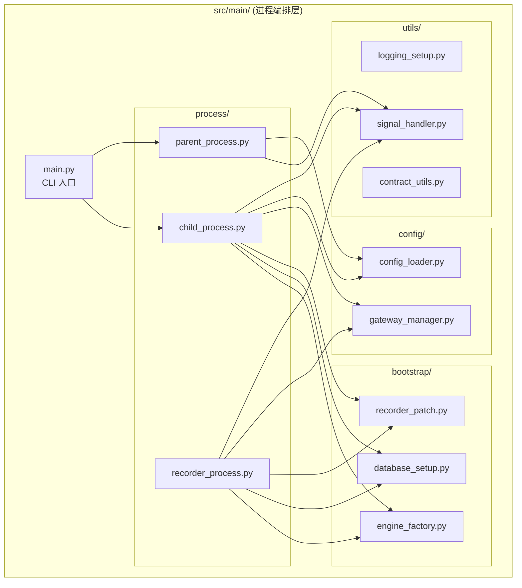

# 设计文档：src/main 模块重构

## 概述

本次重构将 `src/main/` 从扁平结构重组为按职责划分的子目录结构，提取 5 处重复代码为共享模块，并通过 `__init__.py` 重导出机制保持外部导入兼容性。重构不改变任何业务逻辑，仅调整代码组织方式。

### 重构前后目录对比

```
# 重构前                          # 重构后
src/main/                         src/main/
├── __init__.py                   ├── __init__.py          (重导出兼容接口)
├── main.py                       ├── main.py              (CLI 入口，不动)
├── child_process.py              ├── process/
├── parent_process.py             │   ├── __init__.py
├── run_recorder.py               │   ├── child_process.py
├── gateway.py                    │   ├── parent_process.py
└── utils/                        │   └── recorder_process.py  (原 run_recorder.py)
    ├── __init__.py               ├── config/
    ├── config_loader.py          │   ├── __init__.py
    ├── log_handler.py            │   ├── config_loader.py
    └── contract_utils.py         │   └── gateway_manager.py   (原 gateway.py)
                                  ├── bootstrap/
                                  │   ├── __init__.py
                                  │   ├── engine_factory.py     (新：引擎初始化)
                                  │   ├── database_setup.py     (新：数据库配置)
                                  │   └── recorder_patch.py     (新：录制路径补丁)
                                  └── utils/
                                      ├── __init__.py
                                      ├── logging_setup.py      (原 log_handler.py)
                                      ├── signal_handler.py     (新：信号处理)
                                      └── contract_utils.py
```

## 架构

本次重构遵循以下架构原则：

1. **职责分离**：按进程管理、配置、启动引导、工具四个维度划分子目录
2. **DRY 原则**：将 5 处重复代码提取为 `bootstrap/` 和 `utils/` 下的共享模块
3. **向后兼容**：通过 `__init__.py` 重导出保持旧导入路径有效
4. **DDD 边界**：`src/main/` 保持进程编排层定位，不侵入策略领域层



## 组件与接口

### 1. `bootstrap/engine_factory.py` — 引擎工厂

提取自 `child_process.py._init_engines()` 和 `run_recorder.py._init_engines()` 的公共部分。

```python
from dataclasses import dataclass
from typing import Optional, Dict, Any
from vnpy.event import EventEngine
from vnpy.trader.engine import MainEngine


@dataclass
class EngineBundle:
    """VnPy 引擎组合"""
    event_engine: EventEngine
    main_engine: MainEngine


def create_engines() -> EngineBundle:
    """
    创建并返回 VnPy 核心引擎实例。
    
    Returns:
        EngineBundle: 包含 EventEngine 和 MainEngine 的组合
    """
    event_engine = EventEngine()
    main_engine = MainEngine(event_engine)
    return EngineBundle(event_engine=event_engine, main_engine=main_engine)
```

调用方（ChildProcess、RecorderProcess）在获取 `EngineBundle` 后，各自负责添加网关和应用（PortfolioStrategyApp / DataRecorderApp），因为这部分逻辑各进程不同。

### 2. `bootstrap/database_setup.py` — 数据库配置

提取自 `child_process.py._setup_vnpy_database_settings()` 和 `run_recorder.py._setup_vnpy_database_settings()`。

```python
import os
import logging
from typing import bool

logger = logging.getLogger(__name__)


def setup_vnpy_database() -> bool:
    """
    从环境变量读取数据库配置并注入到 VnPy SETTINGS。
    
    Returns:
        True 如果配置成功注入，False 如果未配置或加载失败
    """
    try:
        from vnpy.trader.setting import SETTINGS
    except Exception as e:
        logger.warning(f"加载 vn.py SETTINGS 失败: {e}")
        return False

    driver = os.getenv("VNPY_DATABASE_DRIVER", "").strip()
    if not driver:
        logger.warning("未配置 VNPY_DATABASE_DRIVER")
        return False

    SETTINGS["database.driver"] = driver
    SETTINGS["database.name"] = driver
    SETTINGS["database.database"] = os.getenv("VNPY_DATABASE_DATABASE", "").strip()
    SETTINGS["database.host"] = os.getenv("VNPY_DATABASE_HOST", "localhost").strip()

    try:
        port = int(os.getenv("VNPY_DATABASE_PORT", "3306").strip())
    except (ValueError, TypeError):
        port = 3306
    SETTINGS["database.port"] = port

    SETTINGS["database.user"] = os.getenv("VNPY_DATABASE_USER", "").strip()
    SETTINGS["database.password"] = os.getenv("VNPY_DATABASE_PASSWORD", "")

    logger.info(f"已注入 vn.py 数据库配置: driver={driver}")
    return True
```

### 3. `bootstrap/recorder_patch.py` — 录制路径补丁

提取自 `child_process.py._patch_data_recorder_setting_path()` 和 `run_recorder.py._patch_data_recorder_setting_path()`。

```python
import logging
from pathlib import Path

logger = logging.getLogger(__name__)

PROJECT_ROOT = Path(__file__).parent.parent.parent.parent


def patch_data_recorder_setting_path() -> None:
    """
    将 VnPy 的 data_recorder_setting.json 路径重定向到项目 config/general/ 目录。
    如果目标文件不存在，自动创建空 JSON 文件。
    """
    try:
        import vnpy.trader.utility as vnpy_utility
    except Exception as e:
        logger.warning(f"加载 vn.py utility 失败: {e}")
        return

    original_get_file_path = vnpy_utility.get_file_path
    config_path = PROJECT_ROOT / "config" / "general" / "data_recorder_setting.json"
    config_path.parent.mkdir(parents=True, exist_ok=True)

    if not config_path.exists() or config_path.stat().st_size == 0:
        config_path.write_text("{}", encoding="utf-8")

    def patched_get_file_path(filename: str):
        if filename == "data_recorder_setting.json":
            return config_path
        return original_get_file_path(filename)

    vnpy_utility.get_file_path = patched_get_file_path
    logger.info(f"已重定向 data_recorder_setting.json 到: {config_path}")
```

### 4. `utils/signal_handler.py` — 信号处理

提取自 `main.py`、`child_process.py`、`parent_process.py`、`run_recorder.py` 中重复的信号注册代码。

```python
import signal
import logging
from typing import Callable

logger = logging.getLogger(__name__)


def register_shutdown_signals(callback: Callable[[int, any], None]) -> None:
    """
    注册 SIGTERM 和 SIGINT 信号处理器。
    
    Args:
        callback: 信号回调函数，签名为 (signum, frame) -> None
    """
    signal.signal(signal.SIGTERM, callback)
    signal.signal(signal.SIGINT, callback)
    logger.debug("已注册 SIGTERM/SIGINT 信号处理器")
```

### 5. 向后兼容重导出

`src/main/__init__.py` 和 `src/main/utils/__init__.py` 提供旧路径的重导出：

```python
# src/main/utils/__init__.py
from src.main.utils.contract_utils import ContractUtils
from src.main.utils.logging_setup import setup_logging

# src/main/config/__init__.py  
from src.main.config.config_loader import ConfigLoader

# src/main/__init__.py — 保持旧路径兼容
# 外部模块使用 from src.main.utils.config_loader import ConfigLoader
# 文件已移动到 src/main/config/config_loader.py
# 通过在 src/main/utils/ 下保留 config_loader.py 的重导出模块实现兼容
```

具体兼容策略：

| 旧导入路径 | 新实际位置 | 兼容方式 |
|---|---|---|
| `src.main.utils.config_loader.ConfigLoader` | `src.main.config.config_loader` | `src/main/utils/config_loader.py` 重导出 |
| `src.main.utils.contract_utils.ContractUtils` | `src.main.utils.contract_utils` | 位置不变，无需兼容 |
| `src.main.utils.log_handler.setup_logging` | `src.main.utils.logging_setup` | `src/main/utils/log_handler.py` 重导出 |
| `src.main.gateway.GatewayManager` | `src.main.config.gateway_manager` | `src/main/gateway.py` 重导出 |
| `src.main.child_process.ChildProcess` | `src.main.process.child_process` | `src/main/child_process.py` 重导出 |
| `src.main.parent_process.ParentProcess` | `src.main.process.parent_process` | `src/main/parent_process.py` 重导出 |

重导出文件内容示例（`src/main/utils/config_loader.py`）：

```python
"""向后兼容重导出 — 实际实现已移至 src.main.config.config_loader"""
from src.main.config.config_loader import ConfigLoader  # noqa: F401

__all__ = ["ConfigLoader"]
```

## 数据模型

本次重构不引入新的数据模型。唯一新增的数据结构是 `EngineBundle`：

```python
@dataclass
class EngineBundle:
    """VnPy 引擎组合，由 engine_factory.create_engines() 返回"""
    event_engine: EventEngine
    main_engine: MainEngine
```

现有数据模型（`GatewayStatus`、`GatewayState`、`RestartPolicy`）保持不变，仅随文件移动。


## 正确性属性 (Correctness Properties)

*属性（Property）是一种在系统所有有效执行中都应成立的特征或行为——本质上是对系统应做什么的形式化陈述。属性是人类可读规格说明与机器可验证正确性保证之间的桥梁。*

基于需求验收标准的可测试性分析，提取以下正确性属性：

### Property 1: 子目录包结构完整性

*For any* 子目录在 `src/main/` 下（`process/`、`config/`、`bootstrap/`、`utils/`），该子目录中都应存在 `__init__.py` 文件。

**Validates: Requirements 1.7**

### Property 2: 数据库配置注入正确性

*For any* 环境变量组合（VNPY_DATABASE_DRIVER、VNPY_DATABASE_HOST、VNPY_DATABASE_PORT 等），调用 `setup_vnpy_database()` 后：当 VNPY_DATABASE_DRIVER 非空时，函数应返回 True 且 VnPy SETTINGS 中的对应字段应与环境变量值一致；当 VNPY_DATABASE_DRIVER 为空或未设置时，函数应返回 False。

**Validates: Requirements 3.1, 3.2, 3.3**

### Property 3: 信号处理器注册与回调

*For any* 回调函数，调用 `register_shutdown_signals(callback)` 后，SIGTERM 和 SIGINT 的信号处理器应被设置为该回调函数，且当信号触发时回调函数应被调用并接收到正确的信号编号。

**Validates: Requirements 4.1, 4.3**

### Property 4: 导入路径向后兼容性

*For any* 已知的外部导入路径（`src.main.utils.config_loader.ConfigLoader`、`src.main.utils.contract_utils.ContractUtils`、`src.main.utils.log_handler.setup_logging`、`src.main.gateway.GatewayManager`），重构后该导入路径应仍然可以成功解析，且解析到的类或函数与新实际位置的实现是同一对象。

**Validates: Requirements 6.1, 6.2, 6.3, 6.4**

## 错误处理

本次重构的错误处理策略：

1. **导入兼容层错误**：重导出模块（如 `src/main/utils/config_loader.py`）如果新路径不存在，Python 会在 import 时抛出 `ImportError`，这是预期行为，表明重构不完整。
2. **Engine Factory 错误**：`create_engines()` 不捕获 VnPy 初始化异常，由调用方处理（保持与原有行为一致）。
3. **Database Setup 错误**：`setup_vnpy_database()` 捕获 VnPy SETTINGS 加载失败，返回 False 并记录警告，不抛出异常。
4. **Recorder Patch 错误**：`patch_data_recorder_setting_path()` 捕获 VnPy utility 加载失败，记录警告并静默返回。
5. **Signal Handler 错误**：`register_shutdown_signals()` 不捕获异常，信号注册失败应立即暴露。

## 测试策略

### 单元测试

针对具体示例和边界情况：

- `engine_factory.create_engines()` 返回有效的 EngineBundle（需 mock VnPy）
- `database_setup.setup_vnpy_database()` 在无环境变量时返回 False
- `recorder_patch.patch_data_recorder_setting_path()` 在目标文件不存在时创建空 JSON
- 目录结构验证：所有预期文件存在于正确位置
- 文件重命名验证：旧文件名不存在，新文件名存在

### 属性测试

使用 `hypothesis` 库（Python 属性测试框架），每个属性测试至少运行 100 次迭代。

- **Property 2 测试**：生成随机环境变量组合，验证 `setup_vnpy_database()` 的返回值和 SETTINGS 注入一致性
  - Tag: **Feature: main-module-refactor, Property 2: 数据库配置注入正确性**
- **Property 3 测试**：生成随机回调函数，验证信号注册和触发行为
  - Tag: **Feature: main-module-refactor, Property 3: 信号处理器注册与回调**
- **Property 4 测试**：遍历所有已知外部导入路径，验证 import 成功且指向正确对象
  - Tag: **Feature: main-module-refactor, Property 4: 导入路径向后兼容性**

### 测试配置

- 属性测试库：`hypothesis`
- 每个属性测试最少 100 次迭代
- 每个属性测试必须以注释标注对应的设计文档属性编号
- 标注格式：**Feature: main-module-refactor, Property {number}: {property_text}**
- 每个正确性属性由一个独立的属性测试实现
