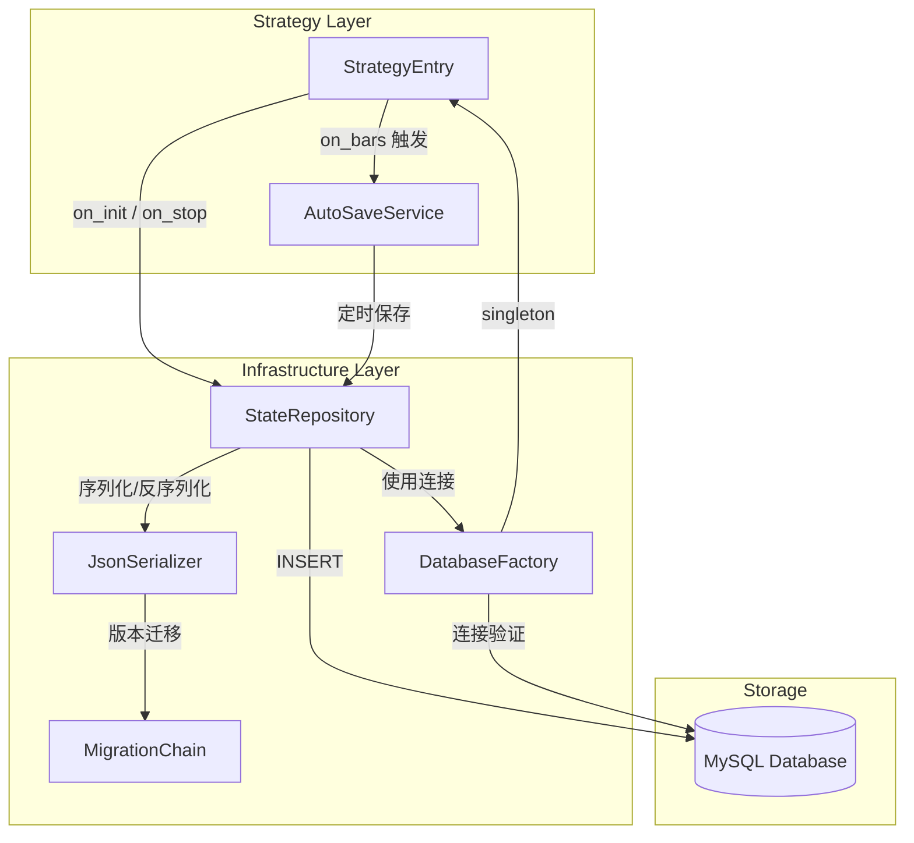
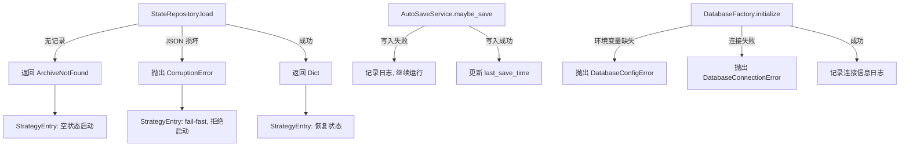

# Design Document: Persistence Resilience Enhancement

## Overview

本设计文档描述 VnPy 交易系统持久化架构的增强方案。核心改进包括五个方面：

1. **周期性自动保存** — 在 `on_bars` 回调中按时间间隔自动保存状态到 MySQL，避免仅在 `on_stop` 时保存导致崩溃丢失数据
2. **Fail-Fast 状态加载** — 区分"无记录"和"记录损坏"两种场景，损坏时立即终止策略启动
3. **数据库连接验证** — 启动时验证 MySQL 连接和环境变量配置，防止静默回退到 SQLite
4. **JSON 序列化 + 版本迁移** — 使用 JSON 替代 pickle 进行状态序列化，支持 schema 版本控制
5. **统一数据库工厂** — 消除回测模块的 monkey-patch，提供单一数据库连接入口

### 存储方案选型

状态快照存储在 MySQL 数据库中（JSON 字段），而非本地文件。选择 MySQL 的理由：
- 统一技术栈，状态和行情数据都在 MySQL
- 可保留历史快照，方便排查问题
- 未来多实例部署天然支持
- 数据库事务保证写入一致性

序列化逻辑（JSON 编解码、DataFrame 转换、版本迁移）与文件方案完全一致，只是存储介质从文件变为数据库记录。

## Architecture

### 整体架构图



### 模块职责划分

| 模块 | 职责 | 位置 |
|------|------|------|
| `AutoSaveService` | 基于时间间隔的自动保存调度 | `src/strategy/infrastructure/persistence/auto_save_service.py` |
| `StateRepository` | 状态的数据库读写，错误分类 | `src/strategy/infrastructure/persistence/state_repository.py` (改造) |
| `JsonSerializer` | JSON 序列化/反序列化，DataFrame 转换 | `src/strategy/infrastructure/persistence/json_serializer.py` |
| `MigrationChain` | Schema 版本迁移链 | `src/strategy/infrastructure/persistence/migration_chain.py` |
| `DatabaseFactory` | 统一数据库连接工厂，连接验证 | `src/main/bootstrap/database_factory.py` |
| `CorruptionError` | 状态损坏异常类型 | `src/strategy/infrastructure/persistence/exceptions.py` |

## Components and Interfaces

### 1. AutoSaveService

```python
class AutoSaveService:
    """周期性自动保存服务"""

    def __init__(
        self,
        state_repository: StateRepository,
        strategy_name: str,
        interval_seconds: float = 60.0,
        logger: Optional[Logger] = None,
    ) -> None: ...

    def maybe_save(self, snapshot_fn: Callable[[], Dict[str, Any]]) -> None:
        """
        在 on_bars 中调用。检查距上次保存是否已超过 interval，
        若超过则调用 snapshot_fn 获取快照并通过 StateRepository 保存到数据库。
        snapshot_fn 是惰性求值，避免未到保存时间时的不必要序列化开销。
        """
        ...

    def force_save(self, snapshot_fn: Callable[[], Dict[str, Any]]) -> None:
        """强制立即保存（用于 on_stop）"""
        ...

    def reset(self) -> None:
        """重置计时器"""
        ...
```

设计决策：
- `maybe_save` 接受 `Callable` 而非直接接受数据，实现惰性求值，避免每次 on_bars 都执行序列化
- 使用 `time.monotonic()` 而非 `datetime.now()` 计时，避免系统时钟调整的影响
- 回测模式下不创建 AutoSaveService 实例，由 StrategyEntry 在初始化时根据 `self.backtesting` 决定

### 2. StateRepository (改造)

```python
class ArchiveNotFound:
    """表示数据库中无该策略状态记录的结果类型"""
    strategy_name: str

class StateRepository:
    def __init__(
        self,
        serializer: JsonSerializer,
        database_factory: DatabaseFactory,
        logger: Optional[Logger] = None,
    ) -> None: ...

    def save(self, strategy_name: str, data: Dict[str, Any]) -> None:
        """
        保存状态到数据库（INSERT 追加）。
        序列化为 JSON 后插入 strategy_state 表，保留所有历史快照。
        """
        ...

    def load(self, strategy_name: str) -> Union[Dict[str, Any], ArchiveNotFound]:
        """
        从数据库加载最新状态。
        查询 strategy_name 对应的最新记录 (ORDER BY saved_at DESC LIMIT 1)。
        - 无记录 → 返回 ArchiveNotFound
        - 记录存在但 JSON 反序列化失败 → 抛出 CorruptionError
        - 成功 → 返回 Dict
        """
        ...

    def verify_integrity(self, strategy_name: str) -> bool:
        """验证最新记录完整性：检查 JSON 可解析且包含 schema_version"""
        ...

    def cleanup(self, strategy_name: str, keep_days: int = 7) -> int:
        """
        清理旧快照。删除 saved_at 早于 keep_days 天前的记录。
        返回删除的记录数。
        """
        ...
```

设计决策：
- 使用返回值 `ArchiveNotFound` 而非异常来表示"无记录"，因为这是正常的首次启动场景
- 使用异常 `CorruptionError` 表示"记录损坏"，因为这是需要立即处理的异常场景
- `verify_integrity` 只读取 JSON 字符串并尝试解析头部，不执行完整反序列化

### 3. JsonSerializer

```python
CURRENT_SCHEMA_VERSION = 1

class JsonSerializer:
    """JSON 序列化器，支持 DataFrame 和 datetime 等特殊类型"""

    def __init__(self, migration_chain: MigrationChain) -> None: ...

    def serialize(self, data: Dict[str, Any]) -> str:
        """
        序列化为 JSON 字符串。
        - 自动注入 schema_version
        - DataFrame → records 格式 (list of dicts)
        - datetime → ISO 8601 字符串
        - set → list
        - Enum → value
        - dataclass → dict
        """
        ...

    def deserialize(self, json_str: str) -> Dict[str, Any]:
        """
        从 JSON 字符串反序列化。
        - 检查 schema_version，必要时执行迁移
        - records 格式 → DataFrame
        - ISO 8601 字符串 → datetime
        """
        ...
```

设计决策：
- 自定义 `JSONEncoder` 子类处理 DataFrame、datetime、set、Enum、dataclass 等类型
- 反序列化时通过约定的 key 前缀（如 `__dataframe__`）识别需要还原为 DataFrame 的字段
- 写入和读取均使用 JSON，不支持其他格式

### 4. MigrationChain

```python
MigrationFn = Callable[[Dict[str, Any]], Dict[str, Any]]

class MigrationChain:
    """Schema 版本迁移链"""

    def __init__(self) -> None:
        self._migrations: Dict[int, MigrationFn] = {}

    def register(self, from_version: int, fn: MigrationFn) -> None:
        """注册从 from_version 到 from_version+1 的迁移函数"""
        ...

    def migrate(self, data: Dict[str, Any], from_version: int, to_version: int) -> Dict[str, Any]:
        """依次执行迁移链，从 from_version 迁移到 to_version"""
        ...
```

设计决策：
- 每个迁移函数只负责一个版本的升级（N → N+1），保持单一职责
- 迁移链是有序的，从低版本依次执行到高版本
- 注册后的迁移函数不可修改，保证向后兼容

### 5. DatabaseFactory

```python
class DatabaseFactory:
    """统一数据库连接工厂（单例）"""

    _instance: ClassVar[Optional["DatabaseFactory"]] = None
    _db: Optional[Any] = None
    _peewee_db: Optional[Any] = None

    @classmethod
    def get_instance(cls) -> "DatabaseFactory":
        """获取单例实例"""
        ...

    def initialize(self, eager: bool = True, timeout: float = 5.0) -> None:
        """
        初始化数据库连接。
        - 验证环境变量完整性
        - 注入 VnPy SETTINGS
        - 配置表名 (dbbardata, dbtickdata)
        - eager=True 时立即建立连接并验证
        - 连接失败时抛出 DatabaseConnectionError
        - 环境变量缺失时抛出 DatabaseConfigError
        """
        ...

    def get_database(self) -> Any:
        """
        获取 VnPy 数据库实例。
        - 如果尚未初始化，执行 lazy 初始化
        - 返回 singleton 实例
        """
        ...

    def get_peewee_db(self) -> Any:
        """
        获取底层 Peewee 数据库连接（用于 strategy_state 表操作）。
        """
        ...

    def validate_connection(self, timeout: float = 5.0) -> bool:
        """验证数据库连接是否可用"""
        ...

    @staticmethod
    def validate_env_vars() -> List[str]:
        """检查必需的环境变量，返回缺失的变量名列表"""
        ...

    def reset(self) -> None:
        """重置工厂状态（仅用于测试）"""
        ...
```

设计决策：
- 使用类级别单例模式，确保全局唯一的数据库连接
- `validate_env_vars` 是静态方法，可在初始化前独立调用
- 内部封装 `vnpy_mysql` 的表名配置（`dbbardata`, `dbtickdata`），消除外部 monkey-patch
- 提供 `get_peewee_db()` 暴露底层 Peewee 连接，供 StateRepository 操作 `strategy_state` 表
- 支持 eager（同步立即连接）和 lazy（首次使用时连接）两种模式
- `reset()` 仅用于测试，生产代码不应调用

### 6. strategy_state 表定义

```python
class StrategyStateModel(Model):
    """策略状态 Peewee 模型 — 保留所有历史快照"""
    id = AutoField(primary_key=True)
    strategy_name = CharField(max_length=128, index=True)
    snapshot_json = TextField()  # JSON 序列化的完整快照数据
    schema_version = IntegerField(default=1)
    saved_at = DateTimeField(index=True)

    class Meta:
        table_name = "strategy_state"
        indexes = (
            (("strategy_name", "saved_at"), False),  # 复合索引，加速按策略+时间查询
        )
```

**存储说明：**
- `snapshot_json` 存储完整的 JSON 序列化快照（包含 `target_aggregate`、`position_aggregate`、`current_dt`）
- 每次保存都是 INSERT（追加），保留所有历史快照
- 加载时查询 `WHERE strategy_name = ? ORDER BY saved_at DESC LIMIT 1` 取最新记录
- 提供 `cleanup(strategy_name, keep_days)` 方法清理超过指定天数的旧快照

**MySQL 中存储的内容：**

| 字段 | 说明 | 示例 |
|------|------|------|
| `id` | 自增主键 | 1, 2, 3... |
| `strategy_name` | 策略名称 | `"VolStrategy"` |
| `snapshot_json` | JSON 序列化的聚合根快照 | `{"schema_version": 1, "target_aggregate": {...}, "position_aggregate": {...}, "current_dt": "..."}` |
| `schema_version` | 冗余字段，方便 SQL 查询版本 | `1` |
| `saved_at` | 保存时间 | `2025-01-15 14:30:00` |

### 7. Exceptions

```python
class CorruptionError(Exception):
    """状态记录损坏异常"""
    def __init__(self, strategy_name: str, original_error: Exception) -> None:
        self.strategy_name = strategy_name
        self.original_error = original_error
        super().__init__(
            f"State record corrupted for strategy: {strategy_name}. "
            f"Original error: {original_error}"
        )

class DatabaseConfigError(Exception):
    """数据库配置错误（缺少环境变量）"""
    def __init__(self, missing_vars: List[str]) -> None:
        self.missing_vars = missing_vars
        super().__init__(
            f"Missing required environment variables: {', '.join(missing_vars)}"
        )

class DatabaseConnectionError(Exception):
    """数据库连接失败"""
    def __init__(self, host: str, database: str, original_error: Exception) -> None:
        self.host = host
        self.database = database
        self.original_error = original_error
        super().__init__(
            f"Failed to connect to database {database}@{host}: {original_error}"
        )
```

## Data Models

### Aggregate Snapshot JSON Schema

序列化后存入 `strategy_state.snapshot_json` 的 JSON 结构：

```json
{
  "schema_version": 1,
  "saved_at": "2025-01-15T14:30:00+08:00",
  "target_aggregate": {
    "instruments": {
      "rb2501.SHFE": {
        "vt_symbol": "rb2501.SHFE",
        "bars": {
          "__dataframe__": true,
          "records": [
            {"datetime": "2025-01-15T14:29:00", "open": 3500.0, "high": 3510.0, "low": 3495.0, "close": 3505.0, "volume": 1200}
          ]
        },
        "indicators": {"hv_20": 0.25, "signal": "sell_put"},
        "last_update_time": "2025-01-15T14:29:00+08:00"
      }
    },
    "active_contracts": {"rb": "rb2501.SHFE"}
  },
  "position_aggregate": {
    "positions": {
      "rb2501P3400.SHFE": {
        "vt_symbol": "rb2501P3400.SHFE",
        "underlying_vt_symbol": "rb2501.SHFE",
        "signal": "sell_put",
        "volume": 2,
        "target_volume": 2,
        "direction": "short",
        "open_price": 45.0,
        "create_time": "2025-01-10T09:30:00+08:00",
        "open_time": "2025-01-10T09:30:05+08:00",
        "close_time": null,
        "is_closed": false,
        "is_manually_closed": false
      }
    },
    "pending_orders": {},
    "managed_symbols": ["rb2501P3400.SHFE"],
    "daily_open_count_map": {},
    "global_daily_open_count": 0,
    "last_trading_date": "2025-01-15"
  },
  "current_dt": "2025-01-15T14:29:00+08:00"
}
```

### 类型转换规则

| Python 类型 | JSON 表示 | 反序列化还原 |
|-------------|-----------|-------------|
| `pd.DataFrame` | `{"__dataframe__": true, "records": [...]}` | `pd.DataFrame(records)` |
| `datetime` | ISO 8601 字符串 | `datetime.fromisoformat(s)` |
| `date` | ISO 8601 日期字符串 | `date.fromisoformat(s)` |
| `set` | `{"__set__": true, "values": [...]}` | `set(values)` |
| `Enum` | `{"__enum__": "ClassName.VALUE"}` | 动态还原 |
| `dataclass` | `{"__dataclass__": "module.ClassName", ...fields}` | 动态还原 |

### Schema 版本迁移策略

- **Version 1**: JSON 格式（MySQL），包含上述完整结构

迁移路径：数据库旧版本 JSON → `MigrationChain.migrate` → 当前版本


## Correctness Properties

*A property is a characteristic or behavior that should hold true across all valid executions of a system — essentially, a formal statement about what the system should do. Properties serve as the bridge between human-readable specifications and machine-verifiable correctness guarantees.*

### Property 1: Auto-save interval gating

*For any* sequence of `maybe_save` calls with associated timestamps, a save operation should occur if and only if the elapsed time since the last save is greater than or equal to the configured interval.

**Validates: Requirements 1.1, 1.3**

### Property 2: Save then load returns latest snapshot

*For any* valid snapshot data and strategy name, after calling `StateRepository.save()` one or more times, a subsequent `StateRepository.load()` with the same strategy name should return data equivalent to the most recently saved snapshot (not `ArchiveNotFound`).

**Validates: Requirements 1.4**

### Property 3: Non-existent strategy returns ArchiveNotFound

*For any* strategy name that has no record in the database, calling `StateRepository.load()` should return an `ArchiveNotFound` instance (not raise an exception, and not return data).

**Validates: Requirements 2.1**

### Property 4: Corrupted record raises CorruptionError with details

*For any* strategy name whose database record contains invalid (non-deserializable) JSON, calling `StateRepository.load()` should raise a `CorruptionError` whose message contains both the strategy name and the original exception details.

**Validates: Requirements 2.2, 2.4**

### Property 5: Integrity check without full deserialization

*For any* strategy name with a valid JSON record containing `schema_version`, `verify_integrity` should return `True`. *For any* strategy name with invalid JSON or missing `schema_version`, `verify_integrity` should return `False`.

**Validates: Requirements 2.5**

### Property 6: Missing environment variables detection

*For any* subset of the required environment variables (`VNPY_DATABASE_DRIVER`, `VNPY_DATABASE_HOST`, `VNPY_DATABASE_DATABASE`, `VNPY_DATABASE_USER`, `VNPY_DATABASE_PASSWORD`) that is missing, `DatabaseFactory.validate_env_vars()` should return exactly the set of missing variable names.

**Validates: Requirements 3.3**

### Property 7: JSON serialization round-trip

*For any* valid `Aggregate_Snapshot` dictionary (containing `target_aggregate`, `position_aggregate`, `current_dt` with arbitrary DataFrame contents, datetime values, sets, and enums), serializing with `JsonSerializer.serialize()` then deserializing with `JsonSerializer.deserialize()` should produce a data structure equivalent to the original.

**Validates: Requirements 4.1, 4.2, 4.5, 4.6, 4.8**

### Property 8: Migration chain sequential application

*For any* data with schema version N (where N < current version), applying the migration chain should produce data with the current schema version, and the migration should be equivalent to applying each individual migration step sequentially from N to current.

**Validates: Requirements 4.3**

### Property 9: Database factory singleton identity

*For any* number of calls to `DatabaseFactory.get_instance()`, the returned object should always be the same instance (identity equality via `is`).

**Validates: Requirements 5.6**

## Error Handling

### 错误分类与处理策略

| 错误场景 | 错误类型 | 处理策略 | 影响范围 |
|----------|---------|---------|---------|
| 数据库中无该策略记录 | `ArchiveNotFound` (返回值) | 继续启动，使用空状态 | 正常流程 |
| 数据库记录存在但 JSON 损坏 | `CorruptionError` (异常) | Fail-fast，阻止策略启动 | 策略级别 |
| 自动保存写入数据库失败 | 捕获 `Exception` | 记录日志，继续运行 | 无影响 |
| 数据库环境变量缺失 | `DatabaseConfigError` (异常) | 阻止应用启动 | 应用级别 |
| 数据库连接失败 | `DatabaseConnectionError` (异常) | 阻止应用启动，不回退 SQLite | 应用级别 |
| Schema 版本过高（未来版本） | `CorruptionError` (异常) | Fail-fast | 策略级别 |
| 本地旧状态文件 | 忽略 | 不再读取本地文件 | 无影响 |

### 错误传播路径



## Testing Strategy

### 测试框架

- **单元测试**: `pytest`
- **属性测试**: `hypothesis` (已在项目中使用)
- **Mock**: `unittest.mock` (标准库)
- **数据库测试**: 使用 SQLite 内存数据库模拟 Peewee 操作，避免依赖真实 MySQL

### 属性测试 (Property-Based Tests)

每个 Correctness Property 对应一个独立的 hypothesis 测试，最少运行 100 次迭代。

测试标注格式: `Feature: persistence-resilience-enhancement, Property {N}: {title}`

| Property | 测试文件 | 生成器策略 |
|----------|---------|-----------|
| P1: Auto-save interval gating | `tests/strategy/infrastructure/persistence/test_auto_save_service.py` | 生成随机时间戳序列和间隔值 |
| P2: Save then load latest | `tests/strategy/infrastructure/persistence/test_state_repository.py` | 生成随机快照数据和策略名 |
| P3: Non-existent → ArchiveNotFound | `tests/strategy/infrastructure/persistence/test_state_repository.py` | 生成随机策略名 |
| P4: Corrupted → CorruptionError | `tests/strategy/infrastructure/persistence/test_state_repository.py` | 生成随机非 JSON 字符串 |
| P5: Integrity check | `tests/strategy/infrastructure/persistence/test_state_repository.py` | 生成有效/无效 JSON 字符串 |
| P6: Missing env vars | `tests/main/bootstrap/test_database_factory.py` | 生成环境变量子集 |
| P7: Serialization round-trip | `tests/strategy/infrastructure/persistence/test_json_serializer.py` | 生成包含 DataFrame、datetime、set、Enum 的随机快照 |
| P8: Migration chain | `tests/strategy/infrastructure/persistence/test_migration_chain.py` | 生成带旧版本号的随机数据 |
| P9: Singleton identity | `tests/main/bootstrap/test_database_factory.py` | 多次调用 get_instance |

### 单元测试 (Unit Tests)

单元测试聚焦于具体示例和边界情况：

- **AutoSaveService**: 默认间隔值为 60 秒 (Req 1.2)、回测模式不保存 (Req 1.6)、写入失败不中断 (Req 1.5)
- **StateRepository**: CorruptionError 传播到 StrategyEntry (Req 2.3)、cleanup 清理旧快照
- **DatabaseFactory**: eager vs lazy 初始化模式 (Req 5.5)、不回退 SQLite (Req 3.4)、日志输出连接信息 (Req 3.5)
- **JsonSerializer**: 特殊类型编码（空 DataFrame、嵌套 datetime、Enum、set）

### 测试目录结构

```
tests/
├── strategy/
│   └── infrastructure/
│       └── persistence/
│           ├── test_auto_save_service.py
│           ├── test_state_repository.py
│           ├── test_json_serializer.py
│           └── test_migration_chain.py
└── main/
    └── bootstrap/
        └── test_database_factory.py
```
