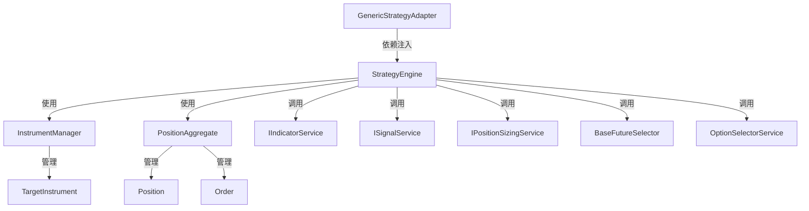

# Design Document

## Overview

本设计文档描述了将现有 StockIndexVolatility 项目重构为通用 VNPY 期货期权交易框架的详细设计方案。该框架采用 DDD（领域驱动设计）架构，通过服务提供者接口（SPI）模式实现策略逻辑的可插拔性，使开发者能够专注于策略核心逻辑的实现。

### 核心设计理念

1. **贫血模型（Anemic Domain Model）**: 实体类作为纯数据容器，业务逻辑由服务层处理
2. **依赖倒置（Dependency Inversion）**: 应用层依赖抽象接口，具体实现由策略开发者提供
3. **开闭原则（Open-Closed Principle）**: 框架对扩展开放，对修改封闭
4. **关注点分离（Separation of Concerns）**: 清晰的分层架构，各层职责明确

## Architecture

### 分层架构

```
┌─────────────────────────────────────────────────────────────┐
│                    Interface Layer                          │
│  (GenericStrategyAdapter - VnPy 适配器)                     │
└─────────────────────────────────────────────────────────────┘
                            ↓
┌─────────────────────────────────────────────────────────────┐
│                   Application Layer                         │
│  (StrategyEngine - 策略执行引擎)                            │
└─────────────────────────────────────────────────────────────┘
                            ↓
┌─────────────────────────────────────────────────────────────┐
│                     Domain Layer                            │
│  ┌──────────────┐  ┌──────────────┐  ┌──────────────┐     │
│  │  Aggregates  │  │   Entities   │  │    Services  │     │
│  └──────────────┘  └──────────────┘  └──────────────┘     │
└─────────────────────────────────────────────────────────────┘
                            ↓
┌─────────────────────────────────────────────────────────────┐
│                 Infrastructure Layer                        │
│  (VnPy Gateways, Persistence, Monitoring)                   │
└─────────────────────────────────────────────────────────────┘
```

### 核心组件关系



## Components and Interfaces

### 1. Domain Layer - Entities

#### 1.1 TargetInstrument (标的实体)

**设计模式**: 贫血模型

**职责**:
- 存储合约基础信息（vt_symbol, exchange）
- 维护 K 线队列（bars DataFrame）
- 提供动态指标存储容器（indicators 字典）

**关键属性**:
```python
@dataclass
class TargetInstrument:
    vt_symbol: str                          # 合约代码
    bars: pd.DataFrame                      # K 线数据
    indicators: Dict[str, Any]              # 动态指标容器
    last_update_time: Optional[datetime]    # 最后更新时间
```

**关键方法**:
- `append_bar(bar_data: dict)`: 追加新 K 线
- `get_bar_history(n: int)`: 获取最近 n 根 K 线
- `latest_close`, `latest_high`, `latest_low`: 属性访问器

**设计决策**:
- 删除所有计算方法（update_macd, check_dullness 等）
- indicators 字典由 IIndicatorService 负责填充
- 保持实体稳定，新增指标无需修改实体结构

#### 1.2 Order & Position

**职责**: 通用金融模型，直接复用现有实现

**关键属性**:
- Order: vt_orderid, vt_symbol, direction, offset, volume, price, signal_type
- Position: vt_symbol, underlying_vt_symbol, direction, volume, signal_type

### 2. Domain Layer - Aggregates

#### 2.1 InstrumentManager (原 TargetInstrumentAggregate)

**职责**:
- 管理多个 TargetInstrument 实体
- 维护品种与活跃合约的映射关系
- 提供标的查询和工厂接口

**关键方法**:
```python
class InstrumentManager:
    def set_active_contract(product: str, vt_symbol: str)
    def get_active_contract(product: str) -> Optional[str]
    def get_all_active_contracts() -> List[str]
    def get_or_create_instrument(vt_symbol: str) -> TargetInstrument
    def update_bar(vt_symbol: str, bar_data: dict) -> TargetInstrument
    def get_bar_history(vt_symbol: str, n: int) -> pd.DataFrame
    def get_latest_price(vt_symbol: str) -> float
    def has_enough_data(vt_symbol: str) -> bool
```

**重构要点**:
- 删除 `update_indicators` 方法及其参数透传逻辑
- 不引用任何特定的 SignalType 或指标类型
- 纯粹的数据容器和查询接口

#### 2.2 PositionAggregate

**职责**: 订单生命周期管理、持仓核对、多空反手逻辑

**保留**: 完整保留现有实现，确保不引用特定 SignalType

### 3. Domain Layer - Service Interfaces (SPI)

#### 3.1 IIndicatorService (指标计算服务接口)

**职责**: 计算技术指标并更新 TargetInstrument 的 indicators 字典

**接口定义**:
```python
class IIndicatorService(ABC):
    @abstractmethod
    def calculate_bar(self, instrument: TargetInstrument, bar: BarData) -> None:
        """
        K 线更新时的指标计算逻辑
        
        实现指导:
        1. 从 instrument.bars 读取历史数据
        2. 计算所需指标（MACD, EMA, TD 等）
        3. 将结果写入 instrument.indicators 字典
        
        示例:
        instrument.indicators['macd'] = {'dif': 0.5, 'dea': 0.3, 'macd_bar': 0.2}
        instrument.indicators['ema'] = {'fast': 3500, 'slow': 3480}
        """
        pass
```

#### 3.2 ISignalService (信号生成服务接口)

**职责**: 根据标的状态判断开平仓信号

**接口定义**:
```python
class ISignalService(ABC):
    @abstractmethod
    def check_open_signal(self, instrument: TargetInstrument) -> Optional[str]:
        """检查开仓信号，返回信号字符串或 None"""
        pass
    
    @abstractmethod
    def check_close_signal(self, instrument: TargetInstrument, position: Position) -> Optional[str]:
        """检查平仓信号，返回信号字符串或 None"""
        pass
```

**信号机制设计**:
- 完全字符串化，废弃 SignalType 枚举
- 用户可使用任意字符串定义信号
- 建议命名规范: `ACTION_REASON_DETAIL`（如 `sell_call_divergence_td9`）

#### 3.3 IPositionSizingService (仓位计算服务接口)

**职责**: 计算实际开平仓手数，执行风控检查

**接口定义**:
```python
class IPositionSizingService(ABC):
    @abstractmethod
    def calculate_open_volume(self, desired_volume: int, instrument: TargetInstrument, account: Account) -> int:
        """计算实际开仓手数，返回 0 表示拒绝开仓"""
        pass
    
    @abstractmethod
    def calculate_exit_volume(self, desired_volume: int, current_position: Position) -> int:
        """计算实际平仓手数"""
        pass
```

#### 3.4 BaseFutureSelector (期货标的筛选基类)

**职责**: 提供常用的期货合约筛选工具

**关键方法**:
- `select_dominant_contract`: 根据成交量筛选主力合约
- `filter_by_maturity`: 根据月份筛选合约

#### 3.5 OptionSelectorService (期权选择服务)

**职责**: 在给定期权链中选择特定合约

**关键方法**:
- `select_option`: 选择期权合约，支持 CALL/PUT 类型

### 4. Application Layer - StrategyEngine

**职责**: 编排领域层组件，协调开平仓业务流程

**依赖注入**:
```python
class StrategyEngine:
    def __init__(
        self,
        strategy_context: Any,
        indicator_service: IIndicatorService,
        signal_service: ISignalService,
        position_sizing_service: IPositionSizingService,
        future_selection_service: BaseFutureSelector,
        option_selector_service: OptionSelectorService
    ):
        # 注入服务
        self.indicator_service = indicator_service
        self.signal_service = signal_service
        self.position_sizing_service = position_sizing_service
        # 聚合根
        self.instrument_manager = InstrumentManager()
        self.position_aggregate = PositionAggregate()
```

**核心流程 - handle_bar_update**:
```python
def handle_bar_update(self, vt_symbol: str, bar_data: dict) -> None:
    # 1. 更新行情数据
    instrument = self.instrument_manager.update_bar(vt_symbol, bar_data)
    # 2. 调用指标服务计算指标
    self.indicator_service.calculate_bar(instrument, bar_data)
    # 3. 检查开仓信号
    open_signal = self.signal_service.check_open_signal(instrument)
    if open_signal:
        self._execute_open(vt_symbol, open_signal)
    # 4. 检查平仓信号
    positions = self.position_aggregate.get_positions_by_underlying(vt_symbol)
    for position in positions:
        close_signal = self.signal_service.check_close_signal(instrument, position)
        if close_signal:
            self._execute_close(position, close_signal)
```

### 5. Interface Layer - GenericStrategyAdapter

**职责**: 连接 VnPy 引擎与 StrategyEngine 的胶水层

**ServiceBundle 定义**:
```python
@dataclass
class ServiceBundle:
    indicator_service: IIndicatorService
    signal_service: ISignalService
    position_sizing_service: IPositionSizingService
    future_selection_service: BaseFutureSelector
    option_selector_service: OptionSelectorService
```

**核心设计**:
```python
class GenericStrategyAdapter(StrategyTemplate):
    def on_init(self):
        self.setup_logger()
        self.services = self.setup_services()
        self.strategy_engine = StrategyEngine(
            strategy_context=self,
            indicator_service=self.services.indicator_service,
            signal_service=self.services.signal_service,
            position_sizing_service=self.services.position_sizing_service,
            future_selection_service=self.services.future_selection_service,
            option_selector_service=self.services.option_selector_service
        )
    
    @abstractmethod
    def setup_services(self) -> ServiceBundle:
        """用户必须实现此方法以提供策略所需的服务组件"""
        pass
```

### 6. Runtime Environment

**策略加载机制**:
- 约定: 所有策略必须在 `src/strategy/__init__.py` 中暴露 `StrategyEntry` 类
- `child_process.py` 使用固定入口加载策略
- `config_loader.py` 返回完整配置字典，不进行字段过滤

## Data Models

### 1. TargetInstrument 数据模型

```python
@dataclass
class TargetInstrument:
    vt_symbol: str                          # 合约代码
    bars: pd.DataFrame                      # K 线数据
    indicators: Dict[str, Any]              # 动态指标容器
    last_update_time: Optional[datetime]    # 最后更新时间
```

### 2. ServiceBundle 数据模型

```python
@dataclass
class ServiceBundle:
    indicator_service: IIndicatorService
    signal_service: ISignalService
    position_sizing_service: IPositionSizingService
    future_selection_service: BaseFutureSelector
    option_selector_service: OptionSelectorService
```

### 3. OrderInstruction 数据模型

```python
@dataclass
class OrderInstruction:
    vt_symbol: str
    direction: Direction
    offset: Offset
    volume: int
    price: float
    signal: str  # 信号字符串（原 signal_type，改为 str）
```

## Correctness Properties

*属性（Property）是关于系统行为的形式化陈述，应当在所有有效执行中保持为真。*

### Property 1: InstrumentManager 合约管理一致性

*For any* 品种（product）和合约代码（vt_symbol），当调用 `set_active_contract(product, vt_symbol)` 后，`get_active_contract(product)` 应返回相同的 vt_symbol

**Validates: Requirements 3.2**

### Property 2: TargetInstrument indicators 字典可写入

*For any* TargetInstrument 实例和任意键值对，indicators 字典应支持动态写入和读取

**Validates: Requirements 1.5**

### Property 3: 信号字符串透传

*For any* 字符串信号，当通过 ISignalService 返回后，系统应在日志、事件和数据库中原样记录该字符串

**Validates: Requirements 10.1, 10.2, 10.5**

### Property 4: ServiceBundle 完整性

*For any* GenericStrategyAdapter 子类，setup_services 方法返回的 ServiceBundle 应包含所有必需的服务接口字段

**Validates: Requirements 5.2**

### Property 5: StrategyEngine 服务调用

*For any* StrategyEngine 实例，当 handle_bar_update 被调用时，应依次调用 IIndicatorService.calculate_bar 和 ISignalService.check_open_signal

**Validates: Requirements 4.5, 4.6**

### Property 6: InstrumentManager K 线更新

*For any* vt_symbol 和 bar_data，调用 `update_bar(vt_symbol, bar_data)` 后，`get_bar_history(vt_symbol, 1)` 应包含该 bar_data

**Validates: Requirements 3.3**

### Property 7: BaseFutureSelector 主力合约选择

*For any* 合约列表，`select_dominant_contract` 应返回成交量最大的未到期合约

**Validates: Requirements 2.5**

### Property 8: OptionSelectorService 类型支持

*For any* 期权链和 option_type（"CALL" 或 "PUT"），`select_option` 应返回对应类型的期权合约

**Validates: Requirements 2.6**

### Property 9: 示例 IIndicatorService 正确性

*For any* TargetInstrument 实例，示例 IIndicatorService 实现应正确计算指标并更新 indicators 字典

**Validates: Requirements 9.1**

### Property 10: 示例 ISignalService 正确性

*For any* TargetInstrument 实例，示例 ISignalService 实现应根据 indicators 字典正确生成信号字符串

**Validates: Requirements 9.2**

### Property 11: 示例 IPositionSizingService 正确性

*For any* 开仓请求，示例 IPositionSizingService 实现应根据账户余额和风控规则返回合理的手数

**Validates: Requirements 9.3**

### Property 12: 配置加载完整性

*For any* 配置文件，config_loader 应返回完整的配置字典，不过滤任何字段

**Validates: Requirements 6.5**

### Property 13: 回测系统策略加载

*For any* 基于 GenericStrategyAdapter 的策略类，回测系统应能正确加载并执行该策略

**Validates: Requirements 7.3**

## Error Handling

### 1. 服务接口异常处理

**原则**: 框架层捕获服务接口抛出的异常，记录日志但不中断策略执行

### 2. 数据不足处理

**场景**: K 线数据不足以计算指标时，跳过本次处理

### 3. 合约选择失败处理

**场景**: 无法找到合适的期权合约时，不执行开仓

### 4. 风控拒绝处理

**场景**: IPositionSizingService 返回 0 手数时，记录日志并跳过

### 5. 配置缺失处理

**场景**: 用户未提供必需的服务实现时，抛出明确的错误

## Testing Strategy

### 测试方法论

本框架采用**双重测试策略**：单元测试（Unit Tests）+ 属性测试（Property-Based Tests）

### 测试框架选择

- **单元测试**: pytest
- **属性测试**: Hypothesis（Python 的 PBT 库）

### 属性测试配置

每个属性测试至少运行 **100 次迭代**，通过随机输入验证属性的普遍性。
