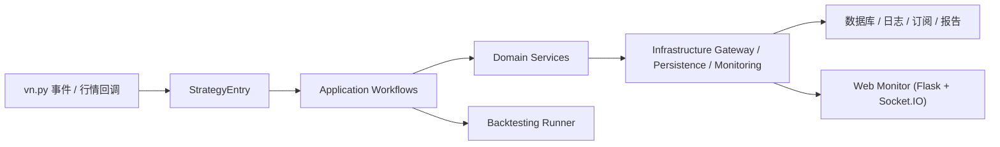

<!-- readme-gen:start:hero -->
<div align="center">


<p><strong>先把策略工程骨架搭稳，再把精力留给信号、选股、风控与执行。</strong></p>
<p>一个面向期权策略研发的 Python 模板仓库，内置分层架构、配置体系、回测入口、监控页面与 Docker 部署能力。</p>

</div>
<!-- readme-gen:end:hero -->

<!-- readme-gen:start:badges -->
<div align="center">


[](https://github.com/maroonxv/option-strategy-scaffold/actions/workflows/ci.yml)
[](https://github.com/maroonxv/option-strategy-scaffold/actions/workflows/docker-smoke.yml)


</div>
<!-- readme-gen:end:badges -->

<!-- readme-gen:start:tech-stack -->
<div align="center">


</div>
<!-- readme-gen:end:tech-stack -->

> [!WARNING]
> 本项目仅供个人学习及参考使用，不作为任何投资建议。

## 项目简介

`option-trading-infra` 是一个基于 `vn.py` 的期权策略脚手架，目标不是直接提供“现成盈利策略”，而是提供一套已经拆好层、配好配置、接好运行与监控入口的工程底座。

你可以在现有骨架上聚焦改造领域服务，例如选合约、信号计算、对冲、组合管理、风控与执行逻辑，而不必从零重复搭建工程基础设施。

## Agent-First Workflow

The recommended AGENT workflow is now built around `forge`, `strategy_spec.toml`, and structured command output.

1. Start with `option-scaffold forge --json` when you need to create or refresh AGENT assets.
2. Read `strategy_spec.toml` for high-level intent.
3. Read `.focus/context.json` for the current machine-readable context contract.
4. Use `.focus/*.md` only as human-readable navigation companions.
5. Edit only files inside the current editable surface.
6. Verify with `option-scaffold validate --json` and `option-scaffold focus test --json`.
7. Use `option-scaffold backtest --json` or `option-scaffold run --json` only when the task requires execution evidence or runtime behavior.

Machine-readable AGENT assets:

- `AGENTS_FOCUS.md`: canonical AGENT operating manual
- `strategy_spec.toml`: AGENT-facing intent spec
- `.focus/context.json`: current machine-readable context contract
- `focus/strategies/*/strategy.manifest.toml`: generated focus manifest
- `focus/packs/*/pack.toml`: pack ownership, tests, and AGENT notes
- `tests/TEST.md`: test plan plus latest acceptance summary
- `artifacts/validate/latest.json` / `artifacts/backtest/latest.json`: latest structured command outputs

<!-- readme-gen:start:highlights -->
## 工程亮点

| 维度 | 已内置内容 | 对开发的价值 |
| --- | --- | --- |
| 分层架构 | `application / domain / infrastructure` | 把策略编排、交易规则、外部依赖隔离开，便于持续演进 |
| 领域能力 | `selection / risk / execution / pricing / signal / hedging / combination` | 可以直接替换或扩展具体策略服务 |
| AGENT workflow | `strategy_spec + forge + .focus/context.json + artifacts` | Give AGENTs a stable protocol for context, editing boundaries, and verification |
| 工程配套 | `config/*.toml`、Docker Compose、Web 监控页 | 让参数管理、部署与观测有统一入口 |
| 质量保障 | `pytest` 测试骨架，当前仓库中已有 `113` 个 `test_*.py` 测试文件 | 做重构和新增策略时更有安全感 |

### 工程快照

- 运行时：默认 Docker 镜像基于 `Python 3.12`
- Web 监控：`Flask + Socket.IO`，默认端口 `5007`
- 默认部署：`runner + monitor + PostgreSQL`
- Unified CLI: `option-scaffold` (recommended AGENT entrypoint: `forge`; structured output: `--json`)
- 文档资产：`doc/` 下包含架构、开发说明与用户手册
<!-- readme-gen:end:highlights -->

<!-- readme-gen:start:architecture -->
## 架构概览



这套结构的核心思路是：让上层流程编排直接连接领域服务与基础设施，把策略变化更高频的部分留在领域层，把数据库、监控、订阅与日志等能力留在基础设施层。这样更方便你按策略需求快速替换单个模块。
<!-- readme-gen:end:architecture -->

<!-- readme-gen:start:quick-start -->
## 快速开始

### 方式一：推荐，使用 Docker Compose 启动完整栈

1. 复制部署环境变量模板：

```powershell
Copy-Item deploy/.env.example deploy/.env
```

2. 按需修改 `deploy/.env`，至少确认这些参数：

- `POSTGRES_USER`
- `POSTGRES_PASSWORD`
- `POSTGRES_DB`
- `APP_CONFIG_PATH`
- `APP_EXTRA_ARGS`
- `HOST_DATA_DIR`

3. 启动数据库、策略运行器和监控页面：

```powershell
docker compose --env-file deploy/.env -f deploy/docker-compose.yml up -d --build
```

4. 查看容器状态与策略日志：

```powershell
docker compose --env-file deploy/.env -f deploy/docker-compose.yml ps
docker compose --env-file deploy/.env -f deploy/docker-compose.yml logs -f runner
```

5. 打开监控页面：`http://localhost:5007`

6. 停止服务：

```powershell
docker compose --env-file deploy/.env -f deploy/docker-compose.yml down
```

### 方式二：本地开发调试

> 适合改代码、调试策略或跑局部流程；如果想快速得到完整的数据库 + 监控 + runner 联调环境，还是更推荐 Docker。

1. 创建虚拟环境、安装依赖并注册本地 CLI：

```powershell
python -m venv .venv
.\.venv\Scripts\Activate.ps1
pip install -r requirements.txt
pip install -e .
```

2. 复制环境变量模板并填写交易、数据库与通知相关配置：

```powershell
Copy-Item .env.example .env
```

3. Inspect the CLI and refresh AGENT assets:

```powershell
option-scaffold --help
option-scaffold --version
option-scaffold forge --json
option-scaffold focus show --json
```

4. Validate the current workspace through structured output:

```powershell
option-scaffold doctor --json
option-scaffold validate --config config/strategy_config.toml --json
option-scaffold focus test --json
```

5. 启动策略主入口（这里示例使用更安全的模拟交易模式）：

```powershell
option-scaffold run --mode standalone --config config/strategy_config.toml --paper
```

7. 如需单独启动监控页面：

```powershell
python src/web/app.py
```
<!-- readme-gen:end:quick-start -->

<!-- readme-gen:start:configuration -->
## 配置说明

最常改的配置文件如下：

- `config/strategy_config.toml`：策略主配置，决定策略类与核心参数
- `config/general/trading_target.toml`：交易标的定义
- `config/domain_service/**/*.toml`：领域服务参数，例如 `selection`、`risk`、`execution`、`pricing`
- `config/subscription/subscription.toml`：动态订阅配置
- `config/timeframe/*.toml`：多周期覆盖配置，可配合 `--override-config` 使用
- `config/logging/logging.toml`：日志配置

如果你是以“模板仓库”的方式开始新策略，建议优先遵循下面这条路径：

1. 先改 `config/general/trading_target.toml` 明确交易品种
2. 再改 `config/strategy_config.toml` 连接你的策略类与核心参数
3. 然后按需补齐 `domain_service` 相关 TOML
4. 最后在 `tests/` 中补上与你新增逻辑对应的用例
<!-- readme-gen:end:configuration -->

<!-- readme-gen:start:commands -->
## 常用命令

### 运行测试

```powershell
pytest -c config/pytest.ini
```

### Refresh AGENT assets

```powershell
option-scaffold forge --json
```

### Inspect current AGENT context

```powershell
option-scaffold focus show --json
```

### Validate current strategy config

```powershell
option-scaffold validate --config config/strategy_config.toml --json
```

### Run focus verification

```powershell
option-scaffold focus test --json
```

### 运行回测

```powershell
option-scaffold backtest --config config/strategy_config.toml --start 2025-01-01 --end 2025-03-01 --no-chart --json
```

### Start runtime workflow

```powershell
option-scaffold run --mode daemon --config config/strategy_config.toml --json
```

### 初始化新策略骨架

```powershell
option-scaffold init ema_breakout --destination example
```

### 创建按需装配的整仓库脚手架

```powershell
option-scaffold create alpha_lab -y
```

```powershell
option-scaffold create alpha_lab
```

如果想在顶层能力组之下继续细化二级子选项，也可以这样写：

```powershell
option-scaffold create alpha_lab --preset custom --with greeks-risk --with hedging --with-option vega-hedging --without-option delta-hedging --no-interactive
```

`create` 会在生成前自动校验二级子选项之间的依赖与禁配关系，并直接拒绝语义冲突的组合。
在交互模式下，如果只是缺少依赖或命中可自动处理的禁配组合，向导会先展示“自动修复预览”，再让你决定是否直接应用修复。

### 浏览内置示例

```powershell
option-scaffold examples
option-scaffold examples ema_cross_example
```
<!-- readme-gen:end:commands -->

<!-- readme-gen:start:tree -->
## Repository Layout

```text
📦 option-strategy-scaffold
├─ pyproject.toml               Python package metadata and CLI entrypoint
├─ .focus/                      Current focus pointer plus generated navigation assets
├─ config/                      Strategy, domain-service, subscription, logging, and timeframe config
│  ├─ domain_service/           Domain-service parameters
│  ├─ general/                  Shared runtime config
│  ├─ logging/                  Logging config
│  ├─ subscription/             Subscription config
│  └─ timeframe/                Timeframe override config
├─ deploy/                      Dockerfile, Compose, and initialization scripts
├─ doc/                         Architecture docs, development plans, and user manuals
├─ focus/                       Focus manifests and pack metadata
├─ src/
│  ├─ cli/                      Unified CLI entrypoint and command wrappers
│  ├─ backtesting/              Backtest CLI and runner
│  ├─ main/                     Main entrypoint, startup flow, and process control
│  ├─ strategy/                 Strategy core code (application / domain / infrastructure)
│  └─ web/                      Monitoring UI and read-only state readers
└─ tests/                       Automated tests for backtesting, main, strategy, and web
```
<!-- readme-gen:end:tree -->

<!-- readme-gen:start:docs -->
## 文档导航

- `doc/architecture/architecture.md`：整体架构说明
- `doc/dev/strategy_detailed_design.md`：策略实现细节
- `doc/dev/main_entrance_detailed_design.md`：主入口与运行流程
- `doc/dev/backtesting_detailed_design.md`：回测模块设计
- `doc/manual/README.md`：用户文档入口
- `doc/manual/非技术人员操作手册.md`：偏使用视角的操作手册
<!-- readme-gen:end:docs -->

<!-- readme-gen:start:license -->
## License

本项目采用 [GNU Affero General Public License v3.0](LICENSE)（`AGPL-3.0`）。如果你基于本项目继续分发或提供网络服务，请在使用前认真阅读许可证全文并自行确认合规要求。
<!-- readme-gen:end:license -->

<!-- readme-gen:start:footer -->
<div align="center">

<sub>Built for strategy research, backtesting, monitoring and fast iteration.</sub>


</div>
<!-- readme-gen:end:footer -->


