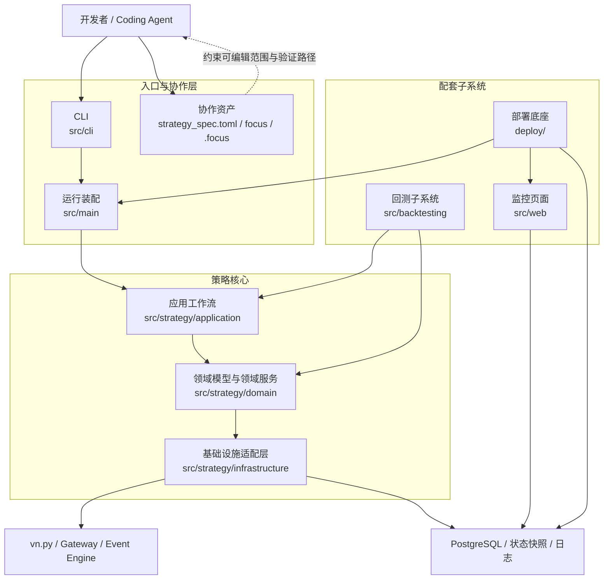
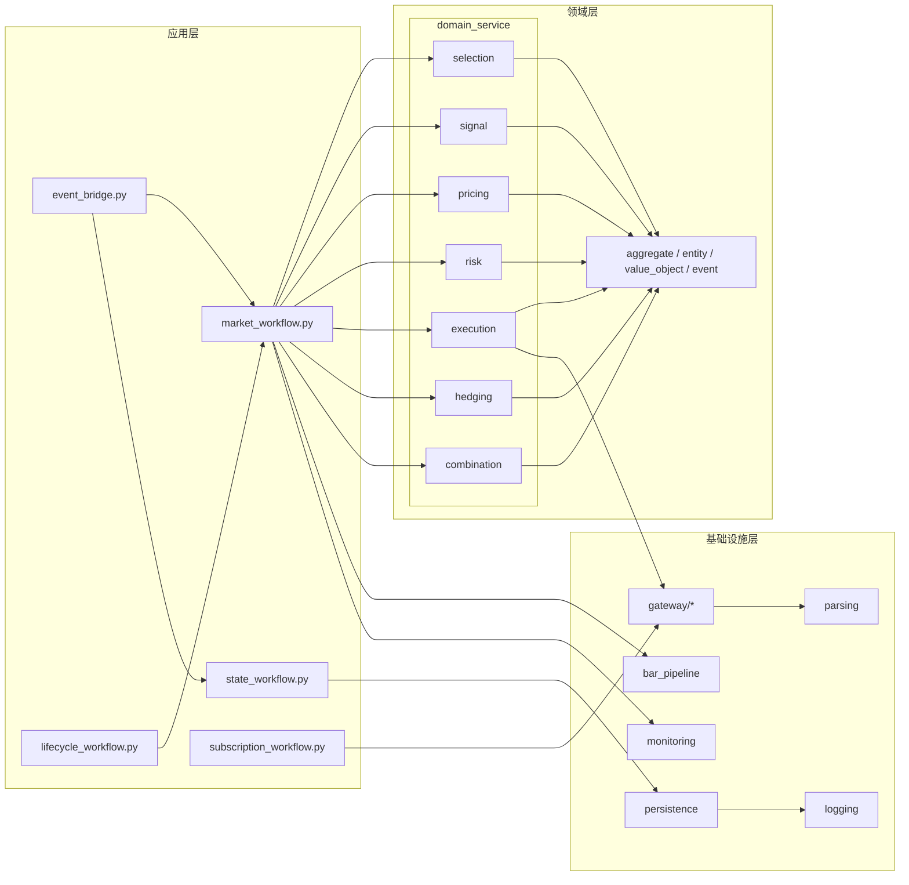
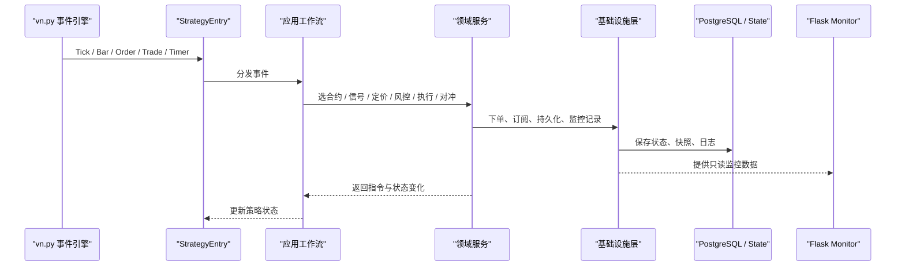
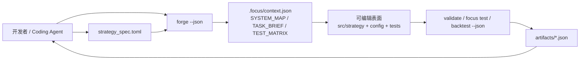

<!-- readme-gen:start:hero -->
<div align="center">


<p><strong>OptionForge：面向 Coding Agent 的期权交易策略研发脚手架。</strong></p>
<p>基于 <code>vn.py</code>、<code>PostgreSQL</code>、<code>Flask</code> 与 <code>Docker</code> 预置领域建模、运行支撑与部署底座，并内建面向 Agent 的上下文协议、编辑边界与验证回路，让你更顺手地通过 agentic coding 持续迭代期权交易策略。</p>
<p><a href="./README_EN.md">英文版</a></p>

</div>
<!-- readme-gen:end:hero -->

<!-- readme-gen:start:badges -->
<div align="center">


[](https://github.com/maroonxv/OptionForge/actions/workflows/docker-smoke.yml)


</div>
<!-- readme-gen:end:badges -->

<!-- readme-gen:start:tech-stack -->
<div align="center">


</div>
<!-- readme-gen:end:tech-stack -->

> [!WARNING]
> 本项目仅供个人学习及参考使用，不作为任何投资建议。

## 项目简介

`OptionForge` 是一个基于 `vn.py` 的期权策略脚手架，目标不是直接提供“现成盈利策略”，而是提供一套已经拆好层、配好配置、接好运行与监控入口，并对 Coding Agent 协作友好的工程底座。

你可以在现有骨架上聚焦改造领域服务，例如选合约、信号计算、对冲、组合管理、风控与执行逻辑，而不必从零重复搭建工程基础设施。

仓库把策略意图、机器可读上下文、可编辑范围和验证产物显式化，方便 Agent 更稳定地理解任务、生成改动并回传可核对的结果。

## Agent 优先工作流

这个仓库把 Coding Agent 视为一等公民：`forge` 用来生成或刷新协作资产，`strategy_spec.toml` 用来描述策略意图，结构化命令输出则负责把验证与运行结果稳定地交给 Agent 消费。

从源码目录运行时，统一使用 `python -m src.cli.app ...`；如果已经安装到当前环境，也可以使用等价简写 `optionforge ...`。


机器可读的 AGENT 资产：

- `AGENTS_FOCUS.md`：AGENT 操作手册
- `strategy_spec.toml`：面向 AGENT 的策略意图说明
- `.focus/context.json`：当前机器可读上下文契约
- `focus/strategies/*/strategy.manifest.toml`：生成出的策略焦点清单
- `focus/packs/*/pack.toml`：Pack 归属、测试与 AGENT 备注
- `tests/TEST.md`：由 `forge` 生成的测试计划与最近一次验收摘要
- `artifacts/validate/latest.json` / `artifacts/backtest/latest.json`：最近一次结构化命令输出


<!-- readme-gen:start:architecture -->
## 架构概览

这个脚手架不是单一策略脚本，而是围绕“运行入口、策略核心、回测子系统、监控页面、部署底座、Agent 协作资产”组织的一套工程骨架。它的目标是让你既能快速替换具体策略逻辑，也能让人和 Agent 都清楚地知道系统从哪里进入、数据如何流动、应该改哪些文件、又该如何验证结果。

### 1. 系统总览



### 2. 策略核心分层



这里采用的是比较直接的分层方式：应用层负责流程编排，领域层承载高频变化的交易规则，基础设施层处理网关、持久化、监控和解析。上层工作流直接调用具体领域服务与基础设施，而不是再额外包一层 `facade` 或 `coordinator`，这样策略演进时边界更清晰，Agent 也更容易定位该改动的真实落点。

### 3. 运行时事件链路



这条链路体现了一个关键设计点：无论是真实运行还是回测，核心策略逻辑都尽量复用同一套应用工作流与领域服务，只是在事件来源和执行环境上切换。这样你新增信号、改风控或接入新的执行逻辑时，不需要重写整条链路。

### 4. Agent 协作闭环



这部分是本项目与普通策略模板最不一样的地方：除了代码本身，仓库还显式维护了策略意图、机器可读上下文、可编辑表面和结构化验证产物。对人来说，这让协作路径更清楚；对 Agent 来说，这意味着它能更稳定地理解需求、控制改动范围并输出可核对的结果。

### 5. 设计取向

| 设计取向 | 在仓库中的落地方式 |
| --- | --- |
| 分层解耦 | `application / domain / infrastructure` 明确拆开流程、规则和外部依赖 |
| 高变更逻辑聚焦领域层 | `selection / signal / pricing / risk / execution / hedging / combination` 集中承载策略差异 |
| 工作流直连真实服务 | 应用层直接编排具体领域服务与基础设施，不再额外叠加 `facade` / `coordinator` |
| 运行与回测复用核心逻辑 | `src/backtesting` 复用策略核心，只替换数据来源与执行场景 |
| Agent 友好 | `strategy_spec.toml`、`.focus/context.json`、`artifacts/*.json` 共同提供上下文、边界与验收闭环 |
<!-- readme-gen:end:architecture -->

<!-- readme-gen:start:quick-start -->
> [!IMPORTANT]
> Docker 部署只支持 `deploy\deploy-main.ps1` 作为入口，环境文件应放在 `.worktrees/deploy-main/.env`。默认宿主机日志目录为 `.worktrees/deploy-main/logs/*`，也可以通过 `HOST_LOGS_DIR` 覆盖。

| 宿主机目录 | 容器目录 | 内容 | 文件名示例 |
| --- | --- | --- | --- |
| `logs/runner` | `/app/logs/runner` | runner Python 日志 | `runner_20260323.log`、`runner_15m_20260323.log` |
| `logs/monitor` | `/app/logs/monitor` | monitor Web 日志 | `monitor_20260323.log` |
| `logs/postgresql` | `/var/log/postgresql` | PostgreSQL 文件日志 | `postgresql-2026-03-23.log` |
| `logs/vnpy` | `/app/logs/vnpy` | vn.py 自身日志 | `vt_20260323.log` |
## 快速开始

### 方式一：推荐，使用 Docker Compose 启动完整栈

1. 复制部署环境变量模板：

```powershell
Copy-Item deploy/.env.example .worktrees/deploy-main/.env
```

2. 按需修改 `.worktrees/deploy-main/.env`，至少确认这些参数：

- `POSTGRES_USER`
- `POSTGRES_PASSWORD`
- `POSTGRES_DB`
- `APP_CONFIG_PATH`
- `APP_EXTRA_ARGS`
- `HOST_DATA_DIR`
- `HOST_LOGS_DIR`

3. 启动数据库、策略运行器和监控页面：

```powershell
powershell -ExecutionPolicy Bypass -File deploy\deploy-main.ps1 `
  -Services postgres,runner,monitor
```

4. 查看容器状态与策略日志：

```powershell
docker compose --project-directory .worktrees/deploy-main/deploy --env-file .worktrees/deploy-main/.env -f .worktrees/deploy-main/deploy/docker-compose.yml ps
docker compose --project-directory .worktrees/deploy-main/deploy --env-file .worktrees/deploy-main/.env -f .worktrees/deploy-main/deploy/docker-compose.yml logs -f runner
```

5. 打开监控页面：`http://localhost:5007`

6. 停止服务：

```powershell
docker compose --project-directory .worktrees/deploy-main/deploy --env-file .worktrees/deploy-main/.env -f .worktrees/deploy-main/deploy/docker-compose.yml down
```

### 方式二：本地开发调试

> 适合改代码、调试策略或跑局部流程；如果想快速得到完整的数据库 + 监控 + runner 联调环境，还是更推荐 Docker。

1. 创建虚拟环境、安装依赖并注册本地 CLI：

```powershell
python -m venv .venv
.\.venv\Scripts\Activate.ps1
pip install -r requirements.txt
pip install -e .
```

2. 复制环境变量模板并填写交易、数据库与通知相关配置：

```powershell
Copy-Item .env.example .env
```

3. 查看 CLI 并刷新 AGENT 协作资产：

```powershell
python -m src.cli.app --help
python -m src.cli.app --version
python -m src.cli.app forge --json
python -m src.cli.app focus show --json
```

4. 通过结构化输出校验当前工作区：

```powershell
python -m src.cli.app doctor --json
python -m src.cli.app validate --config config/strategy_config.toml --json
python -m src.cli.app focus test --json
```

5. 启动策略主入口（这里示例使用更安全的模拟交易模式）：

```powershell
python -m src.cli.app run --mode standalone --config config/strategy_config.toml --paper
```

6. 如需单独启动监控页面：

```powershell
python src/web/app.py
```
<!-- readme-gen:end:quick-start -->

<!-- readme-gen:start:configuration -->
## 配置说明

最常改的配置文件如下：

- `config/strategy_config.toml`：策略主配置，决定策略类与核心参数
- `config/general/trading_target.toml`：交易标的定义
- `config/domain_service/**/*.toml`：领域服务参数，例如 `selection`、`risk`、`execution`、`pricing`
- `config/subscription/subscription.toml`：动态订阅配置
- `config/timeframe/*.toml`：多周期覆盖配置，可配合 `--override-config` 使用
- `config/logging/logging.toml`：日志配置

如果你是以“模板仓库”的方式开始新策略，建议优先遵循下面这条路径：

1. 先改 `config/general/trading_target.toml` 明确交易品种
2. 再改 `config/strategy_config.toml` 连接你的策略类与核心参数
3. 然后按需补齐 `domain_service` 相关 TOML
4. 最后在 `tests/` 中补上与你新增逻辑对应的用例
<!-- readme-gen:end:configuration -->

<!-- readme-gen:start:commands -->
## 常用命令

### 运行测试

```powershell
pytest -c config/pytest.ini
```

### 刷新 AGENT 协作资产

```powershell
python -m src.cli.app forge --json
```

### 查看当前 AGENT 上下文

```powershell
python -m src.cli.app focus show --json
```

### 校验当前策略配置

```powershell
python -m src.cli.app validate --config config/strategy_config.toml --json
```

### 运行 Focus 校验

```powershell
python -m src.cli.app focus test --json
```

### 运行回测

```powershell
python -m src.cli.app backtest --config config/strategy_config.toml --start 2025-01-01 --end 2025-03-01 --no-chart --json
```

### 启动运行时工作流

```powershell
python -m src.cli.app run --mode daemon --config config/strategy_config.toml --json
```

### 初始化新策略骨架

```powershell
python -m src.cli.app init ema_breakout --destination example
```

### 创建按需装配的整仓库脚手架

```powershell
python -m src.cli.app create alpha_lab -y
```

```powershell
python -m src.cli.app create alpha_lab
```

如果想在顶层能力组之下继续细化二级子选项，也可以这样写：

```powershell
python -m src.cli.app create alpha_lab --preset custom --with greeks-risk --with hedging --with-option vega-hedging --without-option delta-hedging --no-interactive
```

`create` 会在生成前自动校验二级子选项之间的依赖与禁配关系，并直接拒绝语义冲突的组合。
在交互模式下，如果只是缺少依赖或命中可自动处理的禁配组合，向导会先展示“自动修复预览”，再让你决定是否直接应用修复。

### 浏览内置示例

```powershell
python -m src.cli.app examples
python -m src.cli.app examples ema_cross_example
```
<!-- readme-gen:end:commands -->

<!-- readme-gen:start:tree -->
## 仓库结构

```text
📦 OptionForge
├─ pyproject.toml               Python 包元数据与 CLI 入口
├─ .focus/                      当前焦点指针与生成出的导航资产
├─ config/                      策略、领域服务、订阅、日志与周期配置
│  ├─ domain_service/           领域服务参数
│  ├─ general/                  通用运行配置
│  ├─ logging/                  日志配置
│  ├─ subscription/             订阅配置
│  └─ timeframe/                多周期覆盖配置
├─ deploy/                      Dockerfile、Compose 与初始化脚本
├─ docs/                        手册、规划与分享材料
├─ focus/                       策略焦点清单与 Pack 元数据
├─ src/
│  ├─ cli/                      统一 CLI 入口与命令封装
│  ├─ backtesting/              回测 CLI 与执行器
│  ├─ main/                     主入口、启动装配与进程控制
│  ├─ strategy/                 策略核心代码（应用层 / 领域层 / 基础设施层）
│  └─ web/                      监控界面与只读状态读取器
└─ tests/                       回测、主入口、策略与 Web 的自动化测试
```
<!-- readme-gen:end:tree -->

<!-- readme-gen:start:docs -->
## 文档导航

- `docs/manual/cli-usage.md`：CLI 使用说明
- `docs/plan/2026-03-08-cli-productization-plan.md`：CLI 产品化规划
- `docs/plan/2026-03-09-python-interactive-cli-wizard-plan.md`：交互式 CLI 向导规划
- `docs/slides/OptionForge-internal-share.html`：项目内部分享材料
- `.focus/SYSTEM_MAP.md`：当前系统地图
- `.focus/TASK_BRIEF.md`：当前任务简报
- `.focus/TEST_MATRIX.md`：当前焦点测试矩阵
<!-- readme-gen:end:docs -->

<!-- readme-gen:start:license -->
## 许可证

本项目采用 [GNU Affero General Public License v3.0](LICENSE)（`AGPL-3.0`）。如果你基于本项目继续分发或提供网络服务，请在使用前认真阅读许可证全文并自行确认合规要求。
<!-- readme-gen:end:license -->

<!-- readme-gen:start:footer -->
<div align="center">

<sub>为策略研究、回测、监控与快速迭代而生。</sub>


</div>
<!-- readme-gen:end:footer -->


