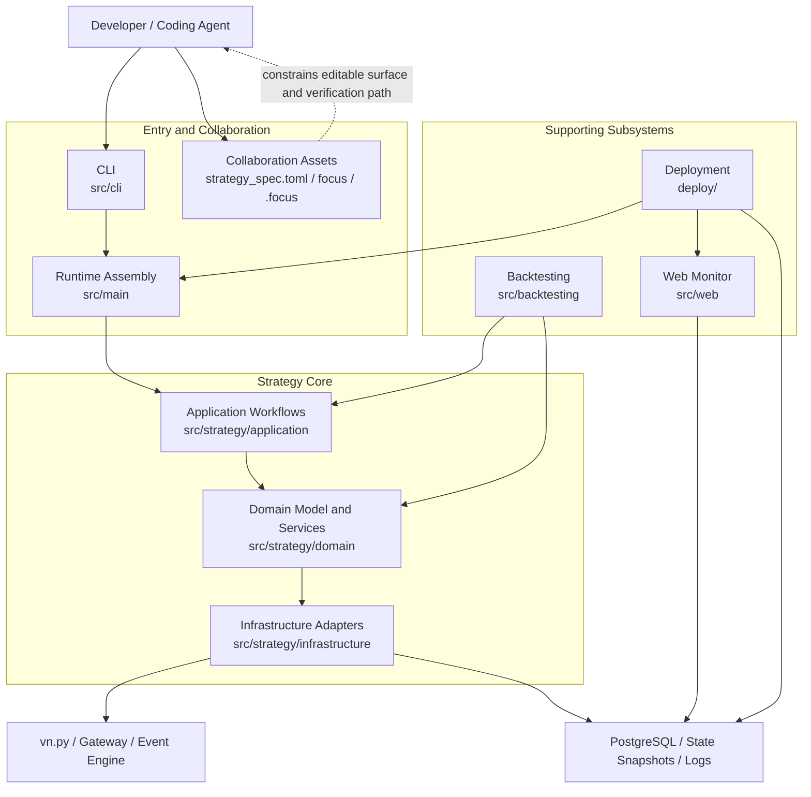
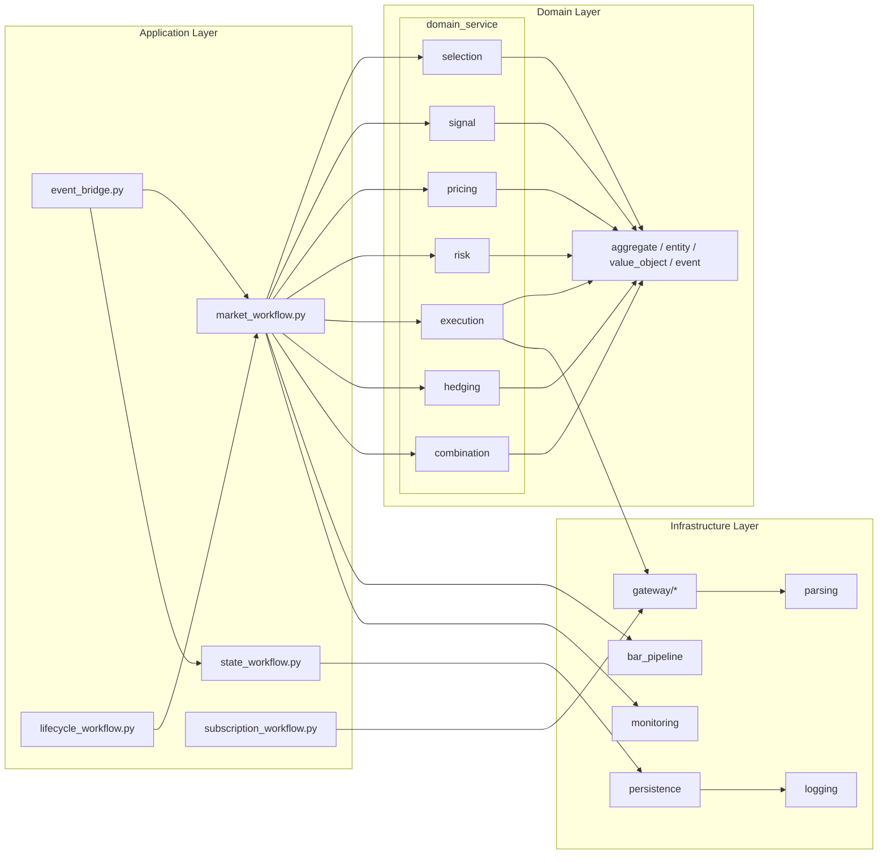
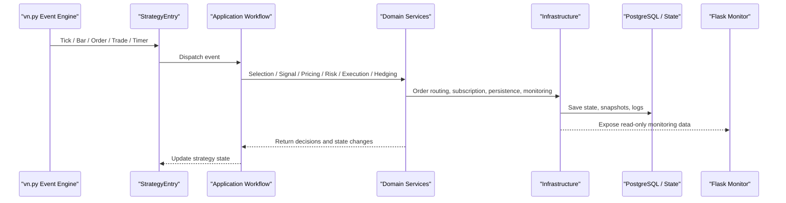
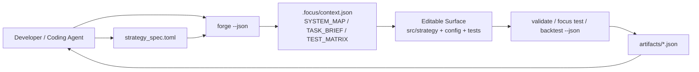

<div align="center">


<p><strong>OptionForge: an option strategy framework built for Coding Agents.</strong></p>
<p>Built on <code>vn.py</code>, <code>PostgreSQL</code>, <code>Flask</code>, and <code>Docker</code>, it ships with domain modeling, runtime support, and deployment foundations, plus explicit Agent-facing context contracts, editable boundaries, and verification loops so you can iterate on option strategies through agentic coding.</p>
<p><a href="./README.md">Chinese Version</a></p>

</div>

<div align="center">


[](https://github.com/maroonxv/OptionForge/actions/workflows/docker-smoke.yml)


</div>

<div align="center">


</div>

> [!WARNING]
> This project is for personal learning and reference only. It is not investment advice.

## Overview

`OptionForge` is a `vn.py`-based framework for option strategy development. Its goal is not to ship a ready-made profitable strategy, but to provide an engineering foundation with clear layers, configuration structure, runtime entrypoints, monitoring, and Agent-friendly collaboration assets.

You can focus on replacing or extending domain logic such as contract selection, signal generation, hedging, combination management, risk control, and execution without rebuilding the surrounding infrastructure from scratch.

The repository makes strategy intent, machine-readable context, editable surface, and verification outputs explicit so both humans and Agents can understand tasks more reliably and review outcomes with less guesswork.

## Agent-First Workflow

This repository treats Coding Agents as a first-class collaborator: `forge` creates or refreshes collaboration assets, `strategy_spec.toml` captures strategy intent, and structured command output gives Agents stable data for validation and runtime evidence.

From a source checkout, use `python -m src.cli.app ...`. If the package is installed into the active environment, the equivalent short alias is `optionforge ...`.

Machine-readable AGENT assets:

- `AGENTS_FOCUS.md`: AGENT operating manual
- `strategy_spec.toml`: Agent-facing strategy intent spec
- `.focus/context.json`: current machine-readable context contract
- `focus/strategies/*/strategy.manifest.toml`: generated focus manifest
- `focus/packs/*/pack.toml`: pack ownership, tests, and AGENT notes
- `tests/TEST.md`: test plan and latest acceptance summary generated by `forge`
- `artifacts/validate/latest.json` / `artifacts/backtest/latest.json`: latest structured command outputs

## Architecture Overview

This scaffold is not a single strategy script. It is an engineering skeleton organized around runtime entrypoints, strategy core layers, a backtesting subsystem, a monitoring UI, deployment support, and Agent collaboration assets. The intent is to make it easy to swap strategy logic while keeping the system legible for both humans and Agents.

### 1. System Overview



### 2. Strategy Core Layering



The layering is intentionally direct: application workflows orchestrate behavior, the domain layer holds high-change trading rules, and infrastructure owns gateways, persistence, monitoring, and parsing. Workflows call concrete domain services and infrastructure directly instead of hiding them behind extra `facade` or `coordinator` layers. That keeps the modification surface easier to understand for both engineers and Agents.

### 3. Runtime Event Flow



This is the key runtime design decision: live trading and backtesting aim to reuse the same application workflows and domain services as much as possible, while only switching the event source and execution environment. That lowers the cost of changing signals, risk rules, or execution logic later.

### 4. Agent Collaboration Loop



This loop is what makes the repository more Agent-friendly than a typical strategy template: the project stores not just code, but also explicit intent, machine-readable context, editable boundaries, and structured verification artifacts. Humans get a clearer workflow, and Agents get a more stable protocol for safe automation.

### 5. Design Priorities

| Design Priority | How it is realized in the repo |
| --- | --- |
| Layered separation | `application / domain / infrastructure` cleanly separates flow orchestration, trading rules, and external dependencies |
| High-change logic stays in the domain | `selection / signal / pricing / risk / execution / hedging / combination` concentrate strategy-specific behavior |
| Workflows call real services directly | The application layer orchestrates concrete services and adapters without extra `facade` / `coordinator` layers |
| Runtime and backtest reuse the same core | `src/backtesting` reuses the strategy core and mainly swaps data source and execution context |
| Agent friendliness | `strategy_spec.toml`, `.focus/context.json`, and `artifacts/*.json` provide context, boundaries, and verification evidence |

## Quick Start

> [!IMPORTANT]
> Docker deployment is only supported through `deploy\deploy-main.ps1`, and the environment file must live at `.worktrees/deploy-main/.env`. By default, host log files are written under `.worktrees/deploy-main/logs/*`, and you can override that with `HOST_LOGS_DIR`.

| Host directory | Container directory | Content | Example filenames |
| --- | --- | --- | --- |
| `logs/runner` | `/app/logs/runner` | runner Python logs | `runner_20260323.log`, `runner_15m_20260323.log` |
| `logs/monitor` | `/app/logs/monitor` | monitor Web logs | `monitor_20260323.log` |
| `logs/postgresql` | `/var/log/postgresql` | PostgreSQL file logs | `postgresql-2026-03-23.log` |
| `logs/vnpy` | `/app/logs/vnpy` | vn.py native logs | `vt_20260323.log` |

### Option 1: Recommended, start the full stack with Docker Compose

1. Copy the deployment environment template:

```powershell
Copy-Item deploy/.env.example .worktrees/deploy-main/.env
```

2. Adjust `.worktrees/deploy-main/.env` as needed, especially:

- `POSTGRES_USER`
- `POSTGRES_PASSWORD`
- `POSTGRES_DB`
- `APP_CONFIG_PATH`
- `APP_EXTRA_ARGS`
- `HOST_DATA_DIR`
- `HOST_LOGS_DIR`

3. Start PostgreSQL, the runner, and the monitoring UI:

```powershell
powershell -ExecutionPolicy Bypass -File deploy\deploy-main.ps1 `
  -Services postgres,runner,monitor
```

4. Check container status and runner logs:

```powershell
docker compose --project-directory .worktrees/deploy-main/deploy --env-file .worktrees/deploy-main/.env -f .worktrees/deploy-main/deploy/docker-compose.yml ps
docker compose --project-directory .worktrees/deploy-main/deploy --env-file .worktrees/deploy-main/.env -f .worktrees/deploy-main/deploy/docker-compose.yml logs -f runner
```

5. Open the monitoring page: `http://localhost:5007`

6. Stop the stack:

```powershell
docker compose --project-directory .worktrees/deploy-main/deploy --env-file .worktrees/deploy-main/.env -f .worktrees/deploy-main/deploy/docker-compose.yml down
```

### Option 2: Local development and debugging

> Use this mode when you want to edit code, debug strategies, or run partial workflows locally. If you want a ready-to-use runner + monitor + database stack, Docker is still the easier path.

1. Create a virtual environment, install dependencies, and register the local CLI:

```powershell
python -m venv .venv
.\.venv\Scripts\Activate.ps1
pip install -r requirements.txt
pip install -e .
```

2. Copy the environment template and fill in trading, database, and notification settings:

```powershell
Copy-Item .env.example .env
```

3. Inspect the CLI and refresh AGENT collaboration assets:

```powershell
python -m src.cli.app --help
python -m src.cli.app --version
python -m src.cli.app forge --json
python -m src.cli.app focus show --json
```

4. Validate the current workspace through structured output:

```powershell
python -m src.cli.app doctor --json
python -m src.cli.app validate --config config/strategy_config.toml --json
python -m src.cli.app focus test --json
```

5. Start the runtime entrypoint in a safer paper-trading example mode:

```powershell
python -m src.cli.app run --mode standalone --config config/strategy_config.toml --paper
```

6. Launch the monitoring UI separately if needed:

```powershell
python src/web/app.py
```

## Configuration

The files you will change most often are:

- `config/strategy_config.toml`: main strategy config, including strategy class and core parameters
- `config/general/trading_target.toml`: trading target definition
- `config/domain_service/**/*.toml`: domain-service configuration such as `selection`, `risk`, `execution`, and `pricing`
- `config/subscription/subscription.toml`: dynamic subscription configuration
- `config/timeframe/*.toml`: timeframe override config, often used with `--override-config`
- `config/logging/logging.toml`: logging configuration

If you start from this repository as a template, the recommended order is:

1. Update `config/general/trading_target.toml` to define the market and instruments
2. Update `config/strategy_config.toml` to connect your strategy class and core parameters
3. Fill in `config/domain_service` TOML files as needed
4. Add or update tests that cover your new logic

## Common Commands

### Run tests

```powershell
pytest -c config/pytest.ini
```

### Refresh AGENT collaboration assets

```powershell
python -m src.cli.app forge --json
```

### Inspect the current AGENT context

```powershell
python -m src.cli.app focus show --json
```

### Validate the current strategy config

```powershell
python -m src.cli.app validate --config config/strategy_config.toml --json
```

### Run Focus verification

```powershell
python -m src.cli.app focus test --json
```

### Run a backtest

```powershell
python -m src.cli.app backtest --config config/strategy_config.toml --start 2025-01-01 --end 2025-03-01 --no-chart --json
```

### Start the runtime workflow

```powershell
python -m src.cli.app run --mode daemon --config config/strategy_config.toml --json
```

### Initialize a new strategy scaffold

```powershell
python -m src.cli.app init ema_breakout --destination example
```

### Create a full repo scaffold with selective capabilities

```powershell
python -m src.cli.app create alpha_lab -y
```

```powershell
python -m src.cli.app create alpha_lab
```

If you want to refine second-level options under top-level capability groups, you can also do:

```powershell
python -m src.cli.app create alpha_lab --preset custom --with greeks-risk --with hedging --with-option vega-hedging --without-option delta-hedging --no-interactive
```

`create` validates dependencies and mutual exclusions between second-level options before rendering anything, and rejects semantically conflicting combinations directly.
In interactive mode, if the issue is auto-fixable, the wizard first shows an auto-fix preview and then lets you decide whether to apply it.

### Browse built-in examples

```powershell
python -m src.cli.app examples
python -m src.cli.app examples ema_cross_example
```

## Repository Layout

```text
📦 OptionForge
├─ pyproject.toml               Python package metadata and CLI entrypoint
├─ .focus/                      Current focus pointer and generated navigation assets
├─ config/                      Strategy, domain-service, subscription, logging, and timeframe config
│  ├─ domain_service/           Domain-service parameters
│  ├─ general/                  Shared runtime config
│  ├─ logging/                  Logging config
│  ├─ subscription/             Subscription config
│  └─ timeframe/                Timeframe override config
├─ deploy/                      Dockerfile, Compose, and initialization scripts
├─ docs/                        Manuals, plans, and sharing materials
├─ focus/                       Focus manifests and pack metadata
├─ src/
│  ├─ cli/                      Unified CLI entrypoint and command wrappers
│  ├─ backtesting/              Backtest CLI and runner
│  ├─ main/                     Main entrypoint, startup assembly, and process control
│  ├─ strategy/                 Strategy core code (application / domain / infrastructure)
│  └─ web/                      Monitoring UI and read-only state readers
└─ tests/                       Automated tests for backtesting, main, strategy, and web
```

## Documentation

- `docs/manual/cli-usage.md`: CLI usage guide
- `docs/plan/2026-03-08-cli-productization-plan.md`: CLI productization plan
- `docs/plan/2026-03-09-python-interactive-cli-wizard-plan.md`: interactive CLI wizard plan
- `docs/slides/OptionForge-internal-share.html`: internal project sharing deck
- `.focus/SYSTEM_MAP.md`: current system map
- `.focus/TASK_BRIEF.md`: current task brief
- `.focus/TEST_MATRIX.md`: current focus test matrix

## License

This project is licensed under [GNU Affero General Public License v3.0](LICENSE) (`AGPL-3.0`). If you distribute a derivative or provide network access based on this project, please read the full license text carefully and confirm compliance requirements on your own.

<div align="center">

<sub>Built for strategy research, backtesting, monitoring, and fast iteration.</sub>


</div>
