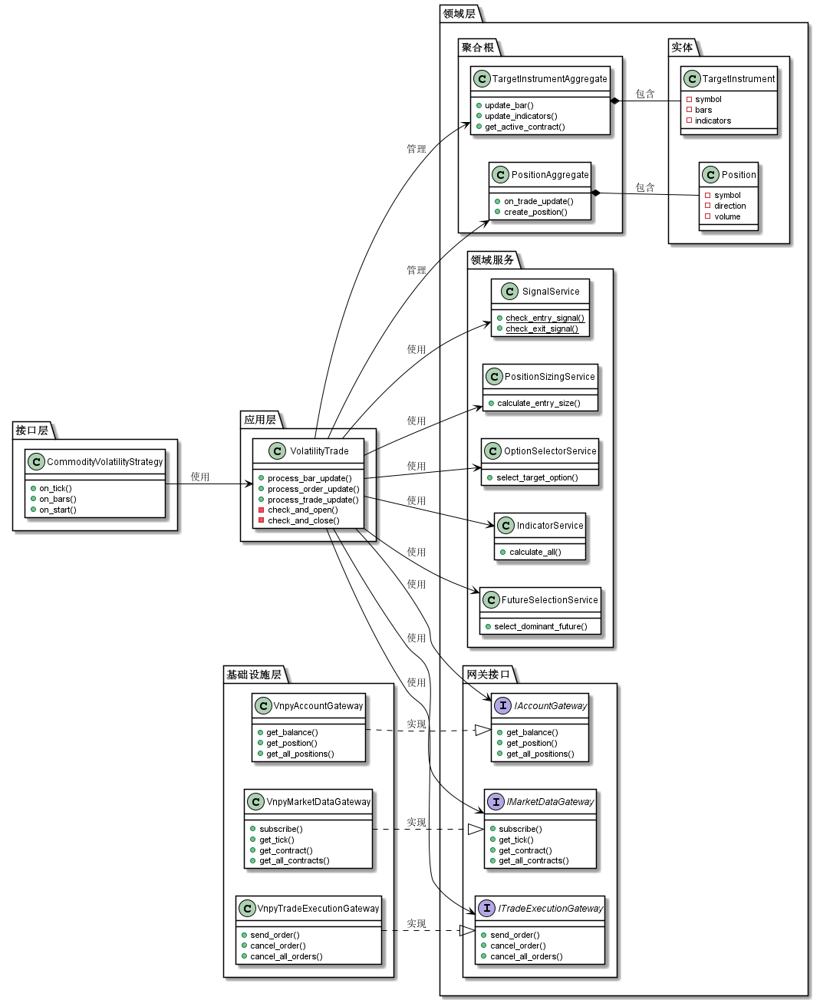
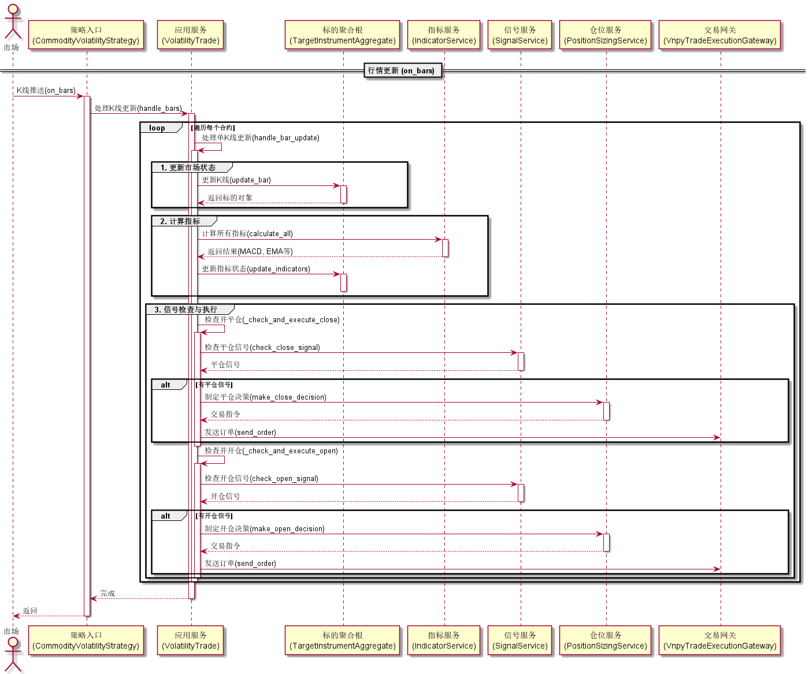
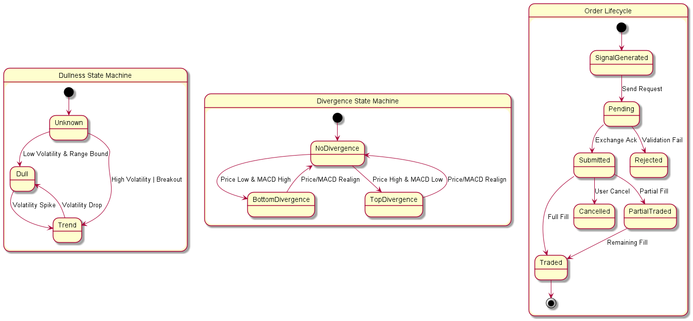

# 策略架构文档

本文档详细介绍了商品卖权震荡策略（Commodity Put Option Oscillation Strategy）的软件架构。本策略采用 **领域驱动设计 (DDD)** 的思想进行分层，并结合量化交易的实时性要求采用了 **实用主义 (Pragmatic)** 的实现方式。

## 1. 领域驱动设计 (DDD)

本章主要介绍系统的静态结构和分层设计，旨在实现业务逻辑与基础设施（VnPy 框架）的解耦。

### 1.1 类图 (Class Diagram)

下图展示了系统各层的核心类及其关系。Interface Layer 负责适配 VnPy，Application Layer 负责编排流程，Domain Layer 包含核心业务逻辑。

### 1.2 接口层 (Interface Layer) / 适配层
*   **文件**: `src/strategy/macd_td_index_strategy.py`
*   **职责**: 
    *   作为 VnPy `StrategyTemplate`（来自 `vnpy_portfoliostrategy`）的子类，充当系统入口。
    *   **不包含核心业务逻辑**。
    *   负责参数解析、初始化 Application Service。
    *   将 VnPy 的回调（`on_tick`, `on_bar`, `on_order`）转发给 Application Service。

### 1.3 应用层 (Application Layer)
*   **文件**: `src/strategy/application/volatility_trade.py`
*   **职责**:
    *   **编排 (Orchestration)**: 协调领域对象和基础设施服务。
    *   **事务边界**: 控制一次行情更新（Tick/Bar）的处理流程：更新数据 -> 计算指标 -> 生成信号 -> 执行交易。
    *   **依赖注入**: 在初始化时接收 `strategy_context`，并组装 Gateway 和 Service。

### 1.4 领域层 (Domain Layer)
这是系统的核心，包含所有业务规则和状态。

#### 1.4.1 聚合根 (Aggregates)
*   **TargetInstrumentAggregate**:
    *   管理行情数据（K线容器）和计算出的指标状态（MACD, EMA等）。
    *   这是一个**只读/状态**聚合根，主要用于决策支持。
*   **PositionAggregate**:
    *   管理策略持仓 (`Position`) 和活动订单 (`Order`)。
    *   包含**状态变更**逻辑，如更新持仓盈亏、处理订单成交事件。

#### 1.4.2 领域服务 (Domain Services)
领域服务封装了核心业务逻辑，通常是无状态的纯函数或服务类。

| 服务名称 | 文件路径 | 职责描述 | 核心方法 |
| :--- | :--- | :--- | :--- |
| **FutureSelectionService** | `domain_service/future_selection_service.py` | **主力合约选择**。 基于“7天规则”判断是否切换到次月合约。 | `select_dominant_contract(contracts, current_date)`: - 若到期日 > 7天，选当月。 - 若到期日 <= 7天，选次月。 |
| **IndicatorService** | `domain_service/indicator_service.py` | **指标计算外观 (Facade)**。 协调 MACD, TD, EMA 计算服务，生成指标快照。 | `calculate_all(instrument, ...)`: - 调用 `MacdCalculatorService` - 调用 `TdCalculatorService` - 调用 `EmaCalculatorService` - 返回 `IndicatorResultDTO` |
| **OptionSelectorService** | `domain_service/option_selector_service.py` | **期权合约筛选**。 根据流动性和虚值程度筛选目标期权。 | `select_option(contracts, option_type, ...)`: - 过滤流动性差的合约。 - 计算虚值程度 (Diff1)。 - 选择虚值第 N 档 (默认4档)。 |
| **SignalService** | `domain_service/signal_service.py` | **信号判断逻辑**。 根据指标状态判断开平仓信号 (纯逻辑)。 | `check_open_signal(instrument)`: - 判断钝化 + TD 8/9。 - 判断背离确认。 `check_close_signal(position, instrument)`: - 判断止盈/止损条件。 |
| **PositionSizingService** | `domain_service/position_sizing_service.py` | **仓位管理**。 计算开仓数量，执行风控检查。 | `make_open_decision(account_balance, ...)`: - 检查最大持仓限制。 - 根据资金比例计算手数。 - 生成 `OrderInstruction`。 |

#### 1.4.3 值对象 (Value Objects)
*   为了保证类型安全和代码可读性，广泛使用了值对象，如 `MACDValue`, `DullnessState`, `SignalType`。

#### 1.4.4 接口 (Interfaces)
定义在 `src/strategy/domain/demand_interface`，声明了策略对外部基础设施的需求。

| 接口名称 | 文件路径 | 职责描述 | 核心方法 |
| :--- | :--- | :--- | :--- |
| **IAccountGateway** | `account_interface.py` | **账户查询接口**。 获取资金和持仓信息。 | `get_balance()`: 获取可用资金。 `get_position(symbol, direction)`: 获取特定持仓。 `get_all_positions()`: 获取所有持仓。 |
| **IMarketDataGateway** | `market_data_interface.py` | **行情数据接口**。 订阅和获取行情。 | `subscribe(symbol)`: 订阅行情。 `get_tick(symbol)`: 获取最新 Tick。 `get_contract(symbol)`: 获取合约详情。 |
| **ITradeExecutionGateway** | `trade_execution_interface.py` | **交易执行接口**。 发送和撤销订单。 | `send_order(instruction)`: 发送订单。 `cancel_order(order_id)`: 撤单。 `cancel_all_orders()`: 全撤。 |

### 1.5 基础设施层 (Infrastructure Layer)
*   **文件**: `src/strategy/infrastructure/gateway/*.py`
*   **职责**:
    *   实现 Domain Layer 定义的接口。
    *   直接与 VnPy 的 `Engine` 交互。
    *   **防腐层 (ACL)**: 将 VnPy 的数据格式转换为策略内部格式。

## 2. 动态交互过程

本章展示了策略在运行时的动态交互流程，重点关注行情更新时的处理闭环。

### 2.1 时序图 (Sequence Diagram)

下图展示了行情更新 (on_bars) 时的处理流程：从接收数据、更新状态、计算指标、生成信号到最终执行交易的完整闭环。

### 2.2 流程说明
1.  **接收数据**: 策略入口接收到 `on_bars` 回调（`Dict[str, BarData]`）。
2.  **转发**: 转发给应用层的 `handle_bars`（内部逐个调用 `handle_bar_update`）。
3.  **更新聚合根**: 调用 `TargetInstrumentAggregate.update_bar` 更新K线数据。
4.  **计算指标**: 调用 `IndicatorService` 计算最新指标。
5.  **生成信号**: 调用 `SignalService` 根据当前状态判断是否产生交易信号。
6.  **执行交易**: 如果有信号，应用层调用 `PositionSizingService` 生成 `OrderInstruction`，再通过 `ITradeExecutionGateway` 发送；同时由 `PositionAggregate` 维护持仓与订单状态。

## 3. 状态流转与业务规则

本章详细描述策略的核心业务规则和状态流转逻辑。

### 3.1 状态图 (State Diagram)

下图展示了策略内部的关键状态机，包括波动率状态（钝化/趋势）的切换、MACD背离状态的判定，以及订单生命周期的管理。

### 3.2 核心策略逻辑

策略主要包含“卖沽（Sell Put）”和“卖购（Sell Call）”两个子策略，分别对应看多震荡和看空震荡。

#### 3.2.1 卖沽策略 (Sell Put) - 看多震荡/反弹
适用于判断底部形成或上涨中继阶段。

**场景一：钝化 + 低9 (Dullness + Low 9)**
*   **逻辑描述**: 价格创新低但动能减弱（钝化），同时 TD 序列提示下跌动能衰竭（低9）。
*   **开仓条件**:
    1.  **价格创新低**: 标的 K 线收盘价创出近期新低。
    2.  **MACD 钝化**: MACD DIFF 值**未**创新低（形成底背离雏形）。
    3.  **TD 结构**: TD 序列出现 **低 8 或 低 9**。
*   **平仓条件**:
    *   **止盈**: TD 序列出现 **高 8 或 高 9**，或 DIFF 值形成顶背离。
    *   **止损**: 钝化失效（DIFF 值跟随价格创出新低）。

**场景二：底背离确认 (Bottom Divergence)**
*   **逻辑描述**: 钝化形成后，价格开始反弹，确认背离成立。
*   **开仓条件**:
    1.  **钝化形成**: 满足上述钝化条件。
    2.  **确认反弹**: 下一根 K 线收盘价 **高于** 前一根。
*   **平仓条件**:
    *   **止盈**: TD 序列出现 **高 8 或 高 9**，或钝化消失。
    *   **止损**: 底背离失效（DIFF 值创出新低）。

#### 3.2.2 卖购策略 (Sell Call) - 看空震荡/回调
适用于判断顶部形成或下跌中继阶段。

**场景一：钝化 + 高9 (Dullness + High 9)**
*   **逻辑描述**: 价格创新高但动能减弱（钝化），同时 TD 序列提示上涨动能衰竭（高9）。
*   **开仓条件**:
    1.  **价格创新高**: 标的 K 线收盘价创出近期新高。
    2.  **MACD 钝化**: MACD DIFF 值**未**创新高（形成顶背离雏形）。
    3.  **TD 结构**: TD 序列出现 **高 8 或 高 9**。
*   **平仓条件**:
    *   **止盈**: TD 序列出现 **低 8 或 低 9**，或 DIFF 值形成底背离。
    *   **止损**: 钝化失效（DIFF 值跟随价格创出新高）。

**场景二：顶背离确认 (Top Divergence)**
*   **逻辑描述**: 钝化形成后，价格开始回调，确认背离成立。
*   **开仓条件**:
    1.  **钝化形成**: 满足上述钝化条件。
    2.  **确认回调**: 下一根 K 线收盘价 **低于** 前一根。
*   **平仓条件**:
    *   **止盈**: TD 序列出现 **低 8 或 低 9**，或钝化消失。
    *   **止损**: 顶背离失效（DIFF 值创出新高）。

### 3.3 合约选择规则

#### 3.3.1 标的合约选择 (The 7-Day Rule)
*   **规则**:
    *   当距离主力合约到期日 **> 7天** 时：选择 **当月** 合约。
    *   当距离主力合约到期日 **<= 7天** 时：切换至 **次月** 合约。
*   **目的**: 避免临近交割日的极端流动性风险和行权风险。

#### 3.3.2 期权合约选择 (OTM Level)
*   **规则**: 选择 **虚值四档 (OTM 4)** 的期权合约。
*   **筛选逻辑**:
    1.  **流动性过滤**: 剔除买一价/量过低的合约。
    2.  **虚值排序**: 计算行权价与标的价格的偏离度 (Diff1)。
    3.  **档位选择**: 按偏离度排序，选取第 4 档。
