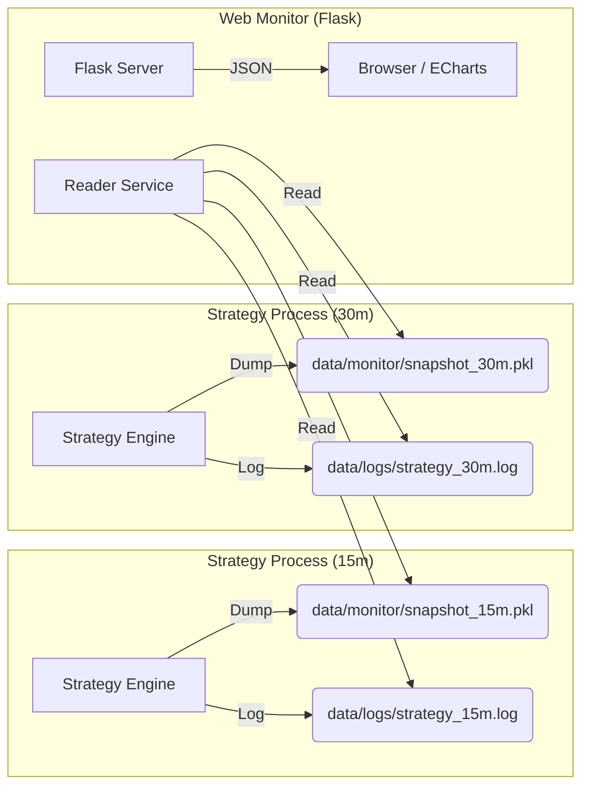

# Flask 可视化监控系统设计方案

## 1. 设计目标

本方案旨在为《商品卖权震荡策略》提供一套**旁路式、低侵入、支持多实例并发**的 Web 监控界面。

*   **旁路监控 (Sidecar)**：Web 服务运行在独立进程中，挂掉不影响策略交易，策略阻塞也不影响 Web 访问。
*   **不干涉原则**：Web 端对策略内存状态只有“读”权限（通过文件快照），无“写”权限，确保交易安全。
*   **多实例支持**：完美适配 `run.bat` 同时启动多个时间窗口（15m, 30m）策略进程的场景，自动区分不同策略实例的状态。
*   **数据可视化**：还原“策略现场”，包括 K 线、TD 序列、MACD 指标、钝化/背离状态、持仓与订单详情。

## 2. 架构设计

采用 **生产者-消费者** 模式，以 **文件系统** 作为解耦中介。



### 核心组件
1.  **数据源 (Producer)**：策略进程。在每次 K 线更新或交易发生后，异步/定时将核心聚合根状态 Dump 到临时 Pickle 文件。
2.  **中介 (Broker)**：文件系统。使用命名空间隔离不同策略实例的快照文件。
3.  **展示端 (Consumer)**：Flask Web 服务。轮询快照文件，解析 Python 对象，转换为前端可用的 JSON 数据。

## 3. 详细设计

### 3.1 目录结构规划

将 Web 相关代码与策略核心逻辑分离，放置在 `src/interface/web`。

```text
src/
├── interface/
│   └── web/
│       ├── app.py                # Flask 主程序
│       ├── reader.py             # 数据读取与清洗层 (防腐层)
│       ├── static/
│       │   └── js/
│       │       └── monitor.js    # ECharts 图表渲染
│       └── templates/
│           ├── index.html        # 策略实例列表 (首页)
│           └── dashboard.html    # 单策略详情页
```

### 3.2 多实例隔离方案

由于 `run.bat` 会启动多个策略进程，我们需要用唯一标识符区分它们。

*   **标识符 (Variant Name)**：来源于配置文件名（如 `15m`, `30m`）。
*   **快照文件命名**：`data/monitor/snapshot_{variant}.pkl`
*   **日志文件命名**：`data/logs/{variant}/strategy.log` 或 `data/logs/strategy_{variant}.log` (复用现有逻辑)

### 3.3 数据映射逻辑 (Pickle -> JSON)

Flask 后端需要加载 Pickle 并提取以下关键信息：

| 模块 | Pickle 源对象 | 前端展示形式 |
| :--- | :--- | :--- |
| **K线** | `TargetInstrumentAggregate` -> `DataFrame` | ECharts Candlestick (OHLC) |
| **TD序列** | `instrument.td_value` (当前) + 历史回算 | K线高低点上方的数字标记 (9/13) |
| **MACD** | `VolatilityTrade._macd_history` (List[MACDValue]) | 副图 Line (Diff, Dea) + Bar (Hist) |
| **状态** | `_dullness_states`, `_divergence_states` | 状态指示灯/徽章 (红/黄/绿) |
| **持仓** | `PositionAggregate.positions` | 表格 + K线上的持仓成本虚线 |
| **订单** | `PositionAggregate.pending_orders` | 活跃委托表格 |

## 4. 关键逻辑伪代码

### 4.1 策略端：生成实时快照

在 `src/strategy/application/volatility_trade.py` 中增加快照生成逻辑。

```python
# 伪代码：策略端快照生成

class VolatilityTrade:
    def __init__(self, ...):
        # ... 原有初始化 ...
        
        # 确定变体名称 (用于区分文件名)
        # 假设从 strategy_context 或 config 传入，例如 "15m"
        self.variant_name = strategy_context.setting.get("variant_name", "default")
        
        # 快照保存路径: data/monitor/snapshot_15m.pkl
        self.snapshot_path = f"data/monitor/snapshot_{self.variant_name}.pkl"

    def on_bar_update_complete(self):
        """
        在每根 K 线处理完，或交易发生后调用
        """
        # 组装快照数据 (轻量级，只存 UI 需要的数据)
        snapshot_data = {
            "update_time": datetime.now(),
            "variant": self.variant_name,
            
            # 聚合根状态
            "instruments": self.target_aggregate,  # 含 K 线和指标
            "positions": self.position_aggregate,  # 含持仓和订单
            
            # 策略中间状态 (用于 Debug)
            "macd_history": self._macd_history,
            "dullness": self._dullness_states,
            "divergence": self._divergence_states
        }
        
        # 异步或快速写入 (避免阻塞交易线程)
        self._dump_snapshot(snapshot_data)

    def _dump_snapshot(self, data):
        # 使用临时文件写入 + 重命名原子操作，防止 Web 端读到写了一半的文件
        temp_path = self.snapshot_path + ".tmp"
        try:
            with open(temp_path, "wb") as f:
                pickle.dump(data, f)
            
            # 原子替换
            os.replace(temp_path, self.snapshot_path)
        except Exception:
            # 记录错误但不崩溃
            pass
```

### 4.2 Web 端：数据读取服务

在 `src/interface/web/reader.py` 中实现。需要解决 Python 路径问题以便反序列化。

```python
# 伪代码：Web 端读取器

class SnapshotReader:
    def __init__(self, monitor_dir="data/monitor"):
        self.monitor_dir = monitor_dir

    def list_available_strategies(self):
        """扫描目录下所有的 snapshot_*.pkl"""
        files = glob.glob(f"{self.monitor_dir}/snapshot_*.pkl")
        strategies = []
        for f in files:
            # 解析文件名得到 variant (如 15m)
            # 读取文件头获取最后更新时间
            strategies.append({...})
        return strategies

    def get_strategy_data(self, variant_name):
        """读取指定变体的快照并转换为 JSON"""
        file_path = f"{self.monitor_dir}/snapshot_{variant_name}.pkl"
        
        if not exists(file_path):
            return None

        # 加载 Pickle
        # 注意：必须确保 src.strategy 相关类已在 sys.path 中，否则 load 会失败
        try:
            with open(file_path, "rb") as f:
                raw_data = pickle.load(f)
        except Exception:
            return None

        # 数据清洗 (转换成前端友好的 dict)
        return {
            "timestamp": raw_data["update_time"],
            "instruments": self._parse_instruments(raw_data["instruments"]),
            "positions": self._parse_positions(raw_data["positions"]),
            "charts": {
                "macd": self._format_macd_series(raw_data["macd_history"]),
                "status": self._format_status_flags(raw_data["dullness"], raw_data["divergence"])
            }
        }

    def _parse_instruments(self, aggregate):
        """提取 K 线和 TD 标记"""
        result = {}
        for symbol, instrument in aggregate.get_all_instruments():
            df = instrument.get_bar_history(100) # 取最近 100 根
            
            # 构造 ECharts 数据格式
            ohlc = df[["open", "close", "low", "high"]].values.tolist()
            
            # 提取 TD 标记 (如果 Instrument 里没存历史 TD，这里可能只能拿最新的)
            # 建议：策略端最好能把 TD 序列也简单的存一下，或者这里回算
            td_marks = self._extract_td_marks(instrument)
            
            result[symbol] = {
                "ohlc": ohlc,
                "td_marks": td_marks,
                "last_price": instrument.latest_close
            }
        return result
```

### 4.3 Web 端：路由设计

在 `src/interface/web/app.py` 中实现。

```python
# 伪代码：Flask 路由

app = Flask(__name__)
reader = SnapshotReader()

@app.route("/")
def index():
    """首页：策略实例列表"""
    strategies = reader.list_available_strategies()
    return render_template("index.html", strategies=strategies)

@app.route("/dashboard/<variant_name>")
def dashboard(variant_name):
    """详情页：渲染外壳"""
    return render_template("dashboard.html", variant=variant_name)

@app.route("/api/data/<variant_name>")
def api_data(variant_name):
    """AJAX 接口：前端轮询获取最新数据"""
    data = reader.get_strategy_data(variant_name)
    if not data:
        return jsonify({"error": "Not found"}), 404
    return jsonify(data)

@app.route("/api/log/<variant_name>")
def api_log(variant_name):
    """读取对应的日志文件"""
    # 根据 variant 找到 log 路径，读取最后 N 行
    return jsonify({"logs": ...})
```

## 5. 实施步骤

1.  **准备阶段**：创建 `src/interface/web` 目录及基础 Flask 文件结构。
2.  **数据源改造**：修改 `VolatilityTrade`，注入 `variant_name`，并实现 `_dump_snapshot` 方法。
3.  **后端实现**：编写 `reader.py`，重点调试 Pickle 反序列化（需要处理好 `sys.path`）。
4.  **前端实现**：使用 ECharts 实现 K 线与 MACD 联动，实现状态看板。
5.  **集成测试**：运行 `run.bat` 启动多个策略，同时启动 Flask，验证多实例隔离是否生效。
