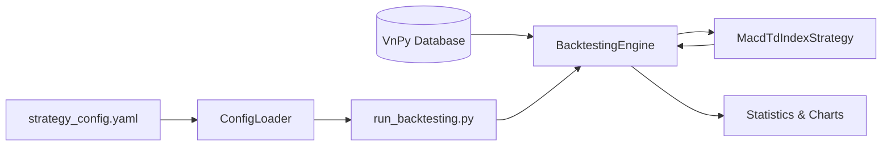

# 回测模块详细设计方案

## 1. 概述

`src/backtesting` 模块主要用于对 `MacdTdIndexStrategy` (商品波动率策略) 进行历史数据回测。
通过模拟历史行情的撮合交易，验证策略逻辑的有效性，评估策略的风险收益特征（如夏普比率、最大回撤、年化收益等），为实盘交易提供参考。

## 2. 架构设计

### 2.1 核心组件

*   **BacktestingEngine**: `vnpy_portfoliostrategy.BacktestingEngine`
    *   VnPy 提供的组合策略回测引擎，负责管理时间序列、数据加载、订单撮合、持仓结算等核心逻辑。
*   **MacdTdIndexStrategy**: `src.strategy.macd_td_index_strategy.MacdTdIndexStrategy`
    *   待回测的策略类，包含具体的交易逻辑。
*   **ConfigLoader**: `src.main.utils.config_loader.ConfigLoader`
    *   配置加载工具，用于读取 `config/strategy_config.yaml` 中的策略参数和合约配置，确保回测参数与实盘一致。

### 2.2 数据流向



### 2.3 流程设计

1.  **配置加载**: 解析命令行参数，并通过 `ConfigLoader` 读取 YAML 配置文件，获取策略名称、标的合约 (`vt_symbols`) 和策略参数 (`setting`)。
2.  **引擎初始化**: 实例化 `BacktestingEngine`。
3.  **环境设置**: 调用 `engine.set_parameters` 设置：
    *   `vt_symbols`: 回测合约列表
    *   `interval`: K线周期 (通常为 `1m`)
    *   `start`/`end`: 回测起止时间
    *   `rate`: 手续费率 (e.g., `0.000025`)
    *   `slippage`: 滑点 (e.g., `0.2`)
    *   `size`: 合约乘数 (e.g., `10`)
    *   `pricetick`: 最小价格变动 (e.g., `1`)
    *   `capital`: 初始资金 (e.g., `1,000,000`)
4.  **策略加载**: 调用 `engine.add_strategy`，将策略类、策略名、合约列表和参数字典传入。
5.  **数据加载**: 调用 `engine.load_data()`，从数据库加载历史 K 线数据。
6.  **执行回测**: 调用 `engine.run_backtesting()`，按时间顺序推进回测。
7.  **结果分析**:
    *   `engine.calculate_result()`: 计算每日盈亏。
    *   `engine.calculate_statistics()`: 计算各项统计指标并输出到控制台。
    *   `engine.show_chart()`: 绘制资金曲线、盈亏分布等图表。

## 3. 详细设计

### 3.1 run_backtesting.py

该脚本位于 `src/backtesting/run_backtesting.py`，是执行回测的入口。

#### 3.1.1 依赖引入

```python
from datetime import datetime
from importlib import reload
import sys
from pathlib import Path

# 添加项目根目录到 sys.path
PROJECT_ROOT = Path(__file__).parent.parent.parent
sys.path.insert(0, str(PROJECT_ROOT))

from vnpy.trader.constant import Interval
from vnpy_portfoliostrategy import BacktestingEngine
from src.strategy.macd_td_index_strategy import MacdTdIndexStrategy
from src.main.utils.config_loader import ConfigLoader
```

#### 3.1.2 核心函数设计

```python
def run_backtesting(
    config_path: str = "config/strategy_config.yaml",
    start_date: str = "2024-01-01",
    end_date: str = "2024-12-31",
    capital: int = 1_000_000,
    rate: float = 2.5e-5,
    slippage: float = 0.2,
    size: int = 10,
    pricetick: float = 1.0,
    show_chart: bool = True
):
    """
    运行回测
    """
    # 1. 加载策略配置
    print(f"Loading config from {config_path}...")
    config = ConfigLoader.load_yaml(config_path)
    
    # 假设回测配置文件中的第一个策略
    # 实际应用中可能需要根据策略名称筛选
    if not config.get("strategies"):
        print("Error: No strategies found in config.")
        return

    strategy_config = config["strategies"][0]
    vt_symbols = strategy_config["vt_symbols"]
    setting = strategy_config["setting"]
    strategy_class_name = strategy_config["class_name"]

    print(f"Strategy: {strategy_config['strategy_name']}")
    print(f"Class: {strategy_class_name}")
    print(f"Symbols: {vt_symbols}")

    # 2. 初始化回测引擎
    engine = BacktestingEngine()
    
    # 3. 设置回测参数
    engine.set_parameters(
        vt_symbols=vt_symbols,
        interval=Interval.MINUTE,
        start=datetime.strptime(start_date, "%Y-%m-%d"),
        end=datetime.strptime(end_date, "%Y-%m-%d"),
        rate=rate,
        slippage=slippage,
        size=size,
        pricetick=pricetick,
        capital=capital
    )
    
    # 4. 添加策略
    engine.add_strategy(
        strategy_class=MacdTdIndexStrategy,
        strategy_name=strategy_config["strategy_name"],
        vt_symbols=vt_symbols,
        setting=setting
    )
    
    # 5. 加载数据
    print("Loading data...")
    engine.load_data()
    
    # 6. 运行回测
    print("Running backtesting...")
    engine.run_backtesting()
    
    # 7. 计算并显示结果
    print("Calculating results...")
    df = engine.calculate_result()
    engine.calculate_statistics()
    
    if show_chart:
        engine.show_chart()
```

#### 3.1.3 执行入口 (`__main__`)

支持命令行参数解析，以便灵活调整回测区间和资金设置。

```python
if __name__ == "__main__":
    import argparse
    
    parser = argparse.ArgumentParser(description="Run Backtesting for Commodity Volatility Strategy")
    parser.add_argument("--config", type=str, default="config/strategy_config.yaml", help="Path to strategy config file")
    parser.add_argument("--start", type=str, default="2024-01-01", help="Start date (YYYY-MM-DD)")
    parser.add_argument("--end", type=str, default="2024-12-31", help="End date (YYYY-MM-DD)")
    parser.add_argument("--capital", type=int, default=1000000, help="Initial capital")
    parser.add_argument("--rate", type=float, default=2.5e-5, help="Commission rate")
    parser.add_argument("--slippage", type=float, default=0.2, help="Slippage")
    parser.add_argument("--size", type=int, default=10, help="Contract size")
    parser.add_argument("--pricetick", type=float, default=1.0, help="Price tick")
    parser.add_argument("--no-chart", action="store_true", help="Do not show chart")
    
    args = parser.parse_args()
    
    run_backtesting(
        config_path=args.config,
        start_date=args.start,
        end_date=args.end,
        capital=args.capital,
        rate=args.rate,
        slippage=args.slippage,
        size=args.size,
        pricetick=args.pricetick,
        show_chart=not args.no_chart
    )
```

### 3.2 关键配置说明

| 参数 | 说明 | 默认值 | 备注 |
| :--- | :--- | :--- | :--- |
| `start`/`end` | 回测区间 | 2024年 | 需确保数据库中有该时间段数据 |
| `rate` | 手续费率 | 2.5%% | 期货通常按万分比收费 |
| `slippage` | 滑点 | 0.2 | 模拟成交价与委托价的偏差 |
| `size` | 合约乘数 | 10 | 螺纹钢(rb)为10，豆粕(m)为10，需根据实际标的调整 |
| `pricetick` | 价格跳动 | 1.0 | 最小变动价位 |

**注意**: 对于组合策略（多标的），`size` 和 `pricetick` 在 `BacktestingEngine` 中是统一设置的。如果回测的品种（如螺纹钢和豆粕）具有不同的乘数或跳动，VnPy 的基础 `BacktestingEngine` 可能无法完美支持（它假设统一设置）。
*   **解决方案**: 如果需要精确回测不同品种，可能需要扩展 `BacktestingEngine` 或将不同品种标准化处理，或者接受一定的近似误差。在当前设计中，我们暂且使用统一设置，以最常用的品种为准。

## 4. 数据准备

在运行回测前，需要确保 VnPy 数据库（如 SQLite, MySQL, MongoDB 等）中已经导入了目标合约（`rb2501.SHFE`, `m2501.DCE` 等）的 `1m` K 线数据。

可以使用 VnPy 的 `DataManager` 或编写脚本下载并导入数据。

## 5. 预期输出

1.  **日志**: 打印策略加载、数据加载进度。
2.  **统计**: 输出 Total Return, Annualized Return, Max Drawdown, Sharpe Ratio 等。
3.  **图表**: 弹出窗口显示账户净值曲线、每日盈亏柱状图、回撤曲线等。
