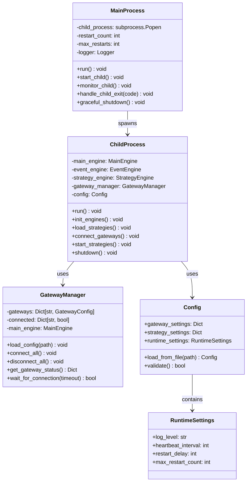
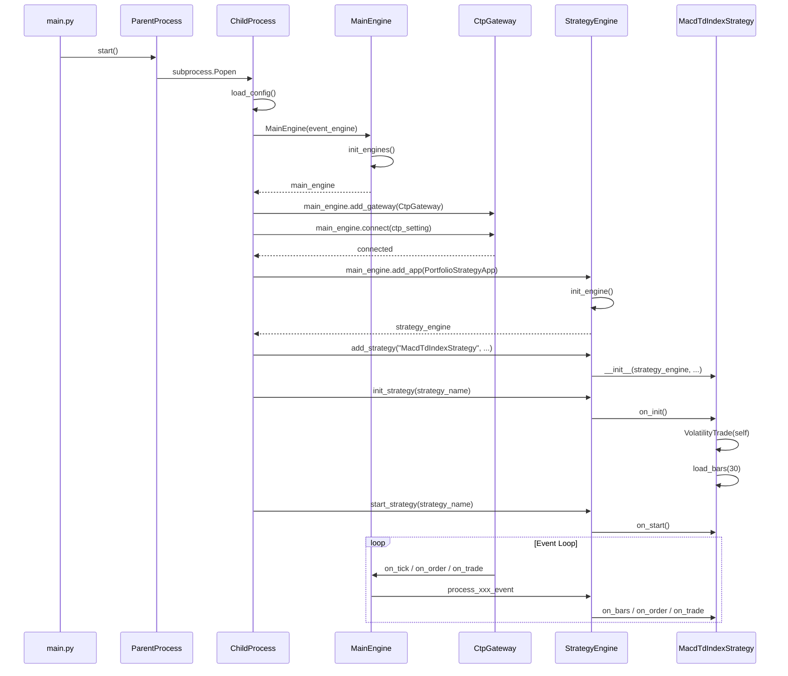

# Main 入口模块详细设计方案

## 一、设计概述

### 1.1 模块定位

`src/main` 模块是商品波动率策略的**运行时入口层**，负责：

1. **进程管理**：支持父子进程分离架构，实现策略与 CTP 网关独立运行
2. **引擎组装**：初始化 VnPy MainEngine、EventEngine、策略引擎
3. **网关配置**：加载 CTP 网关配置并建立连接
4. **策略加载**：注册并启动商品波动率策略
5. **生命周期管理**：优雅启停、异常恢复、日志记录

### 1.2 与已有模块关系

```
┌─────────────────────────────────────────────────────────────────────────┐
│                           src/main (本模块)                              │
│  main.py / parent_process.py / child_process.py / gateway.py           │
├─────────────────────────────────────────────────────────────────────────┤
│                                    │                                     │
│                                    ▼                                     │
│  ┌─────────────────────────────────────────────────────────────────┐    │
│  │         src/strategy/macd_td_index_strategy.py           │    │
│  │         (接口层 - VnPy StrategyTemplate)                         │    │
│  └─────────────────────────────────────────────────────────────────┘    │
│                                    │                                     │
│                                    ▼ 依赖注入                            │
│  ┌─────────────────────────────────────────────────────────────────┐    │
│  │         src/strategy/application/volatility_trade.py            │    │
│  │         (应用层 - 业务编排)                                       │    │
│  └─────────────────────────────────────────────────────────────────┘    │
│                                    │                                     │
│                                    ▼                                     │
│  ┌─────────────────────────────────────────────────────────────────┐    │
│  │         src/strategy/infrastructure/gateway/                     │    │
│  │         vnpy_market_data_gateway.py / vnpy_account_gateway.py /   │    │
│  │         vnpy_trade_execution_gateway.py (基础设施层 - 网关适配)    │    │
│  └─────────────────────────────────────────────────────────────────┘    │
└─────────────────────────────────────────────────────────────────────────┘
```

### 1.3 已有 Gateway 能力引用

当前项目已将网关按职责拆分为三个实现，`main` 模块需确保策略上下文的依赖链路正确建立：

```python
# 已实现的网关能力（按接口隔离原则拆分）
class VnpyMarketDataGateway:
    def subscribe(vt_symbol: str) -> None
    def get_tick(vt_symbol: str)
    def get_contract(vt_symbol: str)
    def get_all_contracts()

class VnpyAccountGateway:
    def get_balance() -> float
    def get_position(vt_symbol: str, direction)
    def get_all_positions()

class VnpyTradeExecutionGateway:
    def send_order(instruction: OrderInstruction) -> List[str]
    def cancel_order(vt_orderid: str) -> None
    def cancel_all_orders() -> None
```

这些能力依赖于 `strategy_context.strategy_engine.main_engine` 的正确初始化，
`main` 模块的核心职责就是确保这条依赖链路正确建立。

---

## 二、架构设计

### 2.1 进程架构

采用父子进程分离架构，提高系统稳定性：

```
┌─────────────────────────────────────────────────────────────────────────┐
│                          守护进程 (Watchdog)                             │
│                          parent_process.py                              │
│  职责: 监控子进程状态, 异常重启, 日志收集                                │
├─────────────────────────────────────────────────────────────────────────┤
│                                    │                                     │
│                                    │ subprocess.Popen                    │
│                                    ▼                                     │
│  ┌─────────────────────────────────────────────────────────────────┐    │
│  │                      工作进程 (Worker)                           │    │
│  │                      child_process.py                            │    │
│  │  职责: 运行 VnPy 引擎, 加载策略, 处理交易                         │    │
│  │                                                                  │    │
│  │  ┌──────────────┐  ┌──────────────┐  ┌──────────────────────┐   │    │
│  │  │ EventEngine  │  │  MainEngine  │  │   StrategyEngine     │   │    │
│  │  │  (事件循环)   │  │  (核心引擎)   │  │  (组合策略引擎)       │   │    │
│  │  └──────────────┘  └──────────────┘  └──────────────────────┘   │    │
│  │         │                  │                   │                │    │
│  │         └──────────────────┼───────────────────┘                │    │
│  │                            ▼                                     │    │
│  │  ┌──────────────────────────────────────────────────────────┐   │    │
│  │  │           MacdTdIndexStrategy                     │   │    │
│  │  │           (商品波动率策略实例)                             │   │    │
│  │  └──────────────────────────────────────────────────────────┘   │    │
│  └─────────────────────────────────────────────────────────────────┘    │
└─────────────────────────────────────────────────────────────────────────┘
```

### 2.2 类图设计



### 2.3 时序图 - 启动流程



---

## 三、模块详细设计

### 3.1 main.py - 入口脚本

**职责**：程序主入口，解析命令行参数，选择运行模式

```python
"""
main.py - 策略运行主入口

支持运行模式:
1. standalone: 单进程直接运行 (开发调试用)
2. daemon: 父子进程分离运行 (生产环境推荐)

命令行参数:
    --mode: 运行模式 (standalone/daemon)
    --config: 配置文件路径
    --log-level: 日志级别
"""
import argparse
import sys
import logging
from pathlib import Path
from typing import Optional

# 添加项目根目录到 Python 路径
PROJECT_ROOT = Path(__file__).parent.parent.parent
sys.path.insert(0, str(PROJECT_ROOT))

from src.main.utils.log_handler import setup_logging


def parse_args() -> argparse.Namespace:
    """
    解析命令行参数
    
    Returns:
        解析后的参数命名空间
    """
    parser = argparse.ArgumentParser(
        description="商品波动率策略运行入口",
        formatter_class=argparse.RawDescriptionHelpFormatter
    )
    
    parser.add_argument(
        "--mode",
        type=str,
        default="standalone",
        choices=["standalone", "daemon"],
        help="运行模式: standalone(单进程) / daemon(守护进程)"
    )
    
    parser.add_argument(
        "--config",
        type=str,
        default="config/strategy_config.yaml",
        help="策略配置文件路径"
    )
    
    parser.add_argument(
        "--log-level",
        type=str,
        default="INFO",
        choices=["DEBUG", "INFO", "WARNING", "ERROR"],
        help="日志级别"
    )
    
    parser.add_argument(
        "--log-dir",
        type=str,
        default="data/logs",
        help="日志目录"
    )
    
    parser.add_argument(
        "--no-ui",
        action="store_true",
        help="无界面模式运行"
    )
    
    return parser.parse_args()


def run_standalone(args: argparse.Namespace) -> None:
    """
    单进程直接运行模式
    
    适用于开发调试环境，所有组件在同一进程内运行。
    
    Args:
        args: 命令行参数
    """
    from child_process import ChildProcess
    
    child = ChildProcess(
        config_path=args.config
    )
    
    try:
        child.run()
    except KeyboardInterrupt:
        child.shutdown()
    except Exception as e:
        logging.error(f"策略运行异常: {e}")
        child.shutdown()
        raise


def run_daemon(args: argparse.Namespace) -> None:
    """
    守护进程模式运行
    
    父进程作为守护进程监控子进程，子进程异常退出时自动重启。
    
    Args:
        args: 命令行参数
    """
    from parent_process import ParentProcess
    
    parent = ParentProcess(
        config_path=args.config,
        log_level=args.log_level,
        log_dir=args.log_dir
    )
    
    try:
        parent.run()
    except KeyboardInterrupt:
        parent.graceful_shutdown()


def main() -> None:
    """主函数"""
    args = parse_args()
    
    setup_logging(args.log_level, args.log_dir)
    
    logger = logging.getLogger(__name__)
    logger.info(f"启动策略, 模式: {args.mode}")
    
    if args.mode == "standalone":
        run_standalone(args)
    else:
        run_daemon(args)


if __name__ == "__main__":
    main()
```

**设计要点**：

1. 支持两种运行模式，满足开发和生产需求
2. 命令行参数配置灵活，支持自定义配置路径
3. 统一日志配置，便于问题追踪

---

### 3.2 parent_process.py - 守护进程

**职责**：监控子进程状态，异常时自动重启

```python
"""
parent_process.py - 守护进程实现

职责:
1. 启动并监控工作子进程
2. 子进程异常退出时自动重启
3. 收集子进程日志和状态
4. 处理信号量实现优雅退出

重启策略:
- 最大重启次数: 10 次
- 重启间隔: 指数退避 (5s, 10s, 20s, ...)
- 连续成功运行 1 小时后重置重启计数
"""
import os
import sys
import time
import signal
import logging
import subprocess
from pathlib import Path
from datetime import datetime, timedelta
from typing import Optional
from dataclasses import dataclass


@dataclass
class RestartPolicy:
    """重启策略配置"""
    max_restarts: int = 10
    base_delay: float = 5.0
    max_delay: float = 300.0
    reset_after_hours: float = 1.0


class ParentProcess:
    """
    守护进程
    
    负责监控和管理工作子进程，确保策略持续运行。
    
    Attributes:
        config_path: 策略配置文件路径
        log_level: 日志级别
        log_dir: 日志目录
    """
    
    def __init__(
        self,
        config_path: str,
        log_level: str = "INFO",
        log_dir: str = "logs"
    ) -> None:
        """
        初始化守护进程
        
        Args:
            config_path: 策略配置文件路径
            log_level: 日志级别
            log_dir: 日志目录
        """
        self.config_path = config_path
        self.log_level = log_level
        self.log_dir = log_dir
        
        self.logger = logging.getLogger(__name__)
        
        # 子进程管理
        self.child_process: Optional[subprocess.Popen] = None
        self.child_pid: Optional[int] = None
        
        # 重启策略
        self.restart_policy = RestartPolicy()
        self.restart_count: int = 0
        self.last_start_time: Optional[datetime] = None
        
        # 运行状态
        self.running: bool = False
        self.shutdown_requested: bool = False
        
        # 设置信号处理
        self._setup_signal_handlers()
    
    def _setup_signal_handlers(self) -> None:
        """设置信号处理器"""
        signal.signal(signal.SIGTERM, self._handle_shutdown_signal)
        signal.signal(signal.SIGINT, self._handle_shutdown_signal)
        
        # Windows 不支持 SIGHUP
        if hasattr(signal, "SIGHUP"):
            signal.signal(signal.SIGHUP, self._handle_reload_signal)
    
    def _handle_shutdown_signal(self, signum: int, frame) -> None:
        """
        处理关闭信号
        
        Args:
            signum: 信号编号
            frame: 当前栈帧
        """
        self.logger.info(f"收到关闭信号 {signum}")
        self.shutdown_requested = True
    
    def _handle_reload_signal(self, signum: int, frame) -> None:
        """
        处理重载信号 (SIGHUP)
        
        触发子进程重启以重新加载配置
        
        Args:
            signum: 信号编号
            frame: 当前栈帧
        """
        self.logger.info("收到重载信号，准备重启子进程")
        self._stop_child()
        # 不用调用 start_child，run 循环会自动重启
    
    def run(self) -> None:
        """
        运行守护进程主循环
        
        主循环流程:
        1. 启动子进程
        2. 监控子进程状态
        3. 子进程退出时根据策略决定是否重启
        4. 收到关闭信号时优雅退出
        """
        self.running = True
        self.logger.info("守护进程启动")
        
        while self.running and not self.shutdown_requested:
            # 启动子进程
            if self.child_process is None or self.child_process.poll() is not None:
                if not self._should_restart():
                    self.logger.error("达到最大重启次数，守护进程退出")
                    break
                
                self._start_child()
            
            # 等待子进程状态变化
            try:
                return_code = self.child_process.wait(timeout=1.0)
                self._handle_child_exit(return_code)
            except subprocess.TimeoutExpired:
                # 子进程仍在运行
                self._check_reset_restart_count()
            except Exception as e:
                self.logger.error(f"监控子进程异常: {e}")
        
        self.graceful_shutdown()
    
    def _start_child(self) -> None:
        """
        启动工作子进程
        
        使用 subprocess.Popen 启动 child_process.py
        """
        delay = self._calculate_restart_delay()
        if delay > 0:
            self.logger.info(f"等待 {delay:.1f} 秒后重启...")
            time.sleep(delay)
        
        self.restart_count += 1
        self.last_start_time = datetime.now()
        
        # 构建子进程命令
        child_script = Path(__file__).parent / "child_process.py"
        
        cmd = [
            sys.executable,
            str(child_script),
            "--config", self.config_path,
            "--log-level", self.log_level,
            "--log-dir", self.log_dir
        ]
        
        self.logger.info(f"启动子进程 (第 {self.restart_count} 次)")
        
        try:
            self.child_process = subprocess.Popen(
                cmd,
                stdout=subprocess.PIPE,
                stderr=subprocess.STDOUT,
                text=True
            )
            self.child_pid = self.child_process.pid
            self.logger.info(f"子进程已启动, PID: {self.child_pid}")
            
        except Exception as e:
            self.logger.error(f"启动子进程失败: {e}")
            self.child_process = None
    
    def _stop_child(self) -> None:
        """停止子进程"""
        if self.child_process is None:
            return
        
        self.logger.info("正在停止子进程...")
        
        try:
            # 先发送 SIGTERM
            self.child_process.terminate()
            
            # 等待进程退出
            try:
                self.child_process.wait(timeout=10.0)
                self.logger.info("子进程已正常退出")
            except subprocess.TimeoutExpired:
                # 强制杀进程
                self.logger.warning("子进程未响应，强制终止")
                self.child_process.kill()
                self.child_process.wait()
                
        except Exception as e:
            self.logger.error(f"停止子进程异常: {e}")
        finally:
            self.child_process = None
            self.child_pid = None
    
    def _handle_child_exit(self, return_code: int) -> None:
        """
        处理子进程退出
        
        Args:
            return_code: 子进程退出码
        """
        if return_code == 0:
            self.logger.info("子进程正常退出")
        else:
            self.logger.warning(f"子进程异常退出, 返回码: {return_code}")
        
        self.child_process = None
        self.child_pid = None
    
    def _should_restart(self) -> bool:
        """
        判断是否应该重启
        
        Returns:
            True 如果应该重启
        """
        if self.shutdown_requested:
            return False
        
        if self.restart_count >= self.restart_policy.max_restarts:
            return False
        
        return True
    
    def _calculate_restart_delay(self) -> float:
        """
        计算重启延迟时间 (指数退避)
        
        Returns:
            延迟秒数
        """
        if self.restart_count == 0:
            return 0
        
        delay = self.restart_policy.base_delay * (2 ** (self.restart_count - 1))
        return min(delay, self.restart_policy.max_delay)
    
    def _check_reset_restart_count(self) -> None:
        """检查是否应该重置重启计数"""
        if self.last_start_time is None:
            return
        
        elapsed = datetime.now() - self.last_start_time
        reset_threshold = timedelta(hours=self.restart_policy.reset_after_hours)
        
        if elapsed > reset_threshold and self.restart_count > 0:
            self.logger.info("子进程运行稳定，重置重启计数")
            self.restart_count = 0
    
    def graceful_shutdown(self) -> None:
        """优雅关闭"""
        self.logger.info("守护进程开始关闭...")
        self.running = False
        self._stop_child()
        self.logger.info("守护进程已关闭")
```

**设计要点**：

1. 指数退避重启策略，避免频繁重启消耗系统资源
2. 信号处理支持优雅退出和配置重载
3. 长时间稳定运行后重置重启计数，提高容错能力

---

### 3.3 child_process.py - 工作进程

**职责**：实际运行 VnPy 引擎和策略

```python
"""
child_process.py - 工作进程实现

职责:
1. 初始化 VnPy 引擎 (EventEngine, MainEngine, StrategyEngine)
2. 加载并连接 CTP 网关
3. 加载并启动商品波动率策略
4. 处理交易事件和策略回调
5. 优雅退出和资源清理

VnPy 引擎初始化顺序:
1. EventEngine (事件循环)
2. MainEngine (核心引擎，自动初始化 LogEngine, OmsEngine)
3. CTP Gateway (行情 + 交易接口)
4. StrategyEngine (组合策略引擎)
5. Strategy Instance (策略实例)
"""
import os
import sys
import json
import time
import signal
import logging
import argparse
from pathlib import Path
from datetime import datetime
from typing import Dict, Any, Optional, List

# VnPy 导入
from vnpy.event import EventEngine
from vnpy.trader.engine import MainEngine
# Removed load_json

# 组合策略应用
from vnpy_portfoliostrategy import StrategyEngine
from vnpy_portfoliostrategy.base import APP_NAME

# CTP 网关
from vnpy_ctp import CtpGateway

# 添加策略路径
STRATEGY_PATH = Path(__file__).parent.parent / "strategy"
sys.path.insert(0, str(STRATEGY_PATH))


class ChildProcess:
    """
    工作进程
    
    负责运行 VnPy 引擎和策略，是策略的实际执行环境。
    
    核心依赖链:
    EventEngine -> MainEngine -> CtpGateway -> StrategyEngine -> Strategy
    
    Attributes:
        config_path: 策略配置文件路径
    """
    
    def __init__(
        self,
        config_path: str,
        log_level: str = "INFO",
        log_dir: str = "logs"
    ) -> None:
        """
        初始化工作进程
        
        Args:
            config_path: 策略配置文件路径
            log_level: 日志级别
            log_dir: 日志目录
        """
        self.config_path = config_path
        self.log_level = log_level
        self.log_dir = log_dir
        
        self.logger = logging.getLogger(__name__)
        
        # VnPy 引擎
        self.event_engine: Optional[EventEngine] = None
        self.main_engine: Optional[MainEngine] = None
        self.strategy_engine: Optional[StrategyEngine] = None
        
        # 配置
        self.gateway_config: Dict[str, Any] = {}
        self.strategy_config: Dict[str, Any] = {}
        
        # 运行状态
        self.running: bool = False
        self.connected: bool = False
        self.strategies_started: bool = False
        
        # 设置信号处理
        self._setup_signal_handlers()
    
    def _setup_signal_handlers(self) -> None:
        """设置信号处理器"""
        signal.signal(signal.SIGTERM, self._handle_shutdown)
        signal.signal(signal.SIGINT, self._handle_shutdown)
    
    def _handle_shutdown(self, signum: int, frame) -> None:
        """处理关闭信号"""
        self.logger.info(f"收到信号 {signum}，准备关闭")
        self.running = False
    
    def run(self) -> None:
        """
        运行工作进程
        
        执行流程:
        1. 加载配置
        2. 初始化引擎
        3. 连接网关
        4. 加载策略
        5. 启动策略
        6. 进入事件循环
        """
        self.running = True
        self.logger.info("工作进程启动")
        
        try:
            # 1. 加载配置
            self._load_configs()
            
            # 2. 初始化引擎
            self._init_engines()
            
            # 3. 连接网关
            self._connect_gateways()
            
            # 4. 等待网关连接成功
            self._wait_for_connection()
            
            # 5. 加载和启动策略
            self._load_strategies()
            self._init_strategies()
            self._start_strategies()
            
            # 6. 进入事件循环
            self._run_event_loop()
            
        except Exception as e:
            self.logger.error(f"工作进程异常: {e}", exc_info=True)
            raise
        finally:
            self.shutdown()
    
    def _load_configs(self) -> None:
        """加载配置文件"""
        self.logger.info("加载配置文件...")
        
        # 加载网关配置 (from .env)
        from src.main.utils.config_loader import ConfigLoader
        try:
            self.gateway_config = ConfigLoader.load_gateway_config()
            self.logger.info("已加载网关配置 (from .env)")
        except Exception as e:
            self.logger.error(f"加载网关配置失败: {e}")
            raise
        
        # 加载策略配置
        strategy_config_path = Path(self.config_path)
        if strategy_config_path.exists():
            self.strategy_config = ConfigLoader.load_yaml(str(strategy_config_path))
            self.logger.info(f"已加载策略配置: {strategy_config_path}")
        else:
            raise FileNotFoundError(f"策略配置文件不存在: {strategy_config_path}")
    
    def _init_engines(self) -> None:
        """
        初始化 VnPy 引擎
        
        初始化顺序非常重要:
        1. EventEngine - 事件循环，所有引擎的基础
        2. MainEngine - 核心引擎，管理网关和其他子引擎
        3. StrategyEngine - 通过 add_app 添加
        """
        self.logger.info("初始化 VnPy 引擎...")
        
        # 1. 创建事件引擎
        self.event_engine = EventEngine()
        self.logger.info("EventEngine 已创建")
        
        # 2. 创建主引擎
        self.main_engine = MainEngine(self.event_engine)
        self.logger.info("MainEngine 已创建")
        
        # 3. 添加 CTP 网关
        self.main_engine.add_gateway(CtpGateway)
        self.logger.info("CtpGateway 已添加")
        
        # 4. 添加组合策略应用
        self.strategy_engine = self.main_engine.add_app(StrategyEngine)
        self.strategy_engine.init_engine()
        self.logger.info("StrategyEngine 已初始化")
    
    def _connect_gateways(self) -> None:
        """连接交易网关"""
        self.logger.info("连接交易网关...")
        
        ctp_setting = self.gateway_config.get("ctp", {})
        
        if not ctp_setting:
            raise ValueError("CTP 网关配置为空")
        
        # 连接 CTP
        self.main_engine.connect(ctp_setting, "CTP")
        self.logger.info("CTP 网关连接请求已发送")
    
    def _wait_for_connection(self, timeout: float = 60.0) -> None:
        """
        等待网关连接成功
        
        通过检查合约数据是否加载完成来判断连接状态。
        
        Args:
            timeout: 超时时间（秒）
        """
        self.logger.info(f"等待网关连接 (超时: {timeout}s)...")
        
        start_time = time.time()
        
        while time.time() - start_time < timeout:
            if not self.running:
                raise InterruptedError("收到关闭信号")
            
            # 检查合约数据
            contracts = self.main_engine.get_all_contracts()
            if contracts:
                self.connected = True
                self.logger.info(f"网关连接成功，已加载 {len(contracts)} 个合约")
                return
            
            time.sleep(1.0)
        
        raise TimeoutError("网关连接超时")
    
    def _load_strategies(self) -> None:
        """加载策略"""
        self.logger.info("加载策略...")
        
        strategies = self.strategy_config.get("strategies", [])
        
        for strategy_setting in strategies:
            class_name = strategy_setting.get("class_name")
            strategy_name = strategy_setting.get("strategy_name")
            vt_symbols = strategy_setting.get("vt_symbols", [])
            setting = strategy_setting.get("setting", {})
            
            if not all([class_name, strategy_name, vt_symbols]):
                self.logger.warning(f"策略配置不完整: {strategy_setting}")
                continue
            
            self.strategy_engine.add_strategy(
                class_name=class_name,
                strategy_name=strategy_name,
                vt_symbols=vt_symbols,
                setting=setting
            )
            
            self.logger.info(f"已添加策略: {strategy_name}")
    
    def _init_strategies(self) -> None:
        """初始化所有策略"""
        self.logger.info("初始化策略...")
        
        # 获取所有策略名称
        for strategy_name in self.strategy_engine.strategies.keys():
            self.strategy_engine.init_strategy(strategy_name)
            self.logger.info(f"策略 {strategy_name} 初始化中...")
        
        # 等待初始化完成
        time.sleep(5.0)
    
    def _start_strategies(self) -> None:
        """启动所有策略"""
        self.logger.info("启动策略...")
        
        for strategy_name, strategy in self.strategy_engine.strategies.items():
            if strategy.inited:
                self.strategy_engine.start_strategy(strategy_name)
                self.logger.info(f"策略 {strategy_name} 已启动")
            else:
                self.logger.warning(f"策略 {strategy_name} 未完成初始化，跳过启动")
        
        self.strategies_started = True
    
    def _run_event_loop(self) -> None:
        """运行事件循环"""
        self.logger.info("进入事件循环")
        
        while self.running:
            time.sleep(1.0)
    
    def shutdown(self) -> None:
        """关闭工作进程"""
        self.logger.info("工作进程开始关闭...")
        
        self.running = False
        
        # 停止所有策略
        if self.strategy_engine and self.strategies_started:
            self.logger.info("停止所有策略...")
            self.strategy_engine.stop_all_strategies()
        
        # 关闭主引擎
        if self.main_engine:
            self.logger.info("关闭主引擎...")
            self.main_engine.close()
        
        self.logger.info("工作进程已关闭")


def parse_args() -> argparse.Namespace:
    """解析命令行参数"""
    parser = argparse.ArgumentParser(description="策略工作进程")
    
    parser.add_argument("--config", required=True)
    parser.add_argument("--log-level", default="INFO")
    parser.add_argument("--log-dir", default="logs")
    
    return parser.parse_args()


if __name__ == "__main__":
    args = parse_args()
    
    # 配置日志
    logging.basicConfig(
        level=getattr(logging, args.log_level),
        format="%(asctime)s [%(levelname)s] %(name)s: %(message)s"
    )
    
    child = ChildProcess(
        config_path=args.config,
        log_level=args.log_level,
        log_dir=args.log_dir
    )
    
    child.run()
```

**设计要点**：

1. 严格按照 VnPy 依赖顺序初始化引擎
2. 等待合约数据加载完成后才启动策略
3. 支持优雅退出，确保策略和网关正确关闭

---

### 3.4 gateway.py - 网关管理器

**职责**：统一管理多个交易网关的配置和连接

```python
"""
gateway.py - 网关管理器

职责:
1. 加载网关配置
2. 管理网关连接状态
3. 支持多网关 (CTP, 仿真等)
4. 提供网关状态查询接口

配置文件格式 (gateway_config.json):
{
    "ctp": {
        "用户名": "xxx",
        "密码": "xxx",
        "经纪商代码": "xxx",
        "交易服务器": "tcp://xxx:xxx",
        "行情服务器": "tcp://xxx:xxx",
        "产品名称": "xxx",
        "授权编码": "xxx",
        "柜台环境": "实盘"
    },
    "simnow": {
        ...
    }
}
"""
import json
import time
import logging
from pathlib import Path
from typing import Dict, Any, Optional, List
from dataclasses import dataclass, field
from enum import Enum

from vnpy.trader.engine import MainEngine
from vnpy.trader.gateway import BaseGateway


class GatewayStatus(Enum):
    """网关状态"""
    DISCONNECTED = "disconnected"
    CONNECTING = "connecting"
    CONNECTED = "connected"
    ERROR = "error"


@dataclass
class GatewayState:
    """网关状态信息"""
    name: str
    status: GatewayStatus = GatewayStatus.DISCONNECTED
    error_message: str = ""
    connected_time: Optional[float] = None
    contract_count: int = 0


class GatewayManager:
    """
    网关管理器
    
    统一管理交易网关的配置、连接和状态。
    
    支持的网关类型:
    - CTP: 期货 CTP 柜台
    - SimNow: 仿真环境
    
    Attributes:
        main_engine: VnPy 主引擎
    """
    
    # 支持的网关类型映射
    GATEWAY_CLASS_MAP: Dict[str, type] = {
        "ctp": None,  # 动态导入
    }
    
    def __init__(
        self,
        main_engine: MainEngine
    ) -> None:
        """
        初始化网关管理器
        
        Args:
            main_engine: VnPy 主引擎
        """
        self.main_engine = main_engine
        
        self.logger = logging.getLogger(__name__)
        
        # 网关配置
        self.configs: Dict[str, Dict[str, Any]] = {}
        
        # 网关状态
        self.states: Dict[str, GatewayState] = {}
        
        # 加载网关类
        self._load_gateway_classes()
    
    def _load_gateway_classes(self) -> None:
        """动态加载网关类"""
        try:
            from vnpy_ctp import CtpGateway
            self.GATEWAY_CLASS_MAP["ctp"] = CtpGateway
        except ImportError:
            self.logger.warning("vnpy_ctp 模块未安装")
    
    def set_config(self, config: Dict[str, Any]) -> None:
        """
        设置网关配置
        
        Args:
            config: 网关配置字典 (e.g. {"ctp": {...}})
        """
        self.configs = config
        
        # 初始化状态
        for gateway_name in self.configs.keys():
            self.states[gateway_name] = GatewayState(name=gateway_name)
        
        self.logger.info(f"已设置网关配置: {list(self.configs.keys())}")
    
    def add_gateways(self) -> None:
        """添加所有配置的网关到主引擎"""
        for gateway_name, config in self.configs.items():
            gateway_class = self.GATEWAY_CLASS_MAP.get(gateway_name)
            
            if gateway_class is None:
                self.logger.warning(f"不支持的网关类型: {gateway_name}")
                continue
            
            # 添加网关
            self.main_engine.add_gateway(gateway_class)
            self.logger.info(f"已添加网关: {gateway_name}")
    
    def connect_all(self) -> None:
        """连接所有网关"""
        for gateway_name, config in self.configs.items():
            self.connect_gateway(gateway_name, config)
    
    def connect_gateway(
        self,
        gateway_name: str,
        config: Optional[Dict[str, Any]] = None
    ) -> None:
        """
        连接指定网关
        
        Args:
            gateway_name: 网关名称
            config: 连接配置，如果为 None 则使用已加载的配置
        """
        setting = config or self.configs.get(gateway_name, {})
        
        if not setting:
            raise ValueError(f"网关 {gateway_name} 配置为空")
        
        # 更新状态
        self.states[gateway_name].status = GatewayStatus.CONNECTING
        
        try:
            # 转换为 VnPy 网关名称 (大写)
            vnpy_gateway_name = gateway_name.upper()
            
            self.main_engine.connect(setting, vnpy_gateway_name)
            self.logger.info(f"网关 {gateway_name} 连接请求已发送")
            
        except Exception as e:
            self.states[gateway_name].status = GatewayStatus.ERROR
            self.states[gateway_name].error_message = str(e)
            raise
    
    def disconnect_all(self) -> None:
        """断开所有网关连接"""
        if self.main_engine:
            self.main_engine.close()
            
            for state in self.states.values():
                state.status = GatewayStatus.DISCONNECTED
    
    def wait_for_connection(
        self,
        timeout: float = 60.0,
        check_interval: float = 1.0
    ) -> bool:
        """
        等待所有网关连接成功
        
        通过检查合约数据来判断连接是否成功。
        
        Args:
            timeout: 超时时间（秒）
            check_interval: 检查间隔（秒）
            
        Returns:
            True 如果所有网关连接成功
        """
        start_time = time.time()
        
        while time.time() - start_time < timeout:
            contracts = self.main_engine.get_all_contracts()
            
            if contracts:
                # 更新状态
                for gateway_name, state in self.states.items():
                    state.status = GatewayStatus.CONNECTED
                    state.connected_time = time.time()
                    state.contract_count = len([
                        c for c in contracts
                        if c.gateway_name.lower() == gateway_name
                    ])
                
                return True
            
            time.sleep(check_interval)
        
        return False
    
    def get_status(self) -> Dict[str, GatewayState]:
        """
        获取所有网关状态
        
        Returns:
            网关状态字典
        """
        return self.states.copy()
    
    def is_all_connected(self) -> bool:
        """
        检查是否所有网关都已连接
        
        Returns:
            True 如果所有网关都已连接
        """
        return all(
            state.status == GatewayStatus.CONNECTED
            for state in self.states.values()
        )
    
    def get_connected_gateways(self) -> List[str]:
        """
        获取已连接的网关列表
        
        Returns:
            已连接的网关名称列表
        """
        return [
            name for name, state in self.states.items()
            if state.status == GatewayStatus.CONNECTED
        ]
```

**设计要点**：

1. 支持多网关配置和管理
2. 统一的状态查询接口
3. 配置文件驱动，便于环境切换

---

### 3.5 utils/ - 工具模块

#### 3.5.1 utils/log_handler.py

```python
"""
log_handler.py - 日志处理模块

负责配置全局日志系统，支持控制台和文件输出。
"""
import logging
from pathlib import Path
from datetime import datetime
from typing import Optional


def setup_logging(log_level: str, log_dir: str) -> None:
    """
    配置日志系统
    
    Args:
        log_level: 日志级别
        log_dir: 日志目录
    """
    import logging.handlers
    
    log_path = Path(log_dir)
    log_path.mkdir(parents=True, exist_ok=True)
    
    log_file = log_path / "strategy.log"
    
    # 移除所有现有的 handlers
    root = logging.getLogger()
    if root.handlers:
        for handler in root.handlers:
            root.removeHandler(handler)
    
    # 每天一个日志文件，保留 30 天
    file_handler = logging.handlers.TimedRotatingFileHandler(
        filename=str(log_file),
        when="midnight",
        interval=1,
        backupCount=30,
        encoding="utf-8"
    )
    file_handler.suffix = "%Y%m%d"  # 设置后缀格式
    
    logging.basicConfig(
        level=getattr(logging, log_level),
        format="%(asctime)s [%(levelname)s] %(name)s: %(message)s",
        handlers=[
            file_handler,
            logging.StreamHandler()
        ]
    )
```

#### 3.5.2 utils/config_loader.py

```python
"""
config_loader.py - 配置加载器

支持:
1. YAML 配置文件 (策略配置)
2. 环境变量 (网关配置)
3. 配置验证
"""
import os
import yaml
from pathlib import Path
from typing import Dict, Any, Optional
from dotenv import load_dotenv


class ConfigLoader:
    """
    配置加载器
    
    - 策略配置: 从 YAML 文件加载
    - 网关配置: 从环境变量加载 (.env)
    """
    
    @staticmethod
    def load_yaml(path: str) -> Dict[str, Any]:
        """加载 YAML 配置文件"""
        with open(path, "r", encoding="utf-8") as f:
            return yaml.safe_load(f)
    
    @staticmethod
    def load_gateway_config() -> Dict[str, Any]:
        """
        从环境变量加载网关配置
        
        Requires:
            .env file with:
            CTP_USERID=xxx
            CTP_PASSWORD=xxx
            CTP_BROKERID=xxx
            CTP_TD_ADDRESS=tcp://...
            CTP_MD_ADDRESS=tcp://...
            CTP_PRODUCT_INFO=...
            CTP_AUTH_CODE=...
        """
        load_dotenv()
        
        return {
            "ctp": {
                "用户名": os.getenv("CTP_USERID", ""),
                "密码": os.getenv("CTP_PASSWORD", ""),
                "经纪商代码": os.getenv("CTP_BROKERID", ""),
                "交易服务器": os.getenv("CTP_TD_ADDRESS", ""),
                "行情服务器": os.getenv("CTP_MD_ADDRESS", ""),
                "产品名称": os.getenv("CTP_PRODUCT_INFO", ""),
                "授权编码": os.getenv("CTP_AUTH_CODE", ""),
                "柜台环境": os.getenv("CTP_ENV", "实盘")
            }
        }
    
    @staticmethod
    def validate_gateway_config(config: Dict[str, Any]) -> bool:
        """
        验证网关配置
        
        Args:
            config: 网关配置字典
            
        Returns:
            True 如果配置有效
        """
        required_fields = [
            "用户名", "密码", "经纪商代码",
            "交易服务器", "行情服务器"
        ]
        
        for gateway_name, gateway_config in config.items():
            for field in required_fields:
                if field not in gateway_config:
                    raise ValueError(
                        f"网关 {gateway_name} 缺少必填字段: {field}"
                    )
        
        return True

    @staticmethod
    def validate_strategy_config(config: Dict[str, Any]) -> bool:
        """
        验证策略配置
        
        Args:
            config: 策略配置字典
            
        Returns:
            True 如果配置有效
        """
        strategies = config.get("strategies", [])
        
        if not strategies:
            raise ValueError("策略配置为空")
        
        for strategy in strategies:
            if "class_name" not in strategy:
                raise ValueError("策略缺少 class_name")
            if "strategy_name" not in strategy:
                raise ValueError("策略缺少 strategy_name")
            if "vt_symbols" not in strategy:
                raise ValueError("策略缺少 vt_symbols")
        
        return True
```

---

## 四、配置文件设计

### 4.1 Gateway Configuration (.env)

Create a `.env` file in the project root:

```ini
# CTP Gateway Configuration
CTP_USERID=
CTP_PASSWORD=
CTP_BROKERID=
CTP_TD_ADDRESS=tcp://180.168.146.187:10202
CTP_MD_ADDRESS=tcp://180.168.146.187:10212
CTP_PRODUCT_INFO=
CTP_AUTH_CODE=
CTP_ENV=实盘
```

### 4.2 strategy_config.yaml

```yaml
strategies:
  - class_name: "MacdTdIndexStrategy"
    strategy_name: "commodity_vol_01"
    vt_symbols:
      - "rb2501.SHFE"
      - "m2501.DCE"
    setting:
      underlying_symbols:
        - "rb2501.SHFE"
        - "m2501.DCE"
      feishu_webhook: ""
      max_positions: 5
      position_ratio: 0.1
      strike_level: 4
      macd_fast: 12
      macd_slow: 26
      macd_signal: 9
      ema_fast: 5
      ema_slow: 20
      bar_window: 15
      bar_interval: "MINUTE"

runtime:
  log_level: "INFO"
  log_dir: "data/logs"
  heartbeat_interval: 60
  max_restart_count: 10
  restart_delay: 5.0
```

---

## 五、部署说明

### 5.1 目录结构

```
商品卖权震荡/
├── .env                          # 环境变量 (网关配置等敏感信息)
├── config/
│   └── strategy_config.yaml     # 策略配置
├── data/
│   └── logs/                    # 日志目录
├── src/
│   ├── main/
│   │   ├── __init__.py
│   │   ├── main.py              # 入口脚本
│   │   ├── parent_process.py    # 守护进程
│   │   ├── child_process.py     # 工作进程
│   │   ├── gateway.py           # 网关管理器
│   │   └── utils/
│   │       ├── __init__.py
│   │       ├── config_loader.py # 配置加载器
│   │       └── log_handler.py   # 日志处理
│   └── strategy/                 # 策略模块 (已实现)
└── strategies/                   # VnPy 策略文件链接目录
```

### 5.2 启动命令

```bash
# 开发模式 (单进程)
python src/main/main.py --mode standalone --config config/strategy_config.yaml

# 生产模式 (守护进程)
python src/main/main.py --mode daemon --config config/strategy_config.yaml

# 调试模式
python src/main/main.py --mode standalone \
    --config config/strategy_config.yaml \
    --log-level DEBUG
```

### 5.3 环境变量

```bash
# 可通过环境变量覆盖配置
export STRATEGY_MAX_POSITIONS=10
export STRATEGY_LOG_LEVEL=DEBUG
```

---

## 六、与现有代码集成

### 6.1 依赖链关系

```
main.py
    └── ChildProcess
            └── MainEngine + StrategyEngine
                    └── MacdTdIndexStrategy (already implemented)
                            └── VolatilityTrade (already implemented)
                                    └── Vnpy*Gateway (already implemented)
                                            ├── VnpyMarketDataGateway.subscribe/get_tick/get_contract
                                            │       └── MainEngine.subscribe/get_tick/get_contract/get_all_contracts
                                            ├── VnpyAccountGateway.get_balance/get_position
                                            │       └── MainEngine.get_all_accounts/get_position/get_all_positions
                                            └── VnpyTradeExecutionGateway.send_order/cancel
                                                    └── strategy.buy/sell/short/cover
                                                            └── StrategyEngine.send_order
                                                                    └── MainEngine.send_order
                                                                            └── Gateway.send_order
```

### 6.2 网关能力验证

拆分后的网关实现依赖以下调用链：

```python
# get_balance 调用链:
strategy_context.strategy_engine.main_engine.get_all_accounts()

# get_position/get_all_positions 调用链:
strategy_context.strategy_engine.main_engine.get_position(...)
strategy_context.strategy_engine.main_engine.get_all_positions()

# send_order 调用链:
strategy_context.buy/sell/short/cover(vt_symbol, price, volume)
    -> strategy_engine.send_order(...)
        -> main_engine.send_order(order_request, gateway_name)
```

`main` 模块确保这条链路的每个节点都正确初始化。

---

## 七、错误处理与监控

### 7.1 异常处理策略

| 异常类型 | 处理方式 | 重启策略 |
|---------|---------|---------|
| 配置文件不存在 | 抛出异常，拒绝启动 | 不重启 |
| 网关连接超时 | 记录日志，触发重启 | 重启 |
| 策略初始化失败 | 记录日志，跳过该策略 | 不重启 |
| 内存不足 | 优雅退出 | 延迟重启 |
| CTP 断连 | 自动重连 | 不重启 |

### 7.2 健康检查

```python
# 在 child_process.py 中添加健康检查
def _health_check(self) -> bool:
    """
    健康检查
    
    检查项:
    1. 事件引擎是否运行
    2. 网关是否连接
    3. 策略是否运行
    """
    # 1. 事件引擎
    if self.event_engine is None:
        return False
    
    # 2. 网关连接
    if not self.main_engine.get_all_contracts():
        return False
    
    # 3. 策略运行
    for strategy in self.strategy_engine.strategies.values():
        if not strategy.trading:
            return False
    
    return True
```

---

## 八、总结

本设计文档详细描述了 `src/main` 模块的架构设计，包括：

1. **进程架构**：父子进程分离，提高稳定性
2. **引擎初始化**：严格遵循 VnPy 依赖顺序
3. **网关管理**：统一的配置和状态管理
4. **配置驱动**：JSON 配置 + 环境变量覆盖
5. **错误处理**：分级异常处理和自动重启

与已实现的三个网关适配器（Market/Account/Execution）集成，确保策略能够正确获取账户、持仓信息并执行交易。
