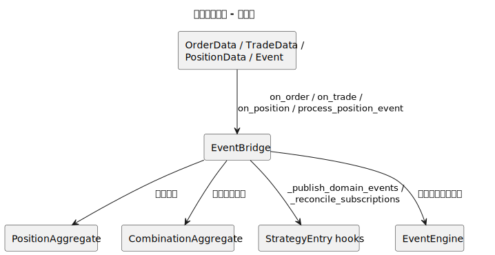
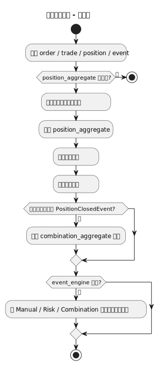
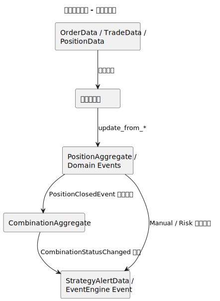
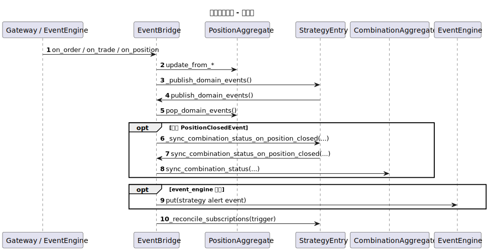

# 事件桥接编排（event_bridge）

- 源文件: `src/strategy/application/event_bridge.py`
- 主入口: `EventBridge.on_order`

## 职责说明

事件桥接编排负责把订单、成交、持仓等外部事件推进到领域聚合，再把领域事件转换为外部事件引擎可消费的告警消息。它不是 `*_workflow.py`，但它是应用层事件流的关键拼接点，因此在当前仓库里值得单独成文。

## 架构图

## 活动图

## 数据血缘图

## 顺序图

## 关键结论

- 这层桥接的核心作用是“把外部交易事件转成聚合更新，再把聚合产生的领域事件转成外部告警事件”。
- `EventBridge` 把 `position_aggregate` 与订阅重算、组合状态同步、事件引擎告警三条链路连接到一起。
- 如果未来某个策略项目没有 bridge 类文件，这一页可以不存在，但全局协作图仍应保留这个“可选桥接点”的概念。
