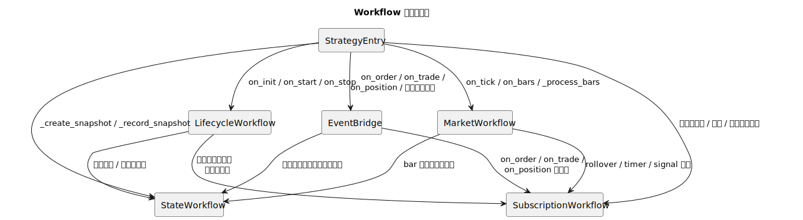
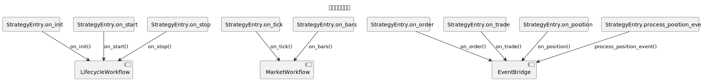
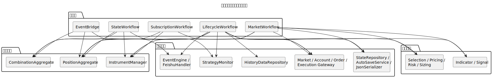

# Workflow 可视化总览

本页汇总 `src/strategy/application` 下应用层编排文件的全局图谱入口，先看整体协作，再进入单个 workflow 或桥接编排文件。

## 仓库级总览图

### 全局协作图

### 事件入口分发图

### 核心对象与基础设施映射图

## Workflow 文档

- [生命周期工作流](./lifecycle-workflow.md)
- [行情工作流](./market-workflow.md)
- [状态工作流](./state-workflow.md)
- [订阅工作流](./subscription-workflow.md)

## 可选桥接编排文档

- [事件桥接编排](./event-bridge.md)
