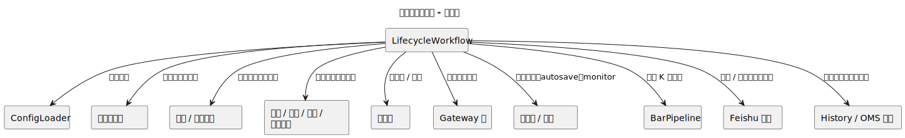
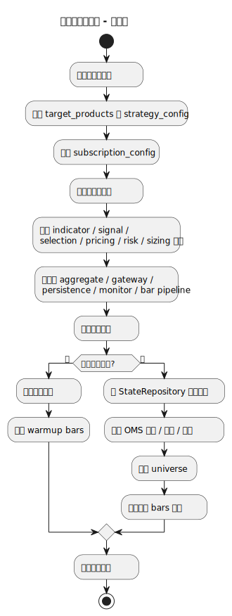
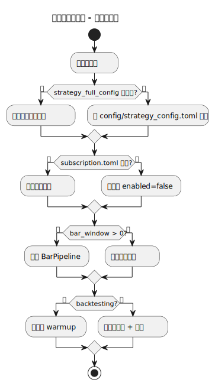
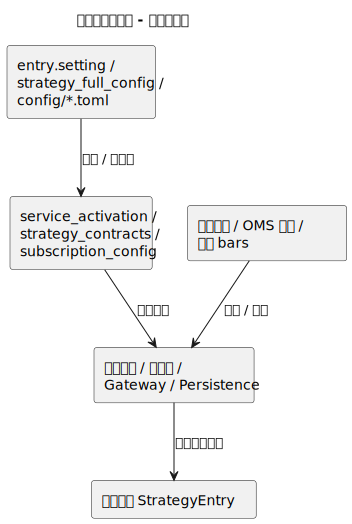
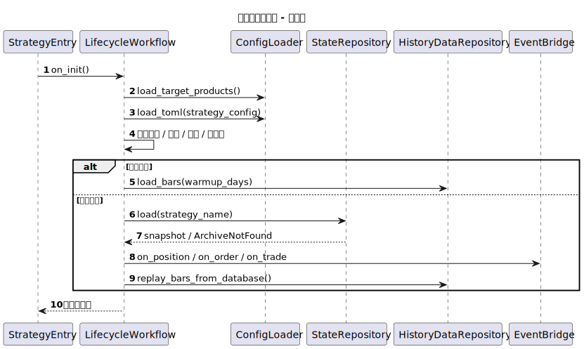
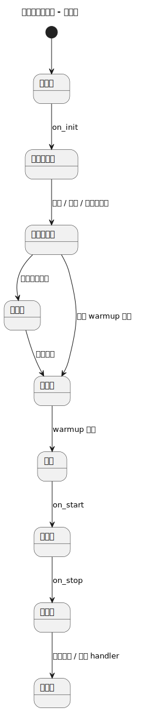
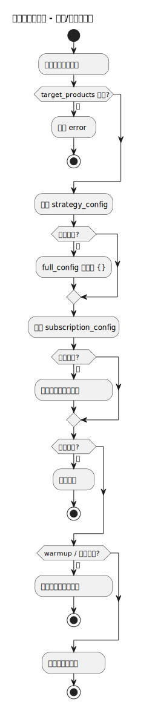

# 生命周期工作流（lifecycle_workflow）

- 源文件: `src/strategy/application/lifecycle_workflow.py`
- 主入口: `LifecycleWorkflow.on_init`

## 职责说明

生命周期工作流负责把策略从“刚构造出来的宿主对象”推进到“可运行、可恢复、可停止的运行态”。它集中处理配置装配、领域服务与基础设施初始化、状态恢复或预热、启动后校验，以及停止时的落盘与清理。

## 架构图

## 活动图

## 分支判定图

## 数据血缘图

## 顺序图

## 状态图

## 异常/降级路径图

## 关键结论

- 这是整个应用层的装配根，几乎所有 workflow 的前置依赖都从这里准备好。
- 最重要的主分支是“回测预热”与“实盘恢复 + 回放”两条启动路径。
- 失败处理并不总是立刻中止，有些配置读取会降级到默认值，但状态损坏和 warmup 失败会直接阻断启动。
- `on_start` 与 `on_stop` 不是简单日志钩子，而是把生命周期真正推进到运行态和收尾态的关键步骤。
