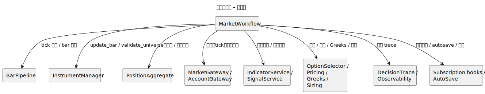
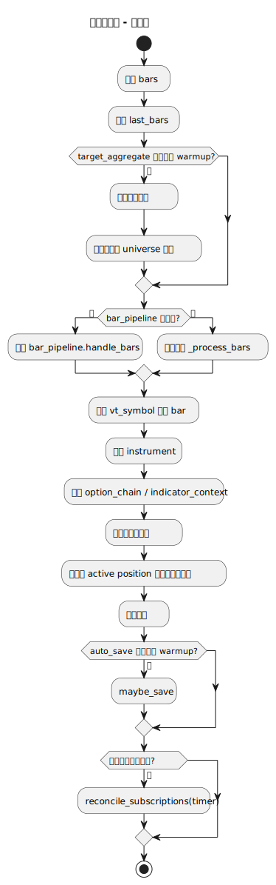
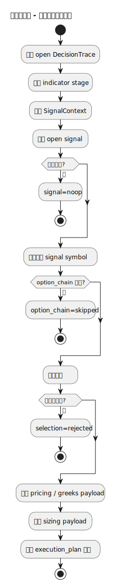
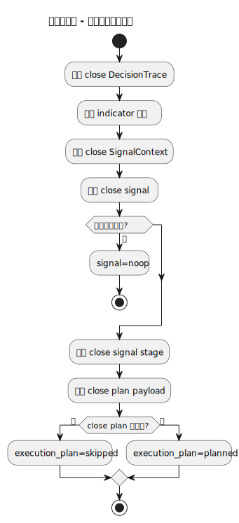
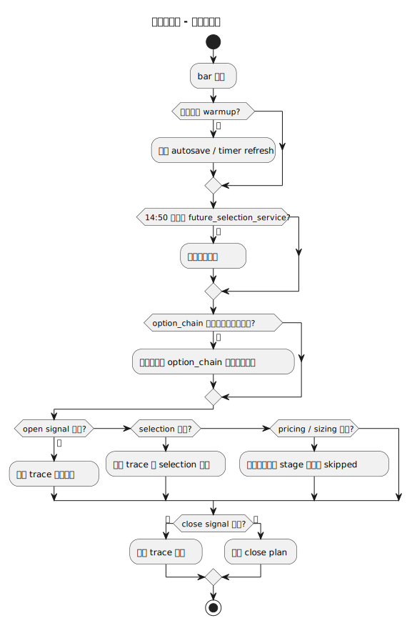
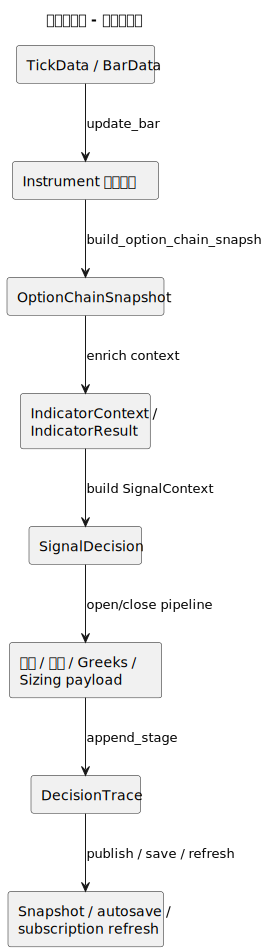
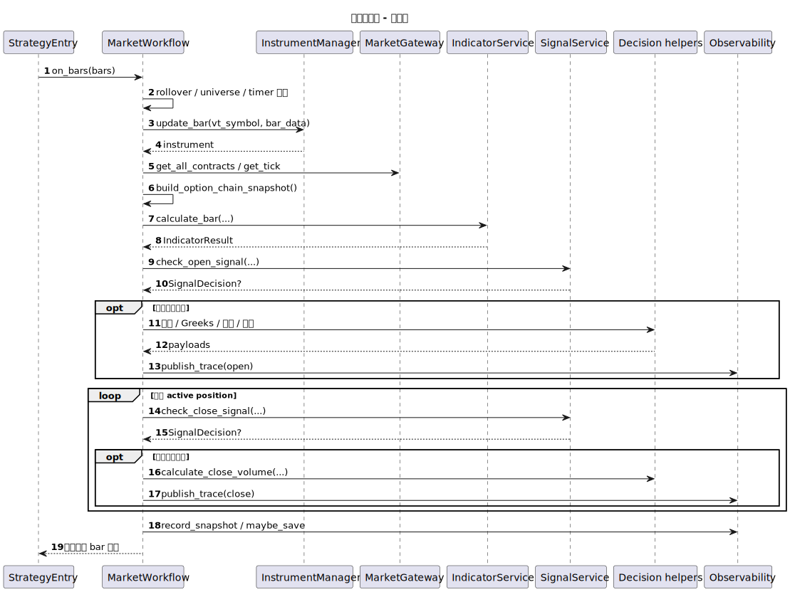
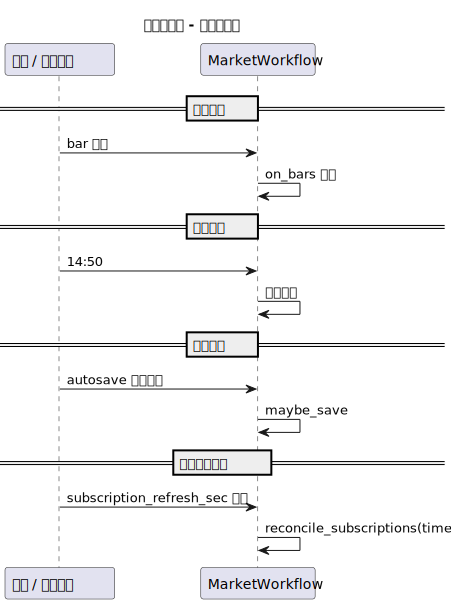

# 行情工作流（market_workflow）

- 源文件: `src/strategy/application/market_workflow.py`
- 主入口: `MarketWorkflow.on_bars`

## 职责说明

行情工作流是应用层里最核心的决策编排链路。它接收 tick / bar 事件，处理换月与标的校验，把行情推进为指标、信号、选约、定价、仓位评估和决策追踪，并在必要时触发快照、自动保存和订阅刷新。

## 架构图

## 活动图

## 开仓子流程活动图

## 平仓子流程活动图

## 分支判定图

## 数据血缘图

## 顺序图

## 时间驱动图

## 关键结论

- 这条链路同时承担“行情编排 + 决策编排 + 观测落地”的职责，是当前应用层最复杂的 workflow。
- 总活动图适合看 bar 主线推进，开仓和平仓子流程图更适合分析早停条件和阶段职责。
- `DecisionTrace` 是整条链路的重要产物，它把指标、信号、选约、定价、仓位和执行计划串成可观测输出。
- 时间因素不仅体现在 bar 到来，还体现在换月检查、自动保存和订阅刷新这些周期性动作上。
