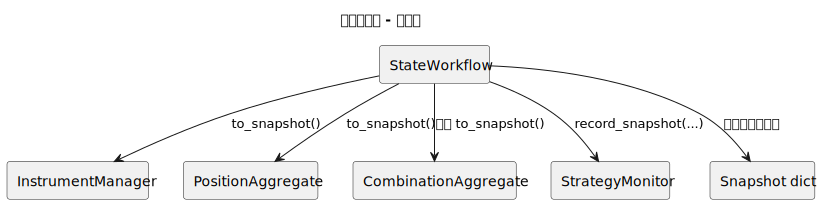
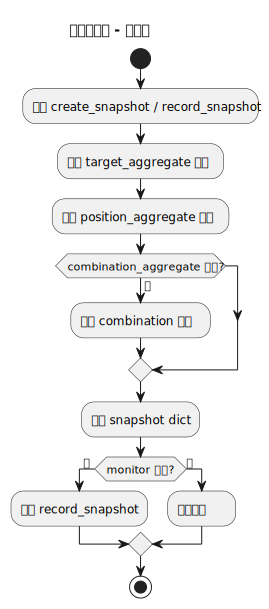
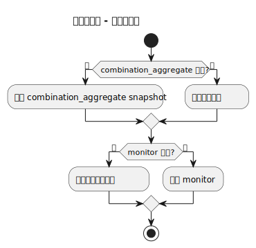
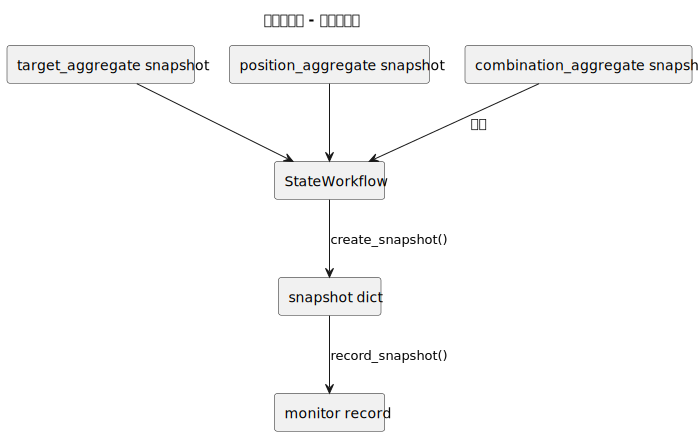
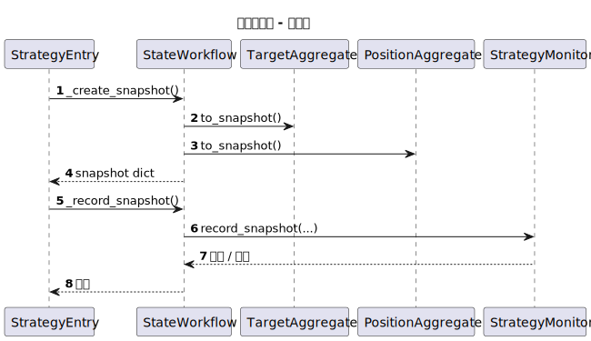
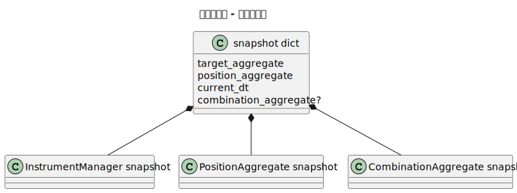

# 状态工作流（state_workflow）

- 源文件: `src/strategy/application/state_workflow.py`
- 主入口: `StateWorkflow.create_snapshot`

## 职责说明

状态工作流负责把运行中的聚合状态转换成可持久化、可监控的快照结构。它本身不复杂，但它把“快照长什么样”和“什么时候把快照送去监控存储”从宿主对象中剥离出来，让状态边界更清晰。

## 架构图

## 活动图

## 分支判定图

## 数据血缘图

## 顺序图

## 对象结构图

## 关键结论

- 这是一个刻意保持轻量的 workflow，重点是“结构清晰”，不是“流程复杂”。
- 关键价值在于把 target / position / combination 三类 aggregate 快照组合成统一持久化对象。
- `record_snapshot()` 是 best-effort 行为，监控记录失败只记日志，不反向污染交易主链。
- 对这个 workflow 来说，对象结构图比状态图更有解释力。
