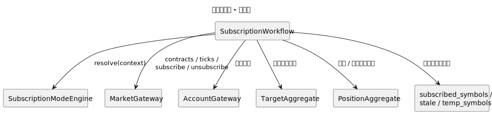
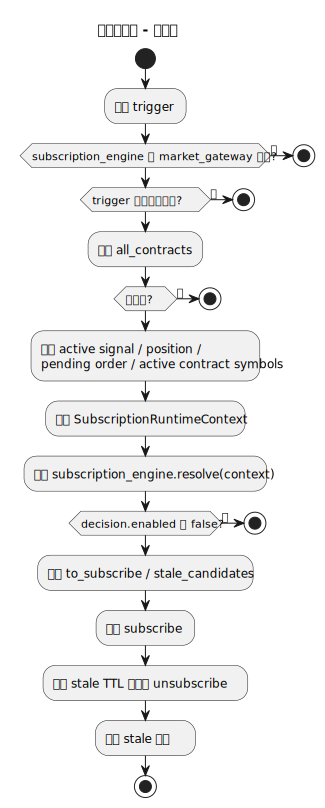
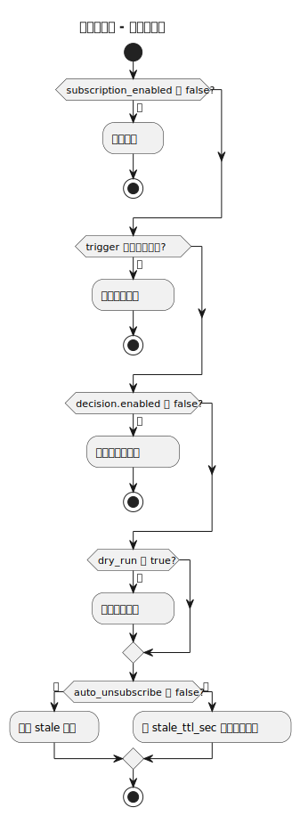
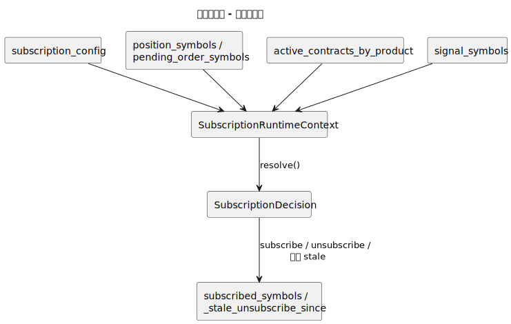
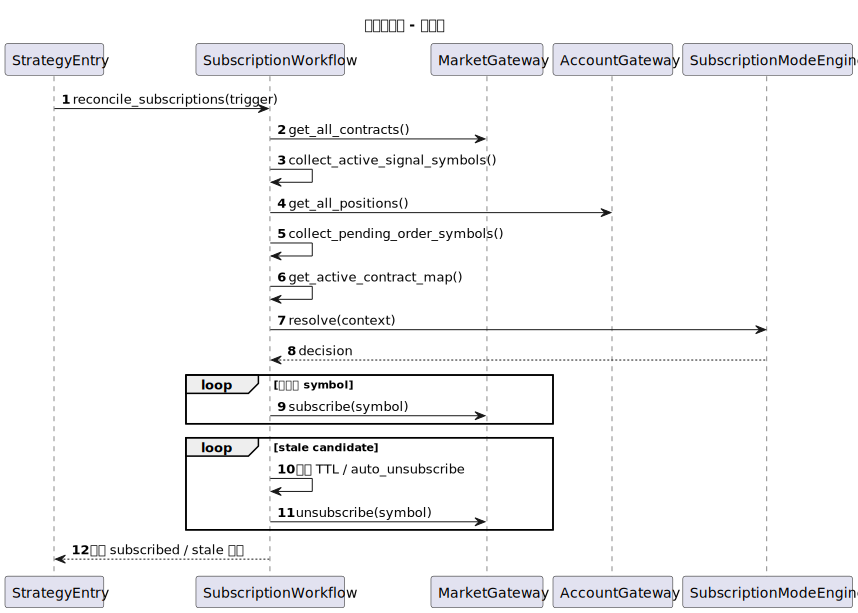
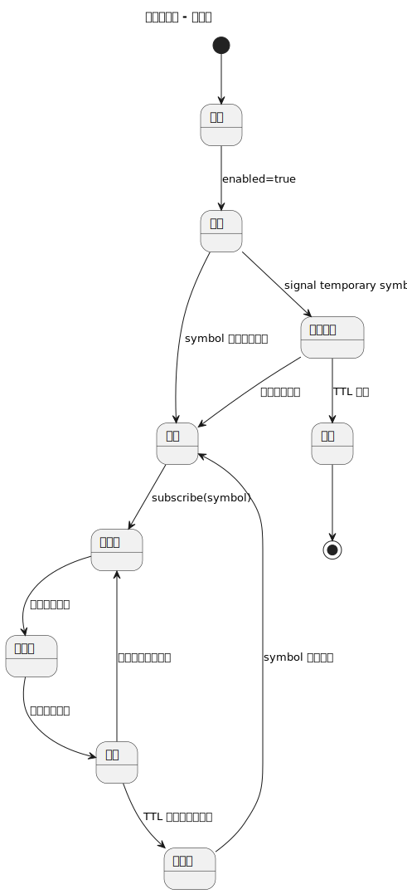
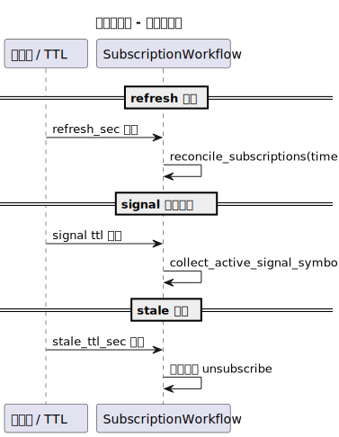
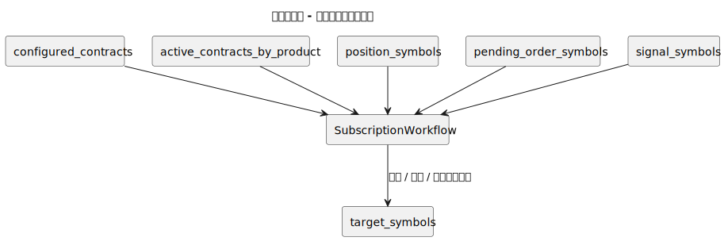

# 订阅工作流（subscription_workflow）

- 源文件: `src/strategy/application/subscription_workflow.py`
- 主入口: `SubscriptionWorkflow.reconcile_subscriptions`

## 职责说明

订阅工作流负责把“应该订阅哪些合约”持续重算出来，并与网关当前的订阅状态同步。它既要汇聚来自持仓、挂单、主力合约、临时信号合约等多路来源，又要处理 TTL、stale 倒计时、dry-run 与自动退订等时间和状态规则。

## 架构图

## 活动图

## 分支判定图

## 数据血缘图

## 顺序图

## 状态图

## 时间驱动图

## 目标合约来源汇聚图

## 关键结论

- 这个 workflow 的复杂度主要来自“来源多路汇聚 + 时间规则 + 退订策略”。
- 状态图适合解释 `subscribed / stale / expired / candidate` 之间的转换。
- 时间驱动图能单独说明 refresh 周期、TTL 与 stale 倒计时，不必把它们都塞进顺序图。
- 汇聚图能直接看出目标订阅集合不是单一来源推导出来的，而是多个运行时来源合并过滤后的结果。
